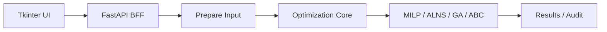

# master-course — EV バス配車・充電スケジューリング最適化研究システム


---

## README 早見表

この README は、**現行 core 実装の事実ベース**で記述しています。
先に全体像を掴み、次に実行手順と注意点を確認できる構成です。

読む順番の推奨:
1. まず「何を最適化しているか」を把握する
2. 次に「制約と目的関数の実装状況」を確認する
3. その後「セットアップ/実行フロー」を実施する
4. 最後に「既知問題・監査・エージェント仕様」を参照する

> 補足: 本リポジトリの現行運用は Tkinter + FastAPI + Python 最適化コアが中心です。

| 節 | 参照先 | 使いどころ |
|---|---|---|
| 要約 | [このシステムが何をしているか（先生向け要約）](#このシステムが何をしているか先生向け要約) | 最初の 5 分で研究対象と全体像を掴む |
| 1 | [1. このシステムが解く問題（先生向け概要）](#1-このシステムが解く問題先生向け概要) | 入力・決定・出力の流れを確認する |
| 2 | [2. 最適化モデルの説明](#2-最適化モデルの説明) | 数理モデル、変数、制約、目的関数を見る |
| 3 | [3. 実装状況と研究フェーズ](#3-実装状況と研究フェーズ) | 実装済み範囲と未実装範囲を確認する |
| 4 | [4. セットアップと実行手順](#4-セットアップと実行手順) | 環境構築、起動、初回接続を行う |
| 5 | [5. 東急全体最適化の推奨フロー](#5-東急全体最適化の推奨フロー) | フロントから Prepare/最適化を流す順番を確認する |
| 6 | [6. システム構成](#6-システム構成) | ディレクトリ構成と主要 API を確認する |
| 7 | [7. 既知の注意事項とトラブルシューティング](#7-既知の注意事項とトラブルシューティング) | timeout や dataset 不整合時の対処を見る |
| 8 | [8. パラメータ保全リスト](#8-パラメータ保全リスト) | 研究パラメータをどこで保持しているか確認する |
| 9 | [9. 実装詳細（技術リファレンス）](#9-実装詳細技術リファレンス) | 実装変数や dispatch 判定式を追う |
| 10 | [10. 実測監査](#10-実測監査) | KPI と再現コマンドを確認する |
| 11 | [11. AI エージェント向けアーキテクチャ仕様](#11-ai-エージェント向けアーキテクチャ仕様) | 自動修正時の制約と責務境界を確認する |



> **要点**
> - 本 README は「理想仕様」ではなく「現行実装」を優先して説明します。
> - 実装済み/未実装は 3章で明示し、断定表現を避けています。
> - 実行前に 4章・5章、問題発生時は 7章、検証時は 10章を参照してください。

## このシステムが何をしているか（先生向け要約）

本システムの現行 core は、東急バス 1 日分の運行計画について以下の **3 つを同時に決める** 混合整数線形計画（MILP）です。

**① 決める内容（決定変数）**

- どの便をどの車両（BEV：電気バス / ICE：エンジンバス）に割り当てるか
- 電気バス（BEV）をいつ・何 kW 充電するか
- 充電電力を PV（太陽光）と系統電力からどう配分するか

**② 守る条件（制約の種類）**

- 時刻表の全便を担当車両に割り当てる（欠便は大きな罰則で抑止）
- 走行中に充電しない / バッテリー残量（SOC）を下限以上に保つ
- 充電設備の台数・出力の上限を守る / 系統受電が契約電力以内

**③ 最小化する費用（目的関数）**

- ICE バスの燃料費（O1）＋ 電気代・TOU（O2）＋ デマンド料金（O3）＋ 車両固定費（O4）を **1 本の式として合算して最小化**します
- CO₂ 費用・電池劣化費（パラメータで有効化、デフォルトは 0 = 無効）
- **O1 と O2 を別々に最小化しないことが重要です**：O1 だけなら「ICE を使わない」、O2 だけなら「BEV を充電しない」が自明な解となり研究上の意味がありません。合算することで ICE↔BEV の最適な混合比率が得られます

> **実装上の重要な注意点（誠実な開示）**
>
> - **C1 欠便制約**：「全便を必ず割り当てる」は絶対制約ではなく、欠便変数に大きな罰則を課す**罰則付き緩和**として実装しています（通常は欠便が抑止されますが、解なし状態の回避が目的です）。
> - **C14 充電器制約**：「各充電器にどの車両が接続されているか」を厳密に追うのではなく、全充電器の合計容量（kW）の上限制約として実装しています。
> - **C20/C21 ピーク判定**：tariff テーブルが設定されている場合はそれを優先しますが、未設定時は時間帯別価格の中央値で on/off を近似的に分類しています。
> - **CO₂費・劣化費**：目的関数への組み込みは実装済みですが、デフォルト値は 0（無効）です。パラメータ（`co2_price_per_kg`・`degradation` 重み）に正の値を設定することで有効化されます。

実装本体：[`src/optimization/milp/solver_adapter.py`](src/optimization/milp/solver_adapter.py)
研究仕様（目標定式化）：[`docs/constant/formulation.md`](docs/constant/formulation.md)
実装済み範囲の詳細：[`docs/constant/implementation_status.md`](docs/constant/implementation_status.md)

---

Tkinter + FastAPI BFF のみで東急全体の最適化を再現実行できるパッケージです。

---

## 目次

1. [このシステムが解く問題（先生向け概要）](#1-このシステムが解く問題先生向け概要)
2. [最適化モデルの説明](#2-最適化モデルの説明)
3. [実装状況と研究フェーズ](#3-実装状況と研究フェーズ)
4. [セットアップと実行手順](#4-セットアップと実行手順)
5. [東急全体最適化の推奨フロー](#5-東急全体最適化の推奨フロー)
6. [システム構成](#6-システム構成)
7. [既知の注意事項とトラブルシューティング](#7-既知の注意事項とトラブルシューティング)
8. [パラメータ保全リスト](#8-パラメータ保全リスト)
9. [実装詳細（技術リファレンス）](#9-実装詳細技術リファレンス)
10. [実測監査](#10-実測監査)

---

## 1. このシステムが解く問題（先生向け概要）

### 1.1 一言で言うと

東急バスの1日の運行計画において、

- **どの便をどの車両（BEV or ICE）に任せるか**
- **BEV をいつ・どれだけ充電するか**
- **充電に使う電力を PV（太陽光）と系統電力からどう調達するか**

の3つを同時に決定し、**1日の総費用を最小化**します。

### 1.2 入力・決定・出力の流れ

```
【入力】
  時刻表（便ごとの出発・到着・走行距離）
  車両諸元（BEV: バッテリー容量・充電出力 / ICE: 燃費・燃料単価）
  電力料金（時間帯別単価・デマンド料金・契約電力上限）
  PV 発電予測（時間帯別の太陽光発電量）
        ↓
【決定】（モデルが自動で決める項目）
  ① 各便をどの車両に割り当てるか
  ② 各 BEV をいつ・何 kW 充電するか
  ③ 充電電力を PV と系統電力からどう分配するか
        ↓
【守るべき条件（制約）】
  ✔ 時刻表の全便を必ず担当車両に割り当てる（欠便は大きなペナルティ）
  ✔ BEV は走行中に充電しない（デポ滞在中のみ充電可能）
  ✔ バッテリー残量（SOC）が下限を下回らない（電欠禁止）
  ✔ 充電器の台数・出力の上限を超えない
  ✔ 系統受電量が契約電力を超えない
        ↓
【出力】
  車両ごとの運行スケジュール（どの便を担当するか）
  充電スケジュール（いつ・何 kW 充電するか）
  費用内訳（燃料費・電気代・デマンド料金・CO₂費・劣化費）
  担当不能な未充足便のリスト
```

### 1.3 最小化する費用の内訳

| 費目 | 内容 | 設定 |
|------|------|------|
| ICE 燃料費 | エンジンバスの燃料消費量 × 燃料単価 | 常時有効 |
| 電気代（TOU） | 時間帯別電力単価 × 系統買電量 | 常時有効 |
| デマンド料金 | 「最大需要電力（ピーク電力）× デマンド単価」 | 常時有効 |
| 車両固定費 | 使用車両に対する日割り固定費 | 車両設定がある場合 |
| 欠便ペナルティ | 担当不能便への大きなペナルティ（実質禁止） | 常時有効 |
| CO₂ 費用 | CO₂ 排出量 × CO₂ 価格（ICE 燃料由来 + 系統電力由来） | `co2_price_per_kg > 0` で有効 |
| 電池劣化費 | 充電量 ÷ バッテリー容量 × 劣化単価 | `degradation > 0` で有効 |

> **デマンド料金について**：電力会社との契約では、その月の「最大需要電力（30分ごとの平均電力の最大値）」に応じた基本料金が発生します。
> BEV の充電タイミングを分散させると最大需要電力を抑えられ、デマンド料金が下がります。
> この効果を定量化するために O3 として目的関数に含めています。

---

## 2. 最適化モデルの説明

本システムは **MILP（混合整数線形計画）** で定式化されています。
ソルバーは [Gurobi](https://www.gurobi.com/) を使用します。

> **MILP とは**：0/1 の整数変数（「便 j を車両 k に割り当てるか否か」など）と
> 連続変数（「充電電力 c kW」など）を混在させた最適化問題の総称です。
> 線形式で書けるため、Gurobi などの商用ソルバーで大規模な実問題を解くことができます。

### 2.1 モデルが決める変数（決定変数）

> ソルバーが値を決定する変数です。制約と目的関数の中で使われます。
> 実装ファイル：[`src/optimization/milp/solver_adapter.py`](src/optimization/milp/solver_adapter.py)

#### 主要決定変数

| 記号 | 意味 | 型・範囲 | Python コード変数 | 定義行 |
|------|------|---------|-----------------|--------|
| $y_j^k$ | 車両 $k$ が便 $j$ を担当する（1）か否（0）か | 0/1 整数 | `y[(vehicle_id, trip_id)]` | [L97](src/optimization/milp/solver_adapter.py#L97) |
| $x_{ij}^k$ | 車両 $k$ が便 $i$ の直後に便 $j$ を担当（1）か否（0）か | 0/1 整数 | `x[(vehicle_id, from_trip_id, to_trip_id)]` | [L100](src/optimization/milp/solver_adapter.py#L100) |
| $u_j$ | 便 $j$ が未充足（担当不能）である（1）か否（0）か | 0/1 整数 | `unserved[trip_id]` | [L114](src/optimization/milp/solver_adapter.py#L114) |
| $z_k$ | 車両 $k$ が1日に1便以上使用される（1）か否（0）か | 0/1 整数 | `used_vehicle[vehicle_id]` | [L119](src/optimization/milp/solver_adapter.py#L119) |
| $\xi_{k,t}$ | 車両 $k$ がスロット $t$ に充電 ON（1）か OFF（0）か | 0/1 整数 | `charge_on_var[(vehicle_id, slot_idx)]` | [L215](src/optimization/milp/solver_adapter.py#L215) |
| $c_{k,t}$ | 車両 $k$ のスロット $t$ での充電電力（kW） | 連続 $[0,\, c_{\max}]$ | `c_var[(vehicle_id, slot_idx)]` | [L216](src/optimization/milp/solver_adapter.py#L216) |
| $s_{k,t}$ | 車両 $k$ のスロット $t$ でのバッテリー残量 SOC（kWh） | 連続 $[SOC_{\min},\, cap_k]$ | `s_var[(vehicle_id, slot_idx)]` | [L218](src/optimization/milp/solver_adapter.py#L218) |
| $g_t$ | スロット $t$ での系統買電量（kWh） | 連続 $\geq 0$ | `g_var[slot_idx]` | [L297](src/optimization/milp/solver_adapter.py#L297) |
| $pv_t^{ch}$ | スロット $t$ での PV 自家消費量（kWh） | 連続 $\geq 0$ | `pv_ch_var[slot_idx]` | [L298](src/optimization/milp/solver_adapter.py#L298) |
| $\bar{p}_t$ | スロット $t$ の平均需要電力（kW）= $g_t / \Delta t$ | 連続 $\geq 0$ | `p_avg_var[slot_idx]` | [L299](src/optimization/milp/solver_adapter.py#L299) |
| $W^{on}$ | オンピーク期間中の最大需要電力（kW） | 連続 $\geq 0$ | `w_on_var` | [L301](src/optimization/milp/solver_adapter.py#L301) |
| $W^{off}$ | オフピーク期間中の最大需要電力（kW） | 連続 $\geq 0$ | `w_off_var` | [L302](src/optimization/milp/solver_adapter.py#L302) |

#### 補助変数（制約式のみに使用）

| 用途 | Python コード変数 | 定義行 | 備考 |
|------|-----------------|--------|------|
| 便鎖の先頭フラグ | `start_arc[(vehicle_id, trip_id)]` | [L105](src/optimization/milp/solver_adapter.py#L105) | C2/C3 の流量保存で使用 |
| 便鎖の末尾フラグ | `end_arc[(vehicle_id, trip_id)]` | [L109](src/optimization/milp/solver_adapter.py#L109) | C2/C3 の流量保存で使用 |
| 放電電力（kW） | `d_var[(vehicle_id, slot_idx)]` | [L217](src/optimization/milp/solver_adapter.py#L217) | V2G 対応用・現行は SOC 遷移に組み込み |

### 2.2 守るべき条件（制約）の説明

制約には C1〜C21 の番号を付けて管理しています（詳細は `docs/constant/formulation.md`）。
以下では非専門家向けに意味を説明します。

#### 便割当の制約（C1〜C5）

- **C1：各便には必ず1台の担当車両を割り当てる（罰則付き緩和）**
  理論式では等式制約 $\sum_k y_j^k = 1$ ですが、実装では欠便変数 $u_j$ を導入して
  $\sum_k y_j^k + u_j = 1$ とし、欠便に大きなペナルティ $\pi \cdot u_j$ を課すことで実質的に抑止します。
  これにより「解なし（infeasible）」状態を避けつつ、通常は欠便が発生しない設計になっています。

  > **先生向け補足**：「欠便ゼロを絶対制約にしている」ではなく「欠便には大きな罰則をかけ、通常は回避されるようにしている」が正確な説明です。

- **C2：車両の行路は連続した便の鎖になる**
  便 $j$ を担当したら、その前後の便との「接続」が整合的でなければなりません（流量保存）。

- **C3：各車両の出庫・入庫は1日1回まで**

- **C4：時刻的に接続不可能な便への移動は禁止**
  便 $i$ の到着後、転換時間＋回送時間以内に便 $j$ の出発地へ到着できない組み合わせは最初から排除します。

- **C5：同じ車両が同時刻に2つの便を担当することを明示禁止**
  重複する時間帯の便ペア $(i, j)$ に対し $y_i^k + y_j^k \leq 1$ を直接追加します。

#### バッテリー残量（SOC）の制約（C6〜C11）

> **SOC（State of Charge）**：バッテリーの残量を指します。ここでは kWh 単位で管理します。

- **C6〜C8：SOC の時系列遷移**（充電で増加、走行・回送で減少）

  $$s_{k,t+1} = s_{k,t} + \eta \cdot c_{k,t} \cdot \Delta t - e_k(j) \cdot y_j^k - e_k^{dh} \cdot x_{ij}^k$$

  $\eta$：充電効率（≈ 0.95）、$e_k(j)$：便 $j$ の走行エネルギー（kWh）、$\Delta t$：時間刻み（h）

- **C9：SOC は常に上下限の範囲内**（電欠禁止・過充電禁止）

  $$SOC_{\min} \leq s_{k,t} \leq cap_k$$

- **C10：出庫時の SOC 設定**（パラメータ `initial_soc` で指定）

- **C11：帰庫後の SOC は翌日確保用の下限以上**

#### 充電設備の制約（C12〜C14）

- **C12：走行中は充電しない**

  $$c_{k,t} \leq c_{\max} \cdot (1 - \text{running}_{k,t})$$

- **C13：1台あたりの充電電力は充電器定格以下**（ON/OFF 二値変数 $\xi_{k,t}$ を導入して厳密化）

- **C14：同時充電台数と総 kW 容量の両方の上限**

  $$\sum_k \xi_{k,t} \leq N_c^{\max}, \quad \sum_k c_{k,t} \leq P_c^{\max}$$

  > **実装の正直な開示**：「各充電器にどの車両が物理的に接続されているか」を厳密に追う
  > 割当制約は実装していません。実装では、全充電器の合計台数（$N_c^{\max}$）と
  > 合計 kW 容量（$P_c^{\max}$）の上限を守ることで、過負荷を防ぐ設計になっています。

#### 電力システムの制約（C15〜C21）

- **C15：電力バランス**（系統 + PV = 充電需要を常に成立させる）

  $$g_t + pv_t^{ch} = \sum_k c_{k,t} \cdot \Delta t$$

- **C16：PV 自家消費量は発電量以内**

- **C17：系統への逆潮流禁止**（$g_t \geq 0$）

- **C18：系統受電量は契約電力以内**

- **C19〜C21：デマンド料金計算用のピーク電力定義**

  > **実装の正直な開示**：オンピーク / オフピークの時間帯分類は、tariff テーブルに `demand_charge_weight` が設定されている場合はその定義を優先します。
  > 未設定の場合は「時間帯別単価の中央値以上をオンピーク」という近似分類を使います。
  > 電力会社の正式な契約時間帯定義を完全再現しているわけではありません。

#### 制約コード対応表（C1〜C21）

| No. | 内容 | 実装コード式（抜粋） | 実装行 |
|-----|------|-------------------|--------|
| C1 | 各便一意割当（罰則付き緩和） | `sum(y[k,j]) + unserved[j] == 1` | [L130](src/optimization/milp/solver_adapter.py#L130) |
| C2 | フロー保存（便鎖整合性） | `incoming + start_arc[key] == y[key]` | [L156–157](src/optimization/milp/solver_adapter.py#L156) |
| C3 | 出庫・入庫は高々1回 | `sum(start_arc) <= 1`, `sum(end_arc) <= 1` | [L160–161](src/optimization/milp/solver_adapter.py#L160) |
| C4 | 可行アークのみ利用 | `arc_pairs` を `feasible_connections` から生成 | [model_builder.py](src/optimization/milp/model_builder.py) |
| C5 | 重複運行禁止（明示制約） | `y[key_a] + y[key_b] <= 1` （重複ペア全列挙） | [L163–178](src/optimization/milp/solver_adapter.py#L163) |
| C6–C8 | SOC 時系列遷移 | `s[next] == s[cur] + 0.95*c*Δt - trip_energy - dh_energy` | [L255–262](src/optimization/milp/solver_adapter.py#L255) |
| C9 | SOC 上下限（変数の lb/ub） | `lb=soc_min, ub=cap` | [L218](src/optimization/milp/solver_adapter.py#L218) |
| C10 | 出庫時 SOC 固定 | `s_var[first_slot] == initial_kwh` | [L229](src/optimization/milp/solver_adapter.py#L229) |
| C11 | 帰庫後 SOC 下限 | `s_var[last_slot] >= soc_min * used_vehicle[k]` | [L233](src/optimization/milp/solver_adapter.py#L233) |
| C12 | 走行中充電禁止 | `charge_on_var[k,t] <= 1 - running_expr` | [L271](src/optimization/milp/solver_adapter.py#L271) |
| C13 | 充電電力上限（充電器定格） | `c_var[k,t] <= charge_max_kw * charge_on_var[k,t]` | [L272–275](src/optimization/milp/solver_adapter.py#L272) |
| C14 | 同時充電台数・容量上限 | `sum(charge_on_var) <= total_ports`, `sum(c_var) <= total_kw` | [L284–291](src/optimization/milp/solver_adapter.py#L284) |
| C15 | 電力バランス | `g_var[t] + pv_ch_var[t] == charge_kwh_expr` | [L315](src/optimization/milp/solver_adapter.py#L315) |
| C16 | PV 自家消費上限 | `pv_ch_var[t] <= pv_available * Δt` | [L316](src/optimization/milp/solver_adapter.py#L316) |
| C17 | 非逆潮流 | `lb=0.0` （g_var の変数定義） | [L297](src/optimization/milp/solver_adapter.py#L297) |
| C18 | 契約電力上限 | `g_var[t] <= contract_limit_kw * Δt` | [L317](src/optimization/milp/solver_adapter.py#L317) |
| C19 | 平均需要電力の定義 | `p_avg_var[t] == g_var[t] / Δt` | [L320](src/optimization/milp/solver_adapter.py#L320) |
| C20 | オンピーク最大需要 | `w_on_var >= p_avg_var[t]` （on_peak スロット） | [L324](src/optimization/milp/solver_adapter.py#L324) |
| C21 | オフピーク最大需要 | `w_off_var >= p_avg_var[t]` （off_peak スロット） | [L326](src/optimization/milp/solver_adapter.py#L326) |

### 2.3 目的関数（最小化する式）

> [!IMPORTANT]
> **O1〜O4・欠便ペナルティはすべて 1 本の式に足し合わせて同時に最小化します。**
>
> O1（ICE 燃料費）だけを最小化すれば「ICE を 1 台も走らせない」が自明な最適解となり、
> O2（電気代）だけを最小化すれば「BEV を 1 台も充電しない（ICE のみ運用）」が自明な最適解となります。
> それぞれを単独で扱っても研究上の意味はありません。
>
> O1 と O2 を同一式で合算することで、「ICE を使えば燃料費（O1）が増え、BEV を充電すれば電気代（O2）が増える」
> というトレードオフが内在化され、ソルバーが **ICE と BEV の最適な混合比率** を自動決定します。
>
> **欠便ペナルティは常に有効**です（O1〜O4・CO₂費・劣化費のいずれの設定にも関わらず、
> すべての項の後に無条件で加算されます — [L425–426](src/optimization/milp/solver_adapter.py#L425)）。

#### 目的関数の全体式

$$
\min \quad C_{total} = \underbrace{O1 + O2 + O3 + O4}_{\text{常に有効}} + \underbrace{\sum_j \pi \cdot u_j}_{\text{欠便ペナルティ（常に有効）}} + \underbrace{C_{CO_2}^{*} + C_{degr}^{*}}_{\text{パラメータ設定時のみ有効}}
$$

各項の展開式：

$$
O1 = \underbrace{\sum_{k \in K^{ICE},\, j \in J} c_f \cdot f_k(j) \cdot y_j^k}_{\text{便走行分}}
   + \underbrace{\sum_{k \in K^{ICE},\, (i,j) \in A} c_f \cdot f_k^{dh}(i,j) \cdot x_{ij}^k}_{\text{回送走行分}}
$$

$$
O2 = \sum_{t \in T} p_t^{grid} \cdot g_t \qquad
O3 = p^{dem,on} \cdot W^{on} + p^{dem,off} \cdot W^{off} \qquad
O4 = \sum_{k \in K} c_k^{veh} \cdot z_k
$$

$$
C_{CO_2}^{*} = p^{CO_2} \cdot \Bigl(
  \alpha_{ICE} \sum_{k \in K^{ICE},j} f_k(j) \cdot y_j^k
  + \alpha_{grid} \sum_{t} g_t
\Bigr) \quad \bigl(p^{CO_2} > 0 \text{ のとき有効}\bigr)
$$

$$
C_{degr}^{*} = w^{degr} \cdot \sum_{k \in K^{BEV},\, t} \frac{c_{k,t} \cdot \Delta t}{cap_k} \cdot \beta
\quad \bigl(w^{degr} > 0 \text{ のとき有効}\bigr)
$$

#### 各費目の有効化条件

| 費目 | 記号 | 有効化条件 | コード行 |
|------|------|-----------|---------|
| ICE 燃料費（便走行） | $O1_{\text{trip}}$ | **常に有効**（ICE 車両が 0 台なら自動的に 0） | [L336–348](src/optimization/milp/solver_adapter.py#L336) |
| ICE 燃料費（回送） | $O1_{\text{dh}}$ | **常に有効**（同上） | [L350–362](src/optimization/milp/solver_adapter.py#L350) |
| 電気代（TOU） | $O2$ | **常に有効**（系統買電量が 0 なら自動的に 0） | [L332–334](src/optimization/milp/solver_adapter.py#L332) |
| デマンド料金 | $O3$ | **常に有効**（単価を 0 に設定すれば実質無効化可） | [L364–367](src/optimization/milp/solver_adapter.py#L364) |
| 車両固定費 | $O4$ | **常に有効**（`fixed_use_cost_jpy = 0` で実質無効化可） | [L369–370](src/optimization/milp/solver_adapter.py#L369) |
| 欠便ペナルティ | $\pi \cdot u_j$ | **常に有効・無条件**（O1〜O4・オプション項の設定に関わらず必ず加算） | [L425–426](src/optimization/milp/solver_adapter.py#L425) |
| CO₂ 費用 | $C_{CO_2}^{*}$ | `co2_price_per_kg > 0` のときのみ加算 | [L372–407](src/optimization/milp/solver_adapter.py#L372) |
| 電池劣化費 | $C_{degr}^{*}$ | `degradation_weight > 0` のときのみ加算 | [L409–423](src/optimization/milp/solver_adapter.py#L409) |

> **コードにおける加算順序（[L330–428](src/optimization/milp/solver_adapter.py#L330)）：**
> `objective = LinExpr()` → O2 → O1 → O3 → O4 → CO₂費（条件付き） → 劣化費（条件付き） → **欠便ペナルティ（無条件）** → `setObjective(minimize)`

---

#### 決定変数の定義

> ソルバーが最適化によって値を決定する変数です。

| 記号 | 意味 | 型 | 範囲 | Python 変数 | コード行 |
|------|------|----|----|------------|---------|
| $y_j^k$ | 車両 $k$ が便 $j$ を担当するか | 0/1 整数 | $\{0, 1\}$ | `y[(vehicle_id, trip_id)]` | [L97](src/optimization/milp/solver_adapter.py#L97) |
| $x_{ij}^k$ | 車両 $k$ が便 $i$ の直後に便 $j$ を担当するか（回送接続） | 0/1 整数 | $\{0, 1\}$ | `x[(vehicle_id, from_trip_id, to_trip_id)]` | [L100](src/optimization/milp/solver_adapter.py#L100) |
| $u_j$ | 便 $j$ が担当不能（欠便）か | 0/1 整数 | $\{0, 1\}$ | `unserved[trip_id]` | [L114](src/optimization/milp/solver_adapter.py#L114) |
| $z_k$ | 車両 $k$ が 1 日に 1 便以上使われるか | 0/1 整数 | $\{0, 1\}$ | `used_vehicle[vehicle_id]` | [L119](src/optimization/milp/solver_adapter.py#L119) |
| $\xi_{k,t}$ | 車両 $k$ がスロット $t$ に充電 ON か | 0/1 整数 | $\{0, 1\}$ | `charge_on_var[(vehicle_id, slot_idx)]` | [L215](src/optimization/milp/solver_adapter.py#L215) |
| $c_{k,t}$ | 車両 $k$ のスロット $t$ における充電電力 | 連続 | $[0,\, c_{\max,k}]$（kW） | `c_var[(vehicle_id, slot_idx)]` | [L216](src/optimization/milp/solver_adapter.py#L216) |
| $s_{k,t}$ | 車両 $k$ のスロット $t$ における SOC（バッテリー残量） | 連続 | $[SOC_{\min},\, cap_k]$（kWh） | `s_var[(vehicle_id, slot_idx)]` | [L218](src/optimization/milp/solver_adapter.py#L218) |
| $g_t$ | スロット $t$ における系統買電量 | 連続 | $\geq 0$（kWh） | `g_var[slot_idx]` | [L297](src/optimization/milp/solver_adapter.py#L297) |
| $pv_t^{ch}$ | スロット $t$ における PV 自家消費量 | 連続 | $[0,\, PV_t^{\max} \cdot \Delta t]$（kWh） | `pv_ch_var[slot_idx]` | [L298](src/optimization/milp/solver_adapter.py#L298) |
| $\bar{p}_t$ | スロット $t$ の平均需要電力（$= g_t / \Delta t$） | 連続 | $\geq 0$（kW） | `p_avg_var[slot_idx]` | [L299](src/optimization/milp/solver_adapter.py#L299) |
| $W^{on}$ | オンピーク期間の最大需要電力 | 連続 | $\geq 0$（kW） | `w_on_var` | [L301](src/optimization/milp/solver_adapter.py#L301) |
| $W^{off}$ | オフピーク期間の最大需要電力 | 連続 | $\geq 0$（kW） | `w_off_var` | [L302](src/optimization/milp/solver_adapter.py#L302) |

#### パラメータの定義

> 入力データとして与えられる定数です（ソルバーは変化させない）。

| 記号 | 意味 | 単位 | Python 変数 | データ源 | コード行 |
|------|------|------|------------|---------|---------|
| $c_f$ | 軽油単価 | 円/L | `diesel_price` | `problem.scenario.diesel_price_yen_per_l` | [L337](src/optimization/milp/solver_adapter.py#L337) |
| $f_k(j)$ | 便 $j$ における車両 $k$ の燃料消費量 | L | `fuel_l` | `trip.fuel_l`（未設定時は距離×燃費） | [L345](src/optimization/milp/solver_adapter.py#L345) |
| $f_k^{dh}(i,j)$ | 便 $i$→$j$ 回送における燃料消費量 | L | `deadhead_km * fuel_rate` | `dispatch_context.get_deadhead_min(...)` | [L357–362](src/optimization/milp/solver_adapter.py#L357) |
| $p_t^{grid}$ | スロット $t$ の系統電力単価（TOU） | 円/kWh | `price_by_slot[slot_idx]` | `slot.grid_buy_yen_per_kwh` | [L332](src/optimization/milp/solver_adapter.py#L332) |
| $p^{dem,on}$ | オンピーク・デマンド単価 | 円/kW | `demand_charge_on_peak_yen_per_kw` | `scenario_overlay.cost_coefficients` | [L366](src/optimization/milp/solver_adapter.py#L366) |
| $p^{dem,off}$ | オフピーク・デマンド単価 | 円/kW | `demand_charge_off_peak_yen_per_kw` | `scenario_overlay.cost_coefficients` | [L367](src/optimization/milp/solver_adapter.py#L367) |
| $c_k^{veh}$ | 車両 $k$ の固定費（日割り） | 円/日 | `vehicle.fixed_use_cost_jpy` | 車両マスタ `fixed_use_cost_jpy` | [L370](src/optimization/milp/solver_adapter.py#L370) |
| $\pi$ | 欠便ペナルティ単価 | 円/便 | `unserved_penalty_weight` | `objective_weights.unserved`（最小値 10,000 円） | [L328](src/optimization/milp/solver_adapter.py#L328) |
| $p^{CO_2}$ | CO₂ 価格 | 円/kg | `co2_price` | `problem.scenario.co2_price_per_kg` | [L373](src/optimization/milp/solver_adapter.py#L373) |
| $\alpha_{ICE}$ | 軽油の CO₂ 排出係数 | kg/L | `ice_co2_kg_per_l` | `problem.scenario.ice_co2_kg_per_l`（既定 2.64） | [L374](src/optimization/milp/solver_adapter.py#L374) |
| $\alpha_{grid}$ | 系統電力の CO₂ 排出係数 | kg/kWh | `co2_factor` | `slot.co2_factor`（スロット別） | [L405](src/optimization/milp/solver_adapter.py#L405) |
| $w^{degr}$ | 劣化費の重み | 無次元 | `degradation_weight` | `objective_weights.degradation` | [L411](src/optimization/milp/solver_adapter.py#L411) |
| $\beta$ | 劣化費の 1 サイクル当たりコスト | 円/cycle | `unit_cost_per_cycle` | ハードコード 50.0（将来パラメータ化予定） | [L413](src/optimization/milp/solver_adapter.py#L413) |
| $cap_k$ | 車両 $k$ のバッテリー容量 | kWh | `cap` | `vehicle.battery_capacity_kwh`（既定 300） | [L202](src/optimization/milp/solver_adapter.py#L202) |
| $\Delta t$ | 1 時間スロットの幅 | h | `timestep_h` | `problem.scenario.timestep_min / 60.0` | [L186](src/optimization/milp/solver_adapter.py#L186) |
| $K^{ICE}$ | ICE 車両の集合 | — | — | `vehicle.vehicle_type` が `BEV/PHEV/FCEV` 以外 | [L340](src/optimization/milp/solver_adapter.py#L340) |
| $K^{BEV}$ | BEV 車両の集合 | — | `bev_ids` | `vehicle.vehicle_type == "BEV"` | [L415](src/optimization/milp/solver_adapter.py#L415) |
| $J$ | 便の集合 | — | `problem.trips` | GTFS から生成 | — |
| $T$ | 時間スロットの集合 | — | `slot_indices` | `problem.price_slots` | — |
| $A$ | 接続可能な便ペアのアーク集合 | — | `arc_pairs` | `builder.enumerate_arc_pairs(...)` | [L93](src/optimization/milp/solver_adapter.py#L93) |

> **データの流れ：** Tkinter UI → Quick Setup 保存 → BFF `PUT /quick-setup` → `dispatch_scope` / `scenario_overlay` に同期保存 →
> `src/optimization/common/builder.py` で `CanonicalOptimizationProblem` に変換 → `solver_adapter.py` に渡る

#### 各費目の役割と組み合わせ効果

| 費目 | 単独で最小化すると | O1+O2+… 合算で最小化すると |
|------|----------------|--------------------------|
| **O1 ICE 燃料費** | ICE を全く使わなければ 0 → BEV のみが自明解 | O2 との合算で「BEV を使いすぎると電気代が増える」トレードオフが生まれ、最適な ICE/BEV 比率が決まる |
| **O2 電気代（TOU）** | BEV を充電しなければ 0 → ICE のみが自明解 | O1 との合算で「ICE を使いすぎると燃料費が増える」トレードオフが生まれる |
| **O3 デマンド料金** | ピーク時に充電しなければ下がるが、全便カバーが崩れる | O1+O2 の合算に加わることで、充電タイミングを深夜・オフピークにシフトさせるインセンティブが働く |
| **O4 車両固定費** | 車両を全台使わなければ 0 | 使用車両台数の最小化を誘導する。複数便を 1 台の BEV に集約すると O4 が下がる |
| **欠便ペナルティ** | 常に有効。欠便 1 件あたり最低 10,000 円の罰則 | 通常は全便カバーが有利になるよう大きな値に設定されているため、欠便はほぼ発生しない |
| **CO₂費（オプション）** | `co2_price_per_kg > 0` の場合のみ加算 | ICE の CO₂ + 系統電力の CO₂ に価格を付け、低炭素な充電時間帯・車種を誘導する |
| **劣化費（オプション）** | `degradation_weight > 0` の場合のみ加算 | 充電量に比例するコストを加えることで、必要以上の充電（過充電）を抑制する |

### 2.4 解法モード

| モード | アルゴリズム | 用途 |
|--------|-------------|------|
| `mode_milp_only` | Gurobi MILP（厳密解） | 小〜中規模の厳密最適解 |
| `mode_alns_only` | ALNS（適応型大規模近傍探索） | 大規模の近似解・高速探索 |
| `mode_ga` | GA（遺伝的アルゴリズム） | 大規模の近似解 |
| `mode_abc` | ABC（人工蜂コロニー） | 大規模の近似解 |

ALNS・GA・ABC は共通評価器 `src/optimization/common/evaluator.py` で O1〜O4 および CO₂費・劣化費を評価します。

---

## 3. 実装状況と研究フェーズ

### 3.1 定式化・実装・今後の3層構造

| 層 | 内容 | 参照先 |
|----|------|--------|
| 目標定式化 | 研究として最終的に目指す C1〜C21 / O1〜O4 の完全モデル | `docs/constant/formulation.md` |
| 実装済み範囲 | 2026-03-18 時点で core に実装された範囲 | `docs/constant/implementation_status.md` |
| 今後の計画 | ε制約法による多目的化・MILP 妥当性確認（Phase 3-4） | 本章 3.3 節 |

### 3.2 制約の実装状況（C1〜C21）

| No. | 内容 | 状態 | 備考 |
|-----|------|------|------|
| C1 | 各便の一意割当 | 🔶 部分対応 | 欠便を罰則付き緩和で許容（意図的設計） |
| C2 | フロー保存（便鎖の整合性） | ✅ 対応 | |
| C3 | 各車両の出庫・入庫は高々1回 | ✅ 対応 | |
| C4 | 接続可能アークのみ利用 | ✅ 対応 | 不可アークは変数自体を作らない |
| C5 | 同時刻の重複運行禁止 | ✅ 対応 | 重複ペア明示制約 `y[k,i]+y[k,j]≤1` を実装済み |
| C6 | SOC 遷移（デポ滞在中充電） | 🔶 部分対応 | 連続遷移による近似（厳密 Big-M なし） |
| C7 | SOC 遷移（便走行消費） | 🔶 部分対応 | 同上 |
| C8 | SOC 遷移（回送消費） | 🔶 部分対応（近似） | 距離→エネルギー換算に近似あり |
| C9 | SOC 上下限（常時） | ✅ 対応 | |
| C10 | 出庫時 SOC | 🔶 部分対応 | 満充電固定ではなく `initial_soc` パラメータ依存 |
| C11 | 帰庫後 SOC 下限 | ✅ 対応 | |
| C12 | 走行中充電禁止 | ✅ 対応 | |
| C13 | 充電電力上限（定格） | ✅ 対応 | ON/OFF 二値変数 $\xi_{k,t}$ を導入 |
| C14 | 同時充電台数・容量上限 | ✅ 対応 | 台数と kW 容量を分離実装 |
| C15 | 電力バランス | ✅ 対応 | |
| C16 | PV 供給上限 | ✅ 対応 | |
| C17 | 非逆潮流 | ✅ 対応 | |
| C18 | 系統受電容量上限（契約電力） | ✅ 対応 | |
| C19 | 平均需要電力の定義 | ✅ 対応 | |
| C20 | オンピーク最大需要電力 | 🔶 改善対応 | tariff 設定がある場合は優先適用、未設定時は中央値フォールバック |
| C21 | オフピーク最大需要電力 | 🔶 改善対応 | 同上 |

### 3.3 目的関数の実装状況

| 費目 | 状態 | 条件 |
|------|------|------|
| O1：ICE 燃料費（便 + 回送） | ✅ 実装済み | 常時有効 |
| O2：TOU 電気代 | ✅ 実装済み | 常時有効 |
| O3：デマンド料金 | ✅ 実装済み | 常時有効 |
| O4：車両固定費 | ✅ 実装済み | 車両設定がある場合 |
| 欠便ペナルティ | ✅ 実装済み | 常時有効 |
| CO₂ 費用 | ✅ 実装済み | `co2_price_per_kg > 0` で有効 |
| 電池劣化費 | ✅ 実装済み | `weights.degradation > 0` で有効 |
| PV 余剰売電 | ❌ 未実装 | 将来拡張 |

MILP（`solver_adapter.py`）と ALNS/GA/ABC 評価器（`evaluator.py`）は同一条件で同一費目を計算します。

### 3.4 研究フェーズ別の実装計画

| Phase | 位置づけ | 状態 |
|-------|---------|------|
| Phase 1（説明責務） | README・formulation.md・implementation_status.md の整備、先生向け説明図 | ✅ 完了 |
| Phase 2（定式整合） | 充電器台数制約分離・充電 ON/OFF 二値・tariff 優先ピーク判定・C5 明示制約 | ✅ 完了 |
| Phase 3（目的関数拡張） | CO₂ 費用の目的関数化・電池劣化費の目的関数化 | ✅ 完了 / deterministic MILP 妥当性確認・ε制約法は 🔲 未 |
| Phase 4（研究拡張） | ALNS + MILP ハイブリッド本格導入・Rolling horizon / 不確実性対応 | 🔲 未 |

---

## 4. セットアップと実行手順

### 4.0 単一アプリ版からの起動（推奨・環境構築不要）
TkinterフロントエンドとFastAPIバックエンドは、**1つの実行ファイル（.exe）に統合**されています。

1. **配置先:** dist/MasterCourseApp/MasterCourseApp.exe
2. **実行:** 上記 .exe をダブルクリックするだけで、裏でFastAPIが立ち上がり、自動でTkinter画面が起動します。
3. **出力:** 実行結果等は .exe と同じディレクトリ内の outputs/scenarios/ ヘ保存されます。

※ 開発用として .exe を再ビルドしたい場合は、ターミナルで pyinstaller build_exe.spec -y を実行してください。

---

### 4.1 環境構築

```powershell
python -m venv .venv
.\.venv\Scripts\Activate.ps1
pip install -r requirements.txt
```

### 4.2 開発環境からの起動（1ターミナルでOK）

Python環境がある場合は、以下のコマンド1つでバックエンドとフロントエンドの両方が起動します。

```powershell
python run_app.py
```
*(内部でFastAPIサーバーをバックグラウンド起動し、自動的にTkinterが立ち上がります。画面を閉じるとバックエンドも自動終了します。)*

---

### 4.3 Route Variant Labeler（路線タグ付与）

路線バリアントの手動タグ付与が必要な場合のみ使用します。

```powershell
.\.venv\Scripts\Activate.ps1
python tools/route_variant_labeler_tk.py
```

操作手順：
1. 対象 Scenario を選択
2. Route family / variant を選択
3. タグ（variant type / canonical direction 等）を編集・保存
4. `tools/scenario_backup_tk.py` 側で `ラベルをシナリオへ反映` を実行

### 4.4 初回接続時の使い方

1. BFF を起動してから `python tools/scenario_backup_tk.py` を開く
2. Tk で `接続確認` を実行し、`/api/app/datasets` の候補取得ログを確認する
3. `datasetId` は runtime 実行可能な候補のみが既定表示される。2026-03-21 時点の既定 runtime dataset は `tokyu_full`
4. `新規作成` 後は必ず `Quick Setup 読込` を押し、営業所・路線の候補を読み直す
5. 路線一覧は `data/catalog-fast/normalized/routes.jsonl` があれば常にそれを優先して表示する。Quick Setup では現在選択している営業所配下の route だけを `routeFamilyCode` 単位で折りたたみ表示し、系統番号の数字は半角に正規化して表示する
6. 既定選択は family 表示のままでも、現行 `dayType` で `trips.parquet` に link している route のみを対象にする。展開すると本線・区間便・入出庫便などの raw variant を個別に外せる
7. 保存時は `refine + excludeRouteIds` として保存するため、同じ営業所の系統を基本全部含めつつ、特定 family の入出庫便だけ / 区間便だけ除外する設定を保持できる
8. 路線は raw route を消さずに保持したまま、`routeFamilyCode` で同一系統として束ねる。Prepare / dispatch / 最適化では `origin_stop_id` / `destination_stop_id` と stop 座標を使い、同一系統内の上り下り・本線・区間便・入出庫便の terminal 間 deadhead を自動補完する
9. 既存シナリオを開いた直後に営業所や路線の選択が空なら、stale な保存選択が runtime 補正で外れた可能性があるため選び直す
10. `Quick Setup 保存` → `入力データ作成 (Prepare)` → `Prepared実行` または `最適化実行` の順で進める

---

## 5. 東急全体最適化の推奨フロー

1. シナリオ作成
2. Quick Setup 読込
3. 営業所と路線を選択
4. パラメータを設定（費用・ソルバー・SOC 等）
5. **シナリオ設定を保存（Quick Setup 保存）**
6. **`入力データ作成 (Prepare)` を実行**（← 必ず保存後に実行）
7. Prepare ログで `tripCount` と車両台数・充電器台数を確認
8. 最適化実行
9. Job completed と Optimization 結果を確認

> **重要：** `保存` の直後に必ず `Prepare` を実行してください。
> Prepare を飛ばすと、最新の営業所・路線・SOC 設定が最適化入力に反映されません。

> **既存シナリオの補正について：** 旧 `tokyu_dispatch_ready` ベースなど runtime 未整備 dataset のシナリオを開くと、
> BFF は利用可能な runtime master（現行既定は `tokyu_full`）へ自動補正します。
> このとき無効な営業所・路線選択はクリアされるため、`Quick Setup 読込` 後に選択内容を再確認してください。

> **台数について：** Prepare 時は「選択した営業所に登録済みの車両台数・充電器台数」をそのまま利用します。
> 手入力は不要です。SOC 設定は `Cost / Tariff Parameters` で `initial_soc` / `soc_min` / `soc_max` を指定します。

> **保存先について：** `Quick Setup 保存` では route/depot 選択を `dispatch_scope` と `scenario_overlay` の両方へ同期し、
> Prepare / Prepared実行 / 最適化実行は `dispatch_scope` の現在選択を優先して使います。

---

## 6. システム構成

### 6.1 ファイル構成

| カテゴリ | パス |
|---------|------|
| Tkinter UI | `tools/scenario_backup_tk.py`, `tools/route_variant_labeler_tk.py` |
| FastAPI BFF | `bff/` |
| Dispatch（運行可行性） | `src/dispatch/` |
| 最適化ソルバー | `src/optimization/` |
| パイプライン | `src/pipeline/` |
| 設定・定数 | `config/`, `docs/constant/` |
| データセット | `data/seed/tokyu/`, `data/built/{dataset_id}/`（現行既定 runtime は `data/built/tokyu_full/`） |

### 6.2 除外したもの

React frontend、テスト、一時検証スクリプト、`__pycache__`、ログ・一時成果物

### 6.3 主な API 導線

| エンドポイント | 用途 |
|--------------|------|
| `GET /api/app/datasets` | runtime 実行可能な dataset 候補と既定 dataset の確認 |
| `GET /api/app/context` | データセット準備状態の確認 |
| `GET /api/app/data-status` | dataset ごとの built/runtime readiness の確認 |
| `POST/GET /api/scenarios/*` | シナリオ CRUD |
| `GET/PUT /api/scenarios/{id}/quick-setup` | Quick Setup の読込・保存 |
| `POST /api/scenarios/{id}/simulation/prepare` | 最適化入力の生成（Prepare） |
| `POST /api/scenarios/{id}/simulation/run` | Prepared input を使って simulation job を開始 |
| `POST /api/scenarios/{id}/run-optimization` | 最適化ジョブの開始 |
| `GET /api/jobs/{job_id}` | ジョブ状態の確認 |

---

## 7. 既知の注意事項とトラブルシューティング

### 7.1 実行環境

- Windows では最適化実行器の既定が `thread` モードです。
  必要に応じて環境変数 `BFF_OPT_EXECUTOR=process` で切り替えられます。
- Windows では simulation 実行器の既定も `thread` モードです。
  必要に応じて環境変数 `BFF_SIM_EXECUTOR=process` で切り替えられます。
- ポート衝突時は 8000 以外のポートで起動し、Tkinter 側の接続先を合わせてください。

### 7.2 503 エラー（`BUILT_DATASET_REQUIRED`）

`data/built/tokyu_full` が未準備の場合に発生します。

```powershell
python catalog_update_app.py refresh gtfs-pipeline `
  --source-dir data/catalog-fast `
  --built-datasets tokyu_full
```

- `No module named 'tokyubus_gtfs'` の環境でも、`data/catalog-fast/normalized/*.jsonl` から自動フォールバックします。
- 出力に `"pipeline_fallback": true` があれば完了しています。
- データ配置・生成後、BFF を再起動してください。

### 7.3 runtime 未整備 dataset / stale scenario の補正

- `tokyu_dispatch_ready` は 2026-03-21 時点のこの clone では runtime 用 `trips.parquet` を持たず、実行対象 dataset には使えません。
- Tk の `datasetId` 候補は `/api/app/datasets` の `runtimeReady=true` を優先表示し、runtime 未整備 dataset は通常候補から外します。
- 路線一覧は `data/catalog-fast/normalized/routes.jsonl` が存在する場合、それを優先して読み込みます。`routes.parquet` は主に trip/timetable 側の runtime 整合確認に使います。
- 新規シナリオ作成時に runtime 未整備 dataset を選んだ場合、bootstrap は実行可能な `tokyu_full` へ自動フォールバックします。
- 既存シナリオを開いた際も、BFF は stale な route/depot master を runtime 実在データへ補正します。
- Quick Setup の営業所一覧は dataset 定義の全営業所を表示し、初期選択は runtime で route-backed な営業所だけに絞ります。`routeCount=0` の営業所は現行 runtime で対象路線が未展開です。
- Quick Setup の路線一覧は catalog-fast 上の全 route inventory を営業所配下で表示し、初期選択は現行 `dayType` で timetable/trip が link している route のみです。`tripCount=0` の route は現行 built/runtime では未リンクです。
- `Quick Setup 読込` 後に route 選択が 0 件なら、その営業所 / 運行種別では現行 built dataset に link 済み trip がありません。その状態では Prepare は `tripCount=0` になります。
- 補正後は、以前保存された営業所・路線が現在の runtime に存在しない場合に選択が外れます。`Quick Setup 読込` 後に営業所・路線・車両配置を再確認してください。
- `Quick Setup 保存` 後は `dispatch_scope` と `scenario_overlay` の両方に選択 route/depot が同期され、Prepare/最適化/Prepared実行は現在の UI 選択を優先します。

### 7.4 MILP 変数名の長さエラー

`ERROR: Name too long (maximum name length is 255 characters)` が出た場合は MILP 変数名長が原因です。
2026-03-18 時点で `src/optimization/milp/solver_adapter.py` は全変数を自動命名（`name=` 省略）に変更済みです。

### 7.5 Gurobi の動作確認

```powershell
python -c "import gurobipy as gp; m=gp.Model(); x=m.addVar(lb=0.0,name='x'); m.setObjective(x, gp.GRB.MINIMIZE); m.optimize(); print('gurobi_ok', gp.gurobi.version())"
```

`gurobi_ok` が出力されれば Python 側の Gurobi は利用可能です。
ライセンス未設定の場合は `optimize()` でライセンスエラーになります。

### 7.6 job completed ≠ 最適化成功

`job completed` はジョブ管理システム上の完了を意味し、数理最適化の成功とは別です。
`solver_status` が `ERROR` / `INFEASIBLE` の場合、最適化結果ファイルが生成されないことがあります。

---

## 8. パラメータ保全リスト

最適化計算に直接関与するため、以下は削除しないでください。
詳細は `docs/core_parameter_preservation_manifest.md` を参照してください。

**ソルバー設定**
`solverMode`, `objectiveMode`, `timeLimitSeconds`, `mipGap`, `alnsIterations`, `randomSeed`

**スコープ設定**
`selectedDepotIds`, `selectedRouteIds`, `dayType`, `service_id`, `service_date`,
`includeShortTurn`, `includeDepotMoves`, `includeDeadhead`,
`allowIntraDepotRouteSwap`, `allowInterDepotSwap`

**ペナルティ**
`allowPartialService`, `unservedPenalty`

**料金・排出係数**
`gridFlatPricePerKwh`, `gridSellPricePerKwh`, `demandChargeCostPerKw`,
`dieselPricePerL`, `gridCo2KgPerKwh`, `co2PricePerKg`, `iceCo2KgPerL`,
`depotPowerLimitKw`, `degradationWeight`, `tou_pricing`

**車両・テンプレート**
`type`, `modelCode`, `modelName`, `capacityPassengers`,
`batteryKwh`, `fuelTankL`, `energyConsumption`, `fuelEfficiencyKmPerL`,
`co2EmissionGPerKm`, `co2EmissionKgPerL`,
`curbWeightKg`, `grossVehicleWeightKg`, `engineDisplacementL`, `maxTorqueNm`, `maxPowerKw`,
`chargePowerKw`, `minSoc`, `maxSoc`, `acquisitionCost`, `enabled`

---

## 9. 実装詳細（技術リファレンス）

この章は開発者・指導教員向けの詳細情報です。

### 9.1 数式記号と実装変数の対応

| 数式記号 | 意味 | 実装変数（Python） |
|---------|------|-------------------|
| $y_j^k$ | 便割当 | `y[(vehicle_id, trip_id)]` |
| $x_{ij}^k$ | 便間接続アーク | `x[(vehicle_id, from_trip_id, to_trip_id)]` |
| $u_j$ | 欠便フラグ | `unserved[trip_id]` |
| $z_k$ | 車両使用フラグ | `used_vehicle[vehicle_id]` |
| $\xi_{k,t}$ | 充電 ON/OFF | `charge_on_var[(vehicle_id, slot_idx)]` |
| $c_{k,t}$ | 充電電力 | `c_var[(vehicle_id, slot_idx)]` |
| $s_{k,t}$ | SOC | `s_var[(vehicle_id, slot_idx)]` |
| $g_t$ | 系統買電量 | `g_var[slot_idx]` |
| $pv_t^{ch}$ | PV 自家消費 | `pv_ch_var[slot_idx]` |
| $\bar{p}_t$ | 平均需要電力 | `p_avg_var[slot_idx]` |
| $W^{on}, W^{off}$ | ピーク需要 | `w_on_var`, `w_off_var` |
| $P^{contract}$ | 契約電力上限 | `contract_limit_kw` |

実装ファイル: `src/optimization/milp/solver_adapter.py`（MILP）、`src/optimization/common/evaluator.py`（ALNS/GA/ABC）

### 9.2 C1〜C21 詳細実装表

詳細は `docs/constant/implementation_status.md` を参照してください。
本 README の 3.2 節が要約版です。

### 9.3 dispatch 接続可否の判定式

便 $i$ の後に便 $j$ を接続するには以下を満たす必要があります。

$$arrival(i) + turnaround(dest_i) + deadhead(dest_i, origin_j) \leq departure(j)$$

実装: `src/dispatch/feasibility.py`、`src/dispatch/graph_builder.py`

補足:
- 接続判定は stop 名ではなく `origin_stop_id` / `destination_stop_id` を優先して使います。
- 明示 `deadhead_rules` が無い場合でも、同一 `routeFamilyCode` の terminal stop 座標から回送候補を補完します。
- これにより、同一系統番号に属する上り下り・本線・区間便・入出庫便を raw trip のまま接続判定できます。

### 9.4 定数文書トレーサビリティ

| 定数文書 | 採用目的 | 反映先 |
|---------|---------|--------|
| `docs/constant/formulation.md` | C1-C21 / O1-O4 定式の正本 | 本 README、`src/optimization/milp/*` |
| `docs/constant/implementation_status.md` | 実装状況一覧 | 本 README 3章 |
| `docs/constant/AGENTS_ev_route_cost.md` | EV/ICE 混成・コスト統合方針 | `bff/routers/optimization.py` |
| `docs/constant/AGENTS.md` | timetable-first の不変条件 | `src/dispatch/*` |
| `docs/constant/ebus_prototype_model_gurobi.md` | Gurobi 実装指針 | `src/optimization/milp/solver_adapter.py` |

### 9.5 非 Tk フロント機能の移植バックログ

`docs/tkinter_feature_parity_backlog.md` を正本として管理しています。

### 9.6 完成判定チェックリスト

- BFF 起動と `/api/app/context` 応答
- Tkinter から Prepare 成功
- Tkinter から最適化 Job が完走
- core 内に `frontend/tests/tmp/cache/log` が存在しない
- パラメータ保全マニフェストに挙げた項目が保持されている

---

## 10. 実測監査

第三者が追試できるよう、監査スクリプトと成果物を追加しています。

- スクリプト: `scripts/audit_timetable_alignment.py`
- 提出版レポート: `docs/reproduction/timetable_alignment_audit_20260318.md`
- 監査成果物（WEEKDAY）: `outputs/audit/bbe1e1bd/timetable_alignment_audit.{json,csv,md}`

### 10.1 監査 KPI

| KPI | 意味 |
|-----|------|
| `timetable_rows_count` | 時刻表行数（便数） |
| `unserved_trip_count` | 担当不能便数 |
| `departure_arrival_match_rate` | 出発・到着一致率 |
| `checked_coverage_rate` | 一致率算出に使えた便の割合 |
| `day_tag_match` | prepared input と最適化結果の曜日タグ整合性 |

`day_tag_match = false` の場合、サービス日種別が異なるため `departure_arrival_match_rate` を品質判定に使わないでください。

### 10.2 再現コマンド

```powershell
python scripts/audit_timetable_alignment.py `
  --scenario-id bbe1e1bd-cd70-4fc0-9cca-6c5283b71a4f `
  --prepared-input-path app/scenarios/bbe1e1bd-cd70-4fc0-9cca-6c5283b71a4f/prepared_inputs/prepared-7822b5b6dd60630d.json `
  --optimization-result-path outputs/tokyu/2026-03-14/optimization/bbe1e1bd-cd70-4fc0-9cca-6c5283b71a4f/meguro/WEEKDAY/optimization_result.json `
  --out-dir outputs/audit/bbe1e1bd
```

---

## 11. AI エージェント向けアーキテクチャ仕様

この README と関連ドキュメントを読む自動化エージェント向けの要約です。

### 11.1 守るべき基本方針

- **Timetable first, dispatch second.**
- Dispatch は `src/dispatch/` を通して扱い、UI や BFF で独自実装しない。
- 最適化入力に関わるパラメータは削除しない。
- `operator_id` を含まないデータは扱わない。
- `docs/constant/` は原則 read-only とする。

### 11.2 レイヤーの役割

| レイヤー | 役割 |
|---|---|
| Tkinter UI | 研究・運用の入力画面、結果確認 |
| FastAPI BFF | API 経由のオーケストレーション |
| Dispatch Core | 時刻表からの接続可否・車両 duty 生成 |
| Optimization Core | MILP / ALNS / GA / ABC による最適化 |
| Data / Catalog | シナリオ・マスタ・派生データの保管 |

### 11.3 実装時の注意点

- 既存の最適化パラメータ契約を壊さない。
- 既知の Tkinter 機能は維持する。
- 一時ファイル・cache・tmp スクリプトは core 配布前に整理する。
- 変更が README / development note に反映されているか確認する。
- 迷ったらまず既存の章と `docs/constant/` を優先して参照する。
