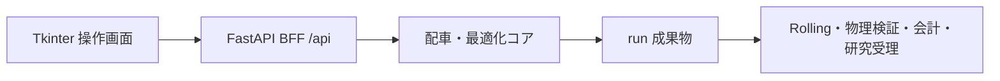

# master-course

## 2026-08-23 bounded M0--M3 protocol: small-scale only, execution pending

`scripts/audit_small_integrated_weather_milp.py --run-small-m0-m3` now creates
one explicitly bounded four-method comparison from the same deterministic
day-spanning subset: M0 is an all-ICE, no-PV/BESS exact-cost baseline; M1 is a
mixed BEV/ICE Phase-3 run with PV/BESS disabled at both asset and time-slot
layers; M2 is the existing mixed-fleet Phase-3 run; and M3 is the matching
mixed-fleet Phase-4 scalar actual-cost oracle. Only M2--M3 retains identical
fleet and energy assets and is therefore an algorithmic oracle comparison.
The emitted artifact is hard-labelled
`small_subset_only_not_full_264_trip_evidence`; M0/M1/M2/M3 deltas are not
full-network method effects, global-optimality evidence, or release readiness.
The protocol itself is committed and tested before any execution artifact is
cited below.

## 2026-08-23 current-SHA diesel-price diagnostic: active cost term, unchanged candidate dispatch

Frozen tag `phase3-diesel-sensitivity-b505c7a` ran the existing frontend/BFF
matrix at 116, 145, and 174 JPY/L from fresh Prepare inputs. The complete
bundle is `output/thesis_sensitivity_diesel_b505c7a_20260823_r1/` (manifest
SHA-256 `ad3380032e561435b2fcabb94aa8c4543232090abe5650b35705910e4a9a223f`).
All three cases share one non-varied-control fingerprint, serve 264/264 trips,
pass physical validation, 24/24 Rolling, accounting, input provenance, and
240/240 finalized-artifact verification. The fuel term is active: the same
436.508457-L ICE consumption yields final costs of 51,763.746062,
64,422.491318, and 77,081.236574 JPY, respectively. Each 29-JPY/L increase
changes cost by 12,658.745256 JPY, as the ledger requires.

The recorded time-limit incumbents retain 32 used vehicles and 48/216 BEV/ICE
trips at all three prices. Since every case misses the declared 1% Stage-1
gap (19.227307%), this is an active-coefficient and candidate-cost response
diagnostic, not evidence of an optimal dispatch response or an accepted
economic sensitivity result.

## 2026-08-23 current-SHA bounded integrated-oracle certificate

The existing isolated-process oracle CLI was rerun from clean commit
`e3fe904ba4afb6e2890aec7a7011e082f3aa20a0` using the fixed prepared input
`prepared-ee27696fc37f0c7a-f1e18f252e336f1f` (SHA-256
`639b6754cccd1aef7758454b56640f968b6b1c277ec32c1c142f53f670ade558`). The
certificate at `output/verification/small_integrated_oracle_scale/e3fe904_20260823/`
has status `VERIFIED_BOUNDED_SMALL_INSTANCES`: Phase 4 reached `optimal` with
zero gap at 8, 12, 24, and 40 trips, and Phase 3 completed each paired case.
At 24 and 40 trips the Phase-3-minus-integrated cost is zero within numerical
tolerance; 8 and 12 trips have a numerically zero reference cost, so their
relative ApproxGap is correctly reported as not identifiable. This is bounded
formulation/approximation evidence only—not a 264-trip global-optimality,
runtime, sensitivity, or full M0--M3 claim.

## 2026-08-23 Phase-3 certified-gap status

Stage 1 now computes two independent weather-aware analytical cost floors. In
addition to the existing continuous powertrain path/source flow LP, it solves a
bounded, exact powertrain-path selector MIP. Only trip/powertrain assignment,
path start/end, and compatible chronological connections are integral; vehicle
identity, SOC, charger, and time-source coupling remain relaxed. An MIP result
is adopted only when Gurobi proves it optimal, so an unfinished diagnostic
cannot raise the certified lower bound. This is a lower-bound strengthening,
not a claim that Phase 3 is an integrated global total-cost optimum.

The same certificate now also retains the necessary fleet-count condition for
simultaneous service: for each powertrain and service instant, selected trips
cannot outnumber available vehicles of that powertrain. It remains a
relaxation—vehicle identity, deadhead occupancy, SOC, chargers, depot, and
energy-time coupling are still omitted—but it no longer permits simultaneous
BEV or ICE service beyond the actual powertrain fleet. These deterministic rows
and fleet counts are included in the certificate input hash and audit. Service
intervals use the canonical service-day convention, including trips that cross
wall-clock midnight; the lower-bound capacity condition therefore cannot omit
an overnight overlap. The fresh 264-trip clean-SHA diagnostic at
`output/2026-08-23/run_20260823_0538/` (commit `9a28677`) generated zero such
rows for the 35-BEV/25-ICE fleet, confirming that the corrected service-day
logic is inactive for this particular input. Its LP/MIP floors were
52,712.318101/52,724.471297 JPY, below the unchanged 52,749.163582-JPY Gurobi
bound; the incumbent and certified gap remained 65,305.688576 JPY and
19.227307%. Stage 2 had no feasible candidate. It is **DIAGNOSTIC, NOT USED
FOR RESEARCH CONCLUSIONS** and rejects this aggregate capacity condition as the
current gap-closing path.

Before any new 264-trip measurement, the same certificate was further
tightened with the exact aggregate consequence of the original Stage-1
fragment constraints: selected path starts for each powertrain cannot exceed
the available vehicle count multiplied by
`min(max_start_fragments_per_vehicle, covered_day_count * daily_fragment_limit)`.
This preserves the lower-bound contract because every full Stage-1 solution
satisfies both underlying per-vehicle limits. The capacity, per-vehicle limit,
and two new deterministic rows are in the certificate input hash and audits.
A focused sequential two-trip, one-BEV/one-ICE test with all connections
withheld proves that the free BEV cannot start both paths; LP/MIP both retain a
10-JPY lower bound. The fresh normal-BFF 264-trip artifact at
`output/2026-08-23/run_20260823_0555/` (clean commit `763c7ad`) materialized
the two rows with per-vehicle limit 3 and BEV/ICE capacities 105/75. Both
certificates proved optimal (LP 52,712.318101 JPY; MIP 52,724.471363 JPY),
but Gurobi's 52,749.163582-JPY bound, 65,305.688576-JPY incumbent, one
explored node, and 19.227307% certified gap were unchanged. Stage 2 had no
valid candidate, so Rolling was not started. It is **DIAGNOSTIC, NOT USED FOR
RESEARCH CONCLUSIONS** and rejects this aggregate start-capacity condition as
the current gap-closing path.

The clean-SHA 264-trip diagnostic at
`output/2026-08-23/run_20260823_0507/` (commit `93608f4`) proves that this
certificate is correct but insufficient for the current case: it solved in
0.637 seconds and raised the analytical floor from 52,712.318101 to
52,724.471363 JPY, while Gurobi's root bound was already 52,749.163582 JPY.
The certified gap therefore remained 19.227307%; Stage 2 time-limited without
a physical candidate. It is **DIAGNOSTIC, NOT USED FOR RESEARCH CONCLUSIONS**.

The frozen 30-JPY/kWh duration escalation at
`output/thesis_phase3_gap_escalation_f9b83ad_20260823_r1/` gave Stage 1 1650
seconds (rather than the prior approximately 405-second primary search) while
holding the model and formal controls fixed. It still ended at the same
19.227307% certified Stage-1 gap, with the same incumbent, bound, and one
explored node. It is a valid physical/accounting candidate but not an accepted
optimality or sensitivity result. Stage-1 Gurobi profiles are explicit and
saved in `solver_settings.json`. The frozen `bound_focus` diagnostic at
`output/thesis_phase3_bound_focus_8c37638_20260823_r1/` changed only
`MIPFocus=3` and aggressive presolve. It again completed the physical,
Rolling, accounting, provenance, and complete-successor gates, but ended at
the identical 19.227307% certified gap after 1,680.193 solver seconds. This
rules out the tested search-profile adjustment as a sufficient fix and is
diagnostic only, not a claimed model improvement or accepted sensitivity
result.

The frozen `explicit_root` diagnostic at
`output/thesis_phase3_explicit_root_dc759be_20260823_r1/` materialized the
same exact fragment-transition rows before the root LP. It added 1,243,440
rows (1,351,502 Stage-1 constraints total), but its 165-second primary search
never obtained a Gurobi root bound beyond 0.0; Stage 2 then time-limited and
no physical-schedule artifact was produced. It is **DIAGNOSTIC, NOT USED FOR
RESEARCH CONCLUSIONS** and rejects full explicit materialization as the next
certificate path.

The next pending diagnostic retains lazy enforcement for integer incumbents
but adds only violated instances of those same exact rows at fractional LP
nodes (`lazy_root_cuts`). It is not a model, performance, or gap-improvement
claim until a clean-SHA 264-trip artifact completes every acceptance gate.
The first `8181622` trial did not invoke its MIPNODE branch because the outer
Stage-1 callback forwarded only MIPSOL events; it is invalid for evaluating
this mode and was superseded by a dedicated callback-routing fix.

The next pending `lifted_root` diagnostic replaces neither the lazy exact
separator nor its integer contract: it adds compact forward/reverse aggregates
of the same forbidden pairs, using the existing maximum fragment counts. It
is an LP-strengthening hypothesis only until a clean-SHA 264-trip audit exists.

That `lifted_root` diagnostic at
`output/thesis_phase3_lifted_root_b484024_20260823_r1/` added 31,140 rows
(139,202 Stage-1 constraints total) but retained the identical 52,749.163582
JPY bound, 65,305.688576-JPY incumbent, and 19.227307% gap. It also exhausted
the short diagnostic budget before physical validation. It is **DIAGNOSTIC,
NOT USED FOR RESEARCH CONCLUSIONS**; fragment-boundary strengthening is not
the next certificate path.

The frozen `root_cut_focus` diagnostic at
`output/2026-08-23/run_20260823_0428/` used clean commit `5665102`, the same
prepared input, full successor network, seed, threads, 240-second budget, and
candidate policy; only `Cuts=3` was added to the prior bound-focused controls.
It retained the 52,749.163582-JPY bound, 65,305.688576-JPY primary incumbent,
19.227307% gap, and one explored node. Stage 2 produced no valid physical
candidate, so Rolling did not start. This is **DIAGNOSTIC, NOT USED FOR
RESEARCH CONCLUSIONS** and rejects the tested generic-cut control as a
certificate path.

An opt-in Stage-1 root-LP diagnostic now solves a separate continuous copy of
the completed model and records only aggregate fractional assignment and
vehicle-activation evidence. It never adds rows, changes bounds, supplies a
MIP start, or affects the production solve; a clean-SHA 264-trip diagnostic is
required before using it to select a structural tightening. Its request default
is 30 seconds and it is capped by the same Phase-3 wall-clock deadline, so the
diagnostic cannot overrun the declared Stage-1/Stage-2 budget.
The pure-ICE A/B harness also now forwards the complete Stage-1 diagnostic,
search-profile, and fragment-cut controls to its synchronous worker, so future
AB/BA runs cannot silently shift their positional arguments.

## 2026-08-23 electricity-price sensitivity status

The fresh three-point Phase-3 frontend/BFF bundle at
`output/thesis_sensitivity_electricity_19bb780_20260823_r1/` is diagnostic
only. At 24, 30, and 36 JPY/kWh, each run served 264/264 trips and passed
physical validation, 24-step Rolling, final accounting, provenance, and
complete-successor checks. Each also stopped with the same 19.227307%
certified Stage-1 MIP gap, above the 1% research threshold; none is an
accepted sensitivity or optimality result. The identical 64,422.491318-JPY
ledger values reflect 0.0-kWh grid import in these candidates, not a general
claim that electricity price is irrelevant.

## 2026-08-23 A/B verification status

The first bundle at
`output/diagnostics/pure_ice_aggregation_phase3_ab_81561d5_20260822/` remains
diagnostic because its effective Stage-1/Stage-2 limits differed. The corrected
clean-SHA bundle is
`output/diagnostics/pure_ice_aggregation_phase3_ab_817d938_20260823/`: AB/BA
isolated processes, five repetitions each, equal SHA/input/seed/threads and
explicit Stage 1=435 / Stage 2=30 seconds. All ten cases passed coverage,
physical validation, 24-step Rolling and final accounting with no fallback or
repair.

Its result is `PASS_STRUCTURAL_ONLY`: median variables fell from 762,906 to
520,173 and constraints from 108,062 to 82,035. It is not a speed or optimality
claim—median solver time increased from 465.531 to 480.192 seconds, and all
264-trip cases remain time-limited. The A/B CLI now requires explicit
`--stage1-time-limit-seconds` and `--stage2-time-limit-seconds` so an unfrozen
comparison fails before execution.

## 2026-08-23 current-SHA Phase-3 feasibility and fixed-plan stress checkpoint

The frozen tag `phase3-current-candidate-5ee35f7` produced a fresh 264-trip
normal-BFF candidate at `output/2026-08-23/run_20260823_0605/`. Its recorded
clean SHA is `5ee35f7`; input provenance, complete-successor scope, 264/264
coverage, physical validation, 24/24 hourly Rolling, executed-day accounting,
and all 240 finalized artifact hashes passed independent verification. The
authoritative final cost is 64,422.491318 JPY. The 19.227307% certified
Stage-1 gap remains above the requested 1%, so this is a physically feasible,
cost-accounted candidate—not an optimality result or a 264-trip integrated
global optimum.

Its same-SHA, no-reoptimization fixed-plan stress artifact is
`output/diagnostics/fixed_solution_stress_5ee35f7_20260823/`. Only initial
SOC minus five percentage points remained physically valid, with a zero JPY
delta; the other six prescribed stresses have explicit physical violations and
therefore null cost fields. This documents fixed-plan fragility honestly; it
does not clear the remaining economic sensitivity, M0--M3, or 1%-gap gates.

## 2026-08-23 electricity-price diagnostic: zero grid import means no observed response

The frozen `phase3-economic-sensitivity-43112a3` three-point frontend/BFF
tranche is stored in
`output/thesis_sensitivity_electricity_43112a3_20260823_r2/`. It reran fresh
Prepare and Phase-3/Rolling jobs at 24, 30, and 36 JPY/kWh while preserving one
non-varied-control fingerprint, clean SHA `43112a3`, the 264-trip scope, and
all declared solver controls. Every case served 264/264 trips and passed input,
physical, Rolling, accounting, and finalized-artifact checks, but each missed
the 1% certified-gap target (19.227307%).

All three recorded candidates have 0 kWh grid import, so their identical
64,422.491318-JPY cost is expected under this candidate's PV/BESS dispatch. It
is **not** evidence that electricity price has no effect, nor an accepted
economic sensitivity or optimality result. The manifest deliberately remains
`BLOCKED`; a price-sensitive, accepted case set and the remaining release gates
are still required.

## 2026-08-23 current-SHA M0--M3 comparison: comparable but not research-accepted

At frozen `phase3-method-comparison-406d02c`, explicit M1
(`phase1_charging_only`) and M3 (`phase4_integrated`) frontend/BFF runs shared
the same prepared-input ID and byte hash, clean SHA `406d02c`, 264-trip scope,
and solver controls. Both passed provenance and 240/240 artifact checks,
physical validation, and 24/24 Rolling. The M1 gap target passed; M3 finished
with a feasible incumbent but a 5.205591% certified gap after its 3,600-second
budget.

The fail-closed comparison at
`output/diagnostics/method_comparison_406d02c_20260823/comparison/` verifies
all input, phase, rule-baseline identity, and source-acceptance checks, but is
`BLOCKED` solely because both source gap targets are not met. Its recorded
M0/M1/M2/M3 day-ahead costs are diagnostic candidate values only—not a formal
method-effect or global-optimality conclusion.

## 2026-08-22 verification checkpoint

- The first fresh 264-trip Phase-3 A/B child at
  `output/diagnostics/pure_ice_aggregation_phase3_ab_64c4a5a_20260822/`
  completed the discrete solve, physical validation, Rolling, and accounting,
  but the parent correctly stopped before comparison publication. Its
  representation-audit counter considered only the then-supported
  single-fragment aggregate groups, so the valid multi-fragment discrete flow was
  falsely reported as absent. This partial bundle is `DIAGNOSTIC`, `NOT USED
  FOR RESEARCH CONCLUSIONS`; it is neither an A/B result nor evidence of
  aggregation performance. The audit counter and the exact layered
  multi-fragment aggregate/recovery regression are corrected on the subsequent
  commit; a new clean-SHA AB/BA x5 run was required at that point. It was
  subsequently completed by the authoritative 2026-08-23 bundle above.

- A clean-SHA 264-trip Phase-3 baseline at
  `output/2026-08-22/run_20260822_2125/` passed coverage, independent
  physical validation, 24/24 Rolling, and final accounting. Its authoritative
  final cost is 64,422.491318 JPY from
  `rolling_hourly_chain/executed_day_accounting.json`; Stage 1 stopped at a
  19.227307% certified gap, so this is not an optimality claim.
- Same-SHA fixed-decision stress results are at
  `output/diagnostics/fixed_solution_stress_a497166_20260822/`. The evaluator
  performs no reoptimization and leaves costs null whenever the unchanged
  plan fails physical/PV validation.
- The bounded 8/12/24/40-trip integrated-oracle certificate at
  `output/verification/small_integrated_oracle_scale/0e9413c/` was regenerated
  at clean commit `0e9413c`: all four Phase-4 cases are exact (`optimal`, zero
  solver gap) and Phase 3 is complete. ApproxGap is zero within numerical
  tolerance for 24/40 trips; it is not identifiable at 8/12 trips because the
  exact reference cost is numerically zero. This is bounded small-scale
  evidence only. It does not establish a 264-trip global optimum, a full-scale
  1% gap, an economic response conclusion, or a full M0--M3 comparison.

## 2026-08-22 Phase-3 sensitivity-mode correction

- The full-scale thesis sensitivity matrix now explicitly submits
  `phase3_two_stage`, matching the method under evaluation. The bounded
  8/12/24-trip `phase4_integrated` runs remain a separate integrated-oracle
  reference only. A started 264-trip charger-capacity run was stopped before
  completion after its submitted request was found to force
  `phase4_integrated`; it is not an experimental result and is not used for
  research conclusions.
- The sensitivity audit now requires the solver artifact to confirm requested,
  resolved, and executed Phase 3. This prevents a Phase-4 result from being
  silently accepted as evidence about the deployed two-stage method.
- Each new frontend run's `optimization_parameters.json` now carries a
  machine-readable runtime-environment snapshot (Python, Gurobi/gurobipy, OS,
  logical CPU count, and RAM with its probe source), together with its existing
  frozen Git and canonical-input provenance.

## 2026-08-22 charger-capacity sensitivity contract

- The frontend/BFF thesis matrix now declares `CHARGER_COUNT_6`, `_8`, and
  `_10`. All three use the generated 90-kW single-port inventory and vary only
  its count; they are not comparisons against persisted charger IDs. The run
  audit fails closed unless the solver artifact reports the requested effective
  charger count, while the frozen Prepare request retains the source/power
  declaration.
- The first corrected `CHARGER_COUNT_6` Phase-3 attempt reached feasible
  Stage 1, optimal Stage 2, and accepted Rolling, but its final artifact gate
  incorrectly required a composition-search certificate although that optional
  search was disabled. It therefore ended `failed` and is retained only as a
  diagnostic bundle at
  `output/thesis_sensitivity_charger_capacity_20260822_8044ab8/`; it is not a
  charger-capacity result. The artifact gate now requires that certificate
  only when the solver records the search as enabled. A fresh frozen-commit
  run is still required for all three counts.
- The replacement 6-port run at clean SHA
  `359cd3617206ac1d3e2ae9ff849c72e0697dffdc` completed its artifact contract,
  264/264 coverage, independent physical validation, and accepted 24-hour
  Rolling/accounting. Stage 1 ended at its limit with a 19.227307% certified
  gap, so it is a feasible-candidate diagnostic only—not an accepted
  charger-capacity sensitivity result. The 8/10-port cases remain unrun.

## Historical 2026-08-22 Phase-3 aggregation A/B status correction

- The archived repeated pure-ICE aggregation A/B bundle was submitted in
  `phase4_integrated` mode. Its structural measurements remain historical
  Phase-4 diagnostics only; they do not meet the Phase-3 A/B gate and must not
  be cited as a result for the deployed two-stage method. A new same-SHA,
  Phase-3-only AB/BA experiment was required at the time.
- The reused A/B harness now compiles an auditable `phase3_two_stage` execution
  request from the frozen source request, removes only Phase-4-only flags, and
  rejects a child unless requested, resolved, and executed phases are all
  Phase 3. It records Stage-1 model size, solve/bound/gap/node telemetry and
  Phase-3 controls. The later replacement ten-run result is recorded in the
  current A/B verification status above.
- A fail-closed exact-clone aggregate network, including its layered
  multi-fragment reset flow, is now wired to Stage 1 only for the isolated A/B
  diagnostic override, with deterministic canonical-ID recovery before Stage
  2. Small one- and two-fragment Phase-3 parity tests pass. The required
  clean-SHA 264-trip AB/BA x5 measurement was subsequently completed; it
  cleared only the formulation-size claim, not a speed or release claim.

## Historical 2026-08-22 repeated same-SHA pure-ICE aggregation A/B result

At this point the Phase-3 A/B gate was blocked: the aggregate ICE-clone
formulation was then available only in the integrated Phase-4 builder, not in
the deployed Phase-3 Stage-1 model. A stopped partial Phase-3 attempt at
`output/diagnostics/pure_ice_aggregation_phase3_ab_c80fc26_20260822/` lacks
the required representation audit and is diagnostic only. It cannot support
a Phase-3 structural or runtime claim.

- The clean frozen commit `7ae60bef01cd6c30d7c82befcae28c3de692d2df`
  completed the required ten isolated child-process measurements in alternating
  AB/BA/AB/BA/AB order (five runs per representation). Every run used the
  same prepared-input SHA-256
  `aa101b4b95364929d2683776b03a4347f06fe7157a8a9ed7e31138968a9fd5f6`,
  seed 42, four threads, 900-second limit, and requested 1% gap.
- All ten cases served 264/264 trips, passed physical validation, 24/24
  Rolling and canonical accounting, and recorded no fallback or post-solve
  repair. The parent measured concurrent RSS across each complete child process
  tree. Gurobi does not expose a separate presolve time in this artifact, so
  that field remains explicitly unavailable rather than estimated.
- Median discrete versus aggregate results were 780,113 versus 536,180 total
  variables, 355,581 versus 233,579 constraints, and 80.547 versus 60.066 s
  complete model-build time. The identical median incumbent was 59,466.604450
  JPY and certified bound 56,086.529926 JPY (5.683988% gap). Aggregate median
  solver time was **slower**, 644.374 versus 624.566 s; median process-tree
  RSS was effectively unchanged (3.699 vs 3.699 GB).
- The authoritative bundle is
  `output/diagnostics/pure_ice_aggregation_ab_repeated_7ae60be/` and its
  verdict is `PASS_STRUCTURAL_ONLY`. It supports exact checked representation
  equivalence and formulation-size reduction only; it does **not** support a
  solver-speedup, 1%-gap, or 264-trip global-optimality claim.

## 2026-08-22 bounded integrated-oracle scale runner

- Corrected the small weather-oracle contract so a Phase-4 reference case is
  eligible only when `integrated_actual_cost_objective` was explicitly
  requested, its structural contract was applied, and canonical accounting
  confirms `objective_is_actual_cost=true`. The runner disables the Phase-3
  seed for the reference solve; Phase 3 remains the separately measured
  comparison method.
- The archived July 10-trip audits recorded
  `objective_is_actual_cost=false`. Their feasibility and accounting traces
  remain diagnostic history, but they no longer qualify as integrated
  actual-cost oracle evidence under the corrected fail-closed gate.
- Added `scripts/build_small_integrated_oracle_scale_certificate.py` to run
  8-, 12-, and 24-trip day-spanning cases in separate processes and publish
  exact eligibility, Phase-3 cost deviation, fleet/assignment comparisons,
  Git/input provenance, and artifact hashes. It refuses a dirty worktree and
  never upgrades bounded evidence to a 264-trip optimality claim.
- The oracle restores only the explicit PV-counterfactual/calendar contract
  already frozen in the prepared input. A non-empty conflicting current
  scenario value is rejected; neither the service date, timetable, nor PV
  curve is rewritten.
- Its Phase-4 reference clears the production `research_lexicographic_v1`
  preset and minimizes scalar canonical actual cost. Phase 3 retains its
  deployed two-stage policy and is compared by its final canonical accounting
  cost; a lexicographic vehicle-day policy is not mislabelled as a cost oracle.
- Approximate cost gap is reported as `(Phase 3 - Phase 4) / abs(Phase 4)`
  only when the exact Phase-4 cost exceeds the documented `1e-5 JPY`
  numerical tolerance. Zero-cost reference cases retain the raw cost delta but
  are labelled `not_identifiable_zero_reference_cost`; solver noise is never
  converted into a signed performance claim.
- The fresh clean-commit certificate at
  `output/verification/small_integrated_oracle_scale/242f35e/` verifies the
  8-, 12-, and 24-trip cases at `242f35e3698052d3e6e314ff8a377100b515e437`.
  Phase 4 is optimal with zero final gap for all three; the 24-trip approximate
  gap is `0.0` within tolerance, while 8 and 12 are correctly non-identifiable
  because both costs are numerically zero. This is bounded formulation
  evidence, not a 264-trip global-optimality or runtime claim.

## 2026-08-21 same-SHA pure ICE aggregation A/B diagnostic

- The historical one-pair bundle remains `PASS_STRUCTURAL_ONLY` for its own
  SHA only. The current CLI now schedules five AB/BA-alternating pairs (ten
  isolated child processes), records per-run input/solver controls, and has
  the parent measure maximum concurrent RSS across each child-process tree.
  It publishes run-level metrics plus median, Q1/Q3, minimum, and maximum
  summaries. The fresh clean-commit ten-run result is recorded above; no
  speedup conclusion is made because its median solver time regressed.

- Prompt A is complete at clean commit
  `a145cf3a8b9cba0e4d97c48f800fba9ff07a1e69`. The normal BFF path ran the
  same canonical 264-trip Phase-4 integrated request once with the labelled
  discrete ICE representation and once with the pure aggregate
  representation. Prepared input, request, objective, successor network,
  seed 42, four threads, 900-second limit, and requested 1% gap were fixed.
- Both cases served 264/264 trips with 17 ICE buses, returned the identical
  61,970.856672 JPY incumbent and 57,986.661708 JPY certified bound, and
  passed physical validation, 24/24 Rolling, accounting reconciliation, and
  fallback/repair exclusion. The certified gap was 6.429143% in both cases,
  so neither run met the requested 1% proof target.
- Pure aggregation reduced total variables by 31.27%, binaries by 31.43%,
  constraints by 34.31%, nonzeros by 40.03%, and complete model-build time by
  25.55%. It did not improve solve performance: total solver time increased
  from 476.701 to 517.938 seconds (+8.65%). The bounded verdict is therefore
  `PASS_STRUCTURAL_ONLY`, not a speedup or global-optimality claim.
- The authoritative diagnostic bundle is
  `output/diagnostics/pure_ice_aggregation_ab_a145cf3/`. Its seven recorded
  artifact hashes and the source prepared-input/request hashes were
  reverified, and the focused suite passes (`72 passed`). No decomposition,
  small integrated oracle, sensitivity sweep, M0--M3 comparison, or formal
  PV rerun was performed at this checkpoint.

## 2026-08-15 pure layered ICE-clone network

- Removed the remaining vehicle-labelled continuous assignment, connection,
  start, and end extension for a certified exact ICE-clone group. Trip coverage
  now consumes the binary group assignment directly; direct connections and
  canonical depot resets are represented only by the integral layered network.
  The complete successor network, route-band policy, startup feasibility,
  path count, fuel, CO2, fixed/vehicle-day cost, and objective coefficients are
  unchanged.
- Individual clone activation variables remain binary only to select a
  canonical prefix of IDs. The solved integral paths are decomposed onto that
  same prefix, so representation recovery changes no selected trip,
  connection, fragment, used-vehicle count, or cost. Phase-3 warm starts now
  seed aggregate/layer/reset variables directly instead of requiring removed
  label-flow variables. A certified group is selected only when the audit
  proves a strictly positive binary-variable reduction; small groups whose
  layered network would be no smaller remain on the original formulation.
- A one-trip exact comparison reduces the actual initial model from 398 to 300
  variables and from 58 to 55 binaries while matching the discrete objective,
  duty count, served trips, and recovered vehicle ID. Single- and two-fragment
  exact-clone tests pass; the integrated file passes (`68 passed`), the focused
  research/fragment/oracle/accounting set passes (`130 passed`), and the full
  regression passes (`1491 passed` in 153.92 seconds).
- Frozen run `output/2026-08-15/run_20260815_1155` from clean `94ce217`
  reduced the initial model to 536,180 variables and pre-optimize time to
  130.42 seconds. However, Gurobi time increased to 505.78 seconds and the
  certified gap remained 6.296823% (61,883.35 JPY incumbent versus
  57,986.66 JPY certified bound). Physical validation and 24/24 Rolling pass,
  but the 1% proof target does not. Research release remains `BLOCKED`; see
  `DEVELOPMENT_NOTES.md` for the controlled comparison and resume point.

## 2026-08-15 literature-checked layered ICE-clone aggregation

- The local literature folder was rechecked against the PDF tables rather than
  headline runtime claims. No16 solves a fixed vehicle schedule with 19,452
  variables in 1.5 seconds; No63 reports 44.5--1,058.9 seconds for fixed-
  schedule charging and 7.5--93.4 seconds for its Lagrangian/DP method. The
  closest joint assignment paper, No06, needs 617.6 seconds for only 50 trips
  and reports no Gurobi feasible solution for 200 or 418 trips within six
  hours; its 418-trip 202.3-second result is ALNS-SA. Therefore a
  hundreds-of-seconds target is reasonable only after formulation reduction
  or as an explicitly approximate mode, not by relabelling an uncertified
  full MILP incumbent.
- Extended the exact 25-ICE-clone convexification from one fragment to the
  actual one-day, at-most-three-fragment contract. A binary layered path
  network represents direct successor arcs within a fragment and canonical
  depot-reset arcs between fragments. Higher-layer starts require one valid
  reset predecessor, reset exits are one-to-one, and the number of layer-0
  roots is the exact used-vehicle count. Integral paths are recovered onto the
  unchanged canonical vehicle IDs; this is exact representation recovery, not
  post-solve repair.
- The fail-closed fuel certificate now multiplies the longest possible single-
  fragment fuel by the configured fragment count. For the saved 264-trip
  case, `3 * 46.036430 = 138.109290 L` remains below the 144 L usable initial
  inventory, and 10,829 canonical reset pairs are available. The projected
  reformulation relaxes 302,600 vehicle-label binaries and adds 70,067 group/
  layer binaries, a net reduction of 232,533 binary variables. Total variables
  increase because the label-flow extension remains continuous.
- The frozen-commit frontend/BFF measurement at `f1690c6` confirms the exact
  trade-off. Initial binaries fell from 739,728 to 507,194 and rows from
  355,581 to 286,282, but total variables rose from 780,113 to 848,980.
  Pre-optimization time was 165.812 seconds, the cost-stage solve was 474.744
  seconds, and the run retained the identical 61,883.346234 JPY incumbent,
  57,986.661708 JPY bound, 6.296823% gap and one explored node. Thus this
  extended formulation provides no measured proof-speed benefit. The next
  exact formulation must remove the continuous vehicle-label extension itself;
  a decomposition/heuristic mode must carry a separate approximation claim.
- Exact objective/path-count/two-fragment recovery, insufficient-fuel rejection,
  and complete two-fragment Phase-3-to-Phase-4 MIP-start regressions pass. A
  focused 128-test set and the full repository regression (`1491 passed` in
  160.65 seconds) pass. The fresh run served 264/264 trips and passed physical
  validation, 24/24 Rolling, accounting, and clean-SHA provenance. It remains
  `BLOCKED` solely because the declared 1% gap was not met. The source run is
  `output/2026-08-15/run_20260815_1109`; its immutable sensitivity bundle is
  `output/thesis_sensitivity_powertrain_low_pv_20260815_f1690c6_bev12_900s`.

## 2026-08-15 exact Phase-4 bound propagation and clone-duty symmetry

- A runtime audit of the first independent BEV-coefficient case found that
  the integrated model spent 2,814 seconds at one root node with Gurobi's raw
  best bound still at 0 JPY, although the independent certified cost floor was
  57,986.662 JPY. The model contained 678,600 connection binaries; 25 exact
  ICE clones formed the dominant vehicle-label symmetry group.
- Fixed a P1 termination bug: the certified `BestObjStop` threshold was
  installed only when the initial feasible solution already met the requested
  gap. It is now installed whenever the independent lower-bound certificate is
  valid, so a later qualifying incumbent can terminate immediately. This does
  not alter the objective, feasible region, or declared gap.
- The certified analytical floor is now the explicit lower bound of a
  continuous canonical-cost objective variable tied by equality to the
  unchanged accounting expression. This exposes the nonzero certified floor
  to Gurobi before the full root relaxation has been solved; invalid or blocked
  certificates continue to omit the proxy entirely.
- Exact-identical vehicles are ordered by non-increasing assigned-trip count
  and, when counts tie, by the sum of chronological assigned-trip ranks. Every
  unlabeled duty set can be relabelled into that order even with multiple
  fragments. A further first-trip tie order is enabled only when the model
  proves a one-start-per-vehicle limit; assignment/start/transition domain
  mismatches fail closed. The current 25-ICE group therefore receives 24
  rank-sum rows even though its maximum fragment count is 100.
- The rank-sum extension passes the full repository regression (`1487 passed`
  in 158.02 seconds). A clean-SHA matched diagnostic at `7fe44eb` confirmed
  that all 24 rank-sum rows were installed, in addition to 24 trip-count rows.
  The result, however, was unchanged at 61,883.346234 JPY and 6.296823% gap
  after one explored node. Reported solve time was 470.404 seconds versus
  467.776 seconds for the preceding `5d0a1c5` control; full runner wall time
  was 1,123.794 versus 1,122.977 seconds. This single matched pair supports no
  speedup claim and closes further row-only symmetry tuning for this case.
- These changes are formulation-equivalent performance repairs, not new
  numerical evidence. The full repository regression passes (`1487 passed` in
  155.40 seconds). The clean-commit diagnostic below measures their runtime and
  gap effects without upgrading the sensitivity case to an accepted result.
- A clean-SHA 900-second diagnostic at `5d0a1c5` now verifies the propagation
  repair. Gurobi's raw bound is 57,986.661708 JPY instead of 0 JPY, the same as
  the independent certificate, and `BestObjStop=58,572.385564 JPY` was active.
  The run still explored only one root node, retained the same 61,883.346234
  JPY incumbent and ended at a 6.296823% gap. The requested 900-second shared
  budget yielded 467.776 seconds of reported solve time and 1,122.977 seconds
  of complete frontend/Prepare/Rolling wall time.
- The stronger start-trip tie order correctly failed closed in this run because
  `max_start_fragments_per_vehicle=100`, so it added zero rows and cannot be
  credited for a speedup. The result proves accurate bound propagation, not a
  solved performance problem; reducing the 678,600 labelled connection
  binaries remains necessary.
- The follow-on `7fe44eb` run is stored at
  `output/2026-08-15/run_20260815_0948`, with immutable bundle
  `output/thesis_sensitivity_powertrain_low_pv_20260815_7fe44eb_bev12_900s`.
  It passed 264/264 coverage, physical validation, 24/24 Rolling and canonical
  accounting, but remains `BLOCKED` solely because the declared 1% gap was not
  met. Its equal outcome and timing are treated as a negative formulation
  experiment, not as accepted sensitivity evidence.
- Phase 4 now batches the four dominant vehicle-indexed unit-interval families
  (`assignment`, `connection`, `start`, and `end`) through Gurobi `addVars`.
  The all-binary research case therefore crosses the Python/Gurobi variable-
  creation boundary four times instead of once per variable. Certified exact-
  clone convexification still partitions each family by binary/continuous
  type, preserving every key, bound and variable type. The search profile now
  records the API-call count, variable count, family-build time and complete
  pre-optimization wall time. This is construction-only and does not alter the
  MILP. A frozen-SHA comparison at `10a6621` created 726,120 variables through
  four API calls in 1.749 seconds, but complete pre-optimization time improved
  only from a derived 168.230 seconds to a measured 166.509 seconds. Gurobi
  solve time increased from 470.404 to 474.988 seconds, with the same incumbent,
  bound, 6.296823% gap and one explored node. Complete runner wall time changed
  from 1,123.794 to 1,117.950 seconds. This single pair supports no end-to-end
  speedup claim; it shows that per-variable API calls were not the dominant
  blocker.
  Focused regression passes (`134 passed`) and the full repository regression
  passes (`1489 passed` in 164.85 seconds).
- The `10a6621` source run is `output/2026-08-15/run_20260815_1018`; its
  immutable bundle is
  `output/thesis_sensitivity_powertrain_low_pv_20260815_10a6621_bev12_900s`.
  All 264 trips, physical validation, 24/24 Rolling, accounting and clean-SHA
  provenance passed. It remains `BLOCKED` only by the declared 1% gap target.
  The next optimization change must address constraint construction and the
  labelled connection formulation itself, not add more row-only symmetry or
  Python variable-creation tuning.

## 2026-08-15 independent BEV/ICE coefficient sensitivity

- The former `trip_energy_sensitivity_scale` changes BEV kWh and ICE fuel
  liters together. It remains available as a backward-compatible common
  trip-demand calibration, but it cannot identify which powertrain
  coefficient caused a dispatch transition.
- Quick Setup and Prepare now expose two independent non-negative controls:
  `bev_trip_energy_sensitivity_scale` changes only BEV trip kWh, and
  `ice_trip_fuel_sensitivity_scale` changes only ICE trip liters. The
  canonical effective factors are
  `common_scale * bev_scale` and `common_scale * ice_scale`; both are stored
  in optimization metadata and trip-demand provenance.
- The thesis matrix adds five one-factor cases for each coefficient at
  0.8/0.9/1.0/1.1/1.2 while fixing the other powertrain factor at 1.0. The
  frontend/BFF runner audits the effective values, prepared trip structure,
  non-varied controls, physical schedule, Rolling accounting, Git SHA and
  artifact hashes before accepting a case.
- Prepared inputs now use
  `v11_powertrain_coefficient_sensitivity`. The experiment and execution
  contracts are `thesis_experiment_matrix_v6_economic_price_sensitivity` and
  `thesis_sensitivity_execution_v4_powertrain_coefficients`. Immutable v2/v3
  execution manifests remain auditable; unknown versions fail closed.
- The same matrix now declares economic one-factor families at flat grid
  prices 24/30/36 JPY/kWh and diesel prices 116/145/174 JPY/L. The execution
  audit verifies the effective marginal price in the canonical economic
  artifact and writes it to the results CSV. Non-varied-control fingerprints
  are compared within each declared family, so intentionally varied price,
  PV, demand, or vehicle-day controls cannot cause a false cross-family pass.
  The corrected three-point electricity tranche completed at clean
  `c4c2ef4aca3f6bb156da10dda68be78867ee23ce` in
  `output/thesis_sensitivity_electricity_low_pv_20260822_c4c2ef4/`. Its
  effective grid prices were exactly 24/30/36 JPY/kWh. All three cases are
  retained as physically valid diagnostics, not accepted economic-response
  evidence, because each ended at its time limit above the requested 1% MIP
  gap (5.099181%, 5.227442%, and 5.330183%).
- A first 24 JPY/kWh attempt correctly failed closed because its saved request
  still carried a 30 JPY/kWh explicit TOU band, which takes precedence over
  the flat-price field. Price-family requests now rewrite a *uniform* TOU band
  to the declared price and reject a non-uniform tariff rather than silently
  flattening it. The failed attempt is diagnostic only and is not used as a
  price-response result.
- In the corrected run, all cases served 264/264 trips and passed physical,
  Rolling, accounting, provenance, and effective-parameter checks. The
  24/30 JPY cases kept the same 78/186 BEV/ICE trip split and 12.528570 kWh
  grid import; the 36 JPY case had 76/188 trips and zero grid import. These
  incumbent observations are descriptive only: the MIP-gap gate prevents a
  conclusion about optimal economic dispatch response.
- This change adds execution support only. No independent 0.8--1.2 solve
  tranche has yet been completed at the current SHA, so thesis Phase 2 and
  research release remain `BLOCKED`.
- A first clean-commit low-PV smoke run at `b9e5234` varied only the BEV
  factor to 1.2. It served 264/264 trips with 74 BEV and 190 ICE trips, used
  15 BEVs and 17 ICE buses, passed physical validation and all 24 Rolling
  steps, and reconciled executed accounting. The case still failed the
  declared research gate: solver status was `time_limit`, certified gap was
  6.296823%, and total frontend-runner wall time was 3,824.702 seconds.
  This is a complete feasible diagnostic, not an accepted sensitivity point
  or evidence for an exact transition boundary.

## 2026-08-15 high-PV 600-second incumbent diagnostic

- A fresh frontend/BFF Day-ahead diagnostic at clean SHA `3353318` verified
  the v6 wall-time reserve. In 607.039 seconds of Phase 4 wall time it served
  264/264 trips, passed physical checks, and found 30 BEVs/2 ICE buses for
  231/33 trips at 650,390.859 JPY. The certified bound remained 640,000 JPY,
  so the 1% target was not met (1.597633%). This run is explicitly
  progress-only because it used the Day-ahead exploratory profile and did not
  execute Rolling.
- The v6 seed generated 7,305 suffix-exchange candidates, evaluated 57 total
  candidates, and selected a round-3 suffix exchange. This beats the prior
  v5 3,600-second high-PV incumbent by 9,315.999 JPY while using two more BEVs
  and two fewer ICE buses. It establishes that the former missing sunny-day
  BEV response was partly an incumbent-generation defect, not evidence that
  28 BEVs were optimal.
- All three executed suffix rounds strictly improved the validated canonical
  cost, but the production profile stopped at the configured three rounds.
  The unchanged 120-second seed-neighborhood budget is therefore reallocated
  from 75/45 seconds (fixed-duty/route-band) to 105/15 seconds and permits up
  to eight improving rounds. This is neutral cost-selected candidate
  generation only; no BEV lower bound, weather bias, objective change, or
  feasibility relaxation is introduced. Fresh evidence is required.
- The first 105/15-second rerun exposed the next bounded-search limiter rather
  than improving the result: it exhausted all 64 candidate evaluations after
  only two suffix rounds and returned 29 BEVs/3 ICE buses at 655,537.126 JPY
  (2.370137% gap). The total wall allowance stays 120 seconds, while the
  candidate ceiling is raised to 128. Under v6 this also reserves 32 candidate
  slots for path-changing search. The failed 64-candidate rerun remains
  diagnostic evidence and is not hidden or selected as the reported result.
- With the 128-candidate ceiling, a third clean-SHA 600-second diagnostic
  reached 31 BEVs/1 ICE bus and 248/16 trips at 649,936.120 JPY. This proves
  31/1 feasibility, but the 640,000 JPY cost lower bound still leaves a
  1.528784% gap. A separate minimum-ICE-fuel run found a 35.884956 L incumbent
  but exported no primary best bound under the previous Gurobi multi-objective
  call, so it could not prove that fuel was unavoidable.
- The EV-utilization policy path now uses explicit sequential scalar solves:
  minimize ICE fuel and persist its incumbent/bound; only if that primary
  optimum is certified is it fixed before minimizing canonical cost. A
  time-limit primary run no longer masquerades as a completed lexicographic
  result. The cost-minimization path is unchanged; fresh diagnostic evidence
  is required before using a fuel certificate to strengthen any cost bound.
- The first sequential rerun exposed a second issue in the warm-start boundary:
  its candidate audit contained physically feasible 32-BEV/0-ICE schedules,
  but the selector still chose the cheaper 31/1 schedule even for the explicit
  minimum-ICE-fuel policy. Policy runs now select a validated zero-ICE seed
  when available; unrestricted canonical-cost runs retain cost-ranked seed
  selection. A fresh rerun is still required before reporting the corrected
  policy result.
- Clean-SHA revalidation now confirms the correction: the explicit
  minimum-ICE-fuel policy serves 264/264 trips with 32 BEVs and 0 ICE buses,
  and certifies the primary objective at 0 L. Its reported 650,053.899 JPY
  all-BEV cost is still 117.778 JPY above the best validated 31/1 cost
  incumbent because the additional 183.387 kWh of grid energy costs slightly
  more than the avoided diesel under the 30 JPY/kWh tariff. This is policy
  evidence, not proof of the unrestricted cost optimum.

## 2026-08-15 formal pair timing result and reporting-contract repair

- A fresh formal frontend/BFF pair was executed from clean commit `79e61ae`.
  The low-PV case reached the predeclared 1% certified gap in 794.542 seconds
  of Phase 4 wall time (certified gap 0.420907%). The high-PV case used
  3,606.884 seconds and stopped at 2.987214%, so the current bottleneck is the
  high-PV lower bound/certification search rather than feasibility in every
  case.
- Both cases served 264/264 trips, passed independent physical validation,
  accepted 24/24 fixed-assignment Rolling steps, and reconciled executed-day
  accounting. High PV used 28 BEVs/4 ICE buses for 202/62 trips; low PV used
  15 BEVs/17 ICE buses for 75/189 trips. The pair is still `BLOCKED` because
  the high-PV gap exceeds 1%; these values are progress evidence, not a formal
  optimality claim.
- The pair runner incorrectly rejected the otherwise valid v5 seed controls
  because it still required retired Phase-3 candidate-order telemetry. It now
  validates either the legacy contract or the current bounded v5 neighborhood
  audit, including wall/candidate budgets, emitted evaluation counts, no
  weather bias, and consistency with the requested controls. Existing
  `79e61ae` artifacts are not relabelled after this code change; a fresh
  clean-commit run remains necessary for release.
- Timing interpretation and the local literature comparison are recorded in
  [the formal-pair timing note](docs/notes/LITERATURE_SOLVE_TIME_FORMAL_PAIR_20260815.md).
- Follow-up audit of the high-PV seed found that v5 reserved candidate count
  but not wall time: sequential whole-duty activation consumed the complete
  75-second fixed-duty window, so suffix exchange and powertrain swap each ran
  zero candidates. The v6 neighborhood now reserves both 16 candidate slots
  and 30 seconds of the existing 75-second budget for path-changing search.
  This changes only feasible MIP-start generation; it adds no runtime and does
  not alter the integrated objective, constraints, lower bound or gap gate.
  A clean frontend diagnostic/formal rerun is required before claiming an
  incumbent or timing improvement.

## 2026-08-15 literature-driven Phase 4 seed restart

- The local literature audit confirms that tens-to-hundreds of seconds are
  common for fixed-assignment energy dispatch, decomposition, and heuristic
  methods. The closest integrated large-instance comparison, No06, reports
  202.3 seconds for ALNS-SA on 418 trips, while its exact Gurobi model found no
  feasible solution for 200 and 418 trips within six hours. These timings are
  reported separately from exact-gap certification.
- A code audit found that the frontend's 64-candidate Phase 4 seed setting
  could consume every evaluation on direct and pairwise vehicle-ID
  replacement. Enabled suffix exchange, powertrain duty swap, sequential
  whole-duty activation, and route-band repartition could therefore be
  unreachable. The seed search now reserves explicit evaluation capacity for
  trip-chain neighborhoods, restarts whole-duty activation from each improved
  incumbent, and gives route-band repartition its documented separate wall
  and candidate budgets.
- This is candidate-generation only. It does not change the integrated MILP
  objective, feasible region, PV/BESS accounting, 1% acceptance target, or
  research guardrails. A reconstruction of the `8066330` low-PV seed reduced
  the validated canonical incumbent from 707,518.152327 JPY to
  697,433.686483 JPY in 32.179 seconds and improved the independent certified
  gap to 0.420907%. This replay is diagnostic evidence, not a fresh formal run;
  current-SHA frontend execution is still required.

## 2026-08-15 thesis Phase 0--7 completion audit

- `scripts/audit_thesis_model_phase_gates.py` now composes the existing
  frontend/BFF provenance, physical validation, accepted Rolling accounting,
  final cost reconciliation, artifact hashes, sensitivity manifests, M0--M3
  comparison, and equation/test evidence into one fail-closed Phase 0--7
  ledger. It never invokes a solver or upgrades the source artifacts.
- A phase is `COMPLETE` only when every declared local check passes and every
  preceding phase is already complete. Missing evidence remains `BLOCKED`;
  valid later evidence is `BLOCKED_BY_PREVIOUS_PHASE` until the earlier gate
  is cleared. Sensitivity and ablation artifacts must have valid payload
  hashes and the same frozen Git SHA as the reference run.
- Example for the 264-trip thesis scope:

  ```powershell
  .\.venv\Scripts\python.exe scripts\audit_thesis_model_phase_gates.py `
    --run-dir <accepted-frontend-run> `
    --expected-trip-count 264 `
    --sensitivity-manifest <sensitivity_execution_manifest.json> `
    --ablation-comparison <day_ahead_method_comparison.json>
  ```

- The existing `ac0115e` sunny/rain diagnostic pair remains blocked: it is
  day-ahead-only, nonformal, above the declared 1% gap, and lacks the required
  current-SHA Phase 1/2/4/5/6 evidence. The new ledger records those gaps; it
  does not relabel the pair as thesis-ready.
- The first clean current-SHA formal reference run at commit `8066330` is
  preserved under
  `output/formal_phase0_reference_8066330_low_pv/reference_low_pv`. It served
  264/264 trips, passed independent physical validation, accepted 24/24
  fixed-assignment Rolling steps, reconciled executed-day accounting, and
  verified 240/240 required artifacts. It remains Phase-0 `BLOCKED` because
  the certified gap was 1.094658% against the predeclared 1% target. This is a
  validated feasible candidate, not an optimality result.

## 2026-08-14 Phase 4 shared runtime budget and fresh diagnostic correction

- A fresh frontend/BFF diagnostic at clean SHA `102546170dc8a07fa91e0b71beaa8c71ca1ea327`
  showed that the displayed 600-second limit did not cap the complete Phase 4
  calculation. The same-problem Phase 3 seed consumed 607.320 wall seconds,
  including inventory-wide composition-model rebuilds, and the integrated
  solve then received a separate 600-second Gurobi limit and ran 601.350
  seconds. The canonical diagnostic is
  `output/2026-08-14/run_20260814_2056`; copied request/response evidence is
  under `output/perf_exact_clone_1025461_sunny_600s_20260814/sunny`.
- The frontend Phase 4 path now treats the user-entered time limit as one
  shared wall-clock budget covering the strict precheck, Phase 3 incumbent,
  integrated model construction, fixed-dispatch recourse preflight, and the
  unrestricted branch-and-bound search. The Phase 3 hand-off generates one
  neutral, independently verified physical incumbent. Inventory-wide adjacent
  composition search and the unused-BEV neighborhood remain available for
  explicit Phase 3 sensitivity work, but are no longer duplicated inside the
  integrated Phase 4 warm-start path. Phase 4 itself retains every feasible
  powertrain composition.
- The same fresh run also invalidated the earlier single-fragment performance
  estimate for exact ICE clone aggregation. The effective scenario permits
  three daily fragments and up to 100 start/end fragments per vehicle, so the
  aggregation correctly reported `applied=false`; the model remained at
  780,112 variables. It ended with a 650,298.979 JPY incumbent, 640,000 JPY
  certified bound, and 1.583730% gap. These are diagnostic values, not a
  speedup or a formal research result.
- A clean post-change diagnostic at SHA `6b090e4` confirmed the outer budget:
  HTTP submit-to-terminal time was 628.657 seconds, optimization wall time was
  604.204 seconds, and the audited overrun was 4.204 seconds. It also exposed
  an inner Phase-3 defect: the Stage-1 Gurobi limit was fixed before roughly
  60 seconds of Python model construction, so the 100-second seed still took
  142.769 seconds and left no Stage-2 candidate. Phase 4 consequently had no
  verified start, found no incumbent, and diagnostic fallback was correctly
  rejected when its SOC graph was empty. The inner Stage-1/Stage-2 limits now
  scale over the wall time remaining after model construction. Another clean
  run is required; research release remains blocked.

## 2026-08-14 exact vehicle-label symmetry reduction

- Phase 3 Stage 1 and Phase 4 now remove one exact source of branch-and-bound
  duplication: vehicles whose complete solver-relevant records, assignment
  domains, and transition-arc domains are identical are ordered by
  non-increasing assigned-trip count.
  This preserves at least one representative of every vehicle-identifier
  permutation orbit; it does not change tariffs, PV/BESS/SOC mathematics,
  fleet composition, trip coverage, or the accounting objective.
- A production-size upper-bound regression with two fully identical groups
  (35 BEVs, 25 ICE buses, 264 trips) adds zero variables and 58 adjacent-pair
  inequalities. In the historical high-PV artifact, the 35 BEVs have distinct
  initial SOC and are correctly not treated as symmetric; only the identical
  25-ICE group is eligible, implying 24 new rows. A group with unequal
  assignment or transition domains is skipped and reported rather than
  assumed symmetric. Warm starts are relabelled by trip count before
  submission.
- This is an exact formulation-strengthening candidate, not measured runtime
  evidence. The current high-PV run still lacks the declared 1% certificate;
  a clean frozen-commit matched diagnostic is required before claiming any
  speedup or using new results for research conclusions.

## 2026-08-14 literature runtime audit and turnaround optimization tranche

- The local literature PDFs confirm that tens-to-hundreds of seconds are
  common only after solver semantics are separated. The closest integrated
  comparison, No06, reports Gurobi at 617.6 seconds for 50 trips but no
  feasible Gurobi solution for 200 or 418 trips within six hours; its
  418-trip 202.3-second result is ALNS-SA, not an exact Gurobi certificate.
  No16's 275-trip 1.5-second result keeps bus assignments fixed and solves a
  19,452-variable charging/ESS problem. See
  `docs/notes/LITERATURE_SOLVE_TIME_COMPARISON_20260814.md` for the
  source-page comparison.
- The thesis experiment matrix now declares
  `TURNAROUND_BUFFER_5`, `TURNAROUND_BUFFER_10`, and
  `TURNAROUND_BUFFER_15`. Each case uses fresh Prepare and the normal
  frontend/BFF Phase-4 path; only the additive operational margin in
  `arrival + base_turnaround + buffer + deadhead <= next departure` changes.
- Unrelated sensitivity families explicitly preserve the current zero-buffer
  baseline. Effective `turnaround_buffer_min` is checked in the run bundle
  and exported to the sensitivity CSV. A hidden reset or stale prepared input
  therefore blocks acceptance rather than being reported as a matched case.
- This is execution-contract support, not runtime or optimality evidence. The
  three optimization cases and route-band ON/OFF pair remain unexecuted, and
  the high-PV 1% proof blocker remains open.

## 2026-08-14 trip-energy sensitivity provenance correction

- Clean frozen SHA `735527da7f117f5af894263dcdf4fe55e8226328`
  completed fresh frontend/BFF runs at 0.8, 0.9, 1.0, 1.1, and 1.2 times
  the declared trip-energy demand. All five reached finalized physical and
  Rolling-accounting artifacts without changing the worktree.
- The original execution manifest correctly stayed `BLOCKED`, but for two
  reasons: every solve missed the predeclared 1% MIP-gap target, and the
  supposed non-varied-control fingerprint included
  `required_soc_departure_percent`, which is itself derived from the varied
  energy demand. That second failure is a provenance-definition defect, not
  evidence that the timetable, fleet, chargers, tariff, or PV/BESS controls
  changed.
- Run-input provenance now labels the trip-structure hash explicitly and
  excludes all energy-derived fields, including the departure-SOC
  requirement. It also persists a compact hash of the 264 prepared trip rows.
  Legacy sensitivity runs may use that hash only after the complete prepared
  source file passes its stored size and SHA-256 checks.
- The five immutable prepared artifacts independently produce the same trip
  row hash, `1c382c9c3dc6eec41173c1c451d790a66ae41ffef5c4bd10d2caabc7826511f9`.
  Clean re-audit builder SHA
  `2a4da8b6ad48c8ffc297b784c616dabd83ba1281` now certifies the common
  non-varied-control fingerprint and every run-input, physical, Rolling,
  accounting, artifact, and executed-SOC gate. Re-audit payload SHA-256 is
  `b5736dec1edfd1ddb2c0b7861f2127b77dd6a74a2dc59375f3d88b73175a75e4`.
- Sensitivity re-audit now derives minimum BEV SOC only from the accepted
  Rolling execution chain: the active-fleet cyclic boundary at 00:00/24:00
  and the 23 persisted hourly state handoffs. Every source JSON is checked
  against `artifact_completeness.json`; day-ahead SOC CSVs are not mixed into
  this executed KPI.
- `scripts/build_trip_energy_sensitivity_reporting.py` fail-closes on a
  modified manifest, control/hash drift, any non-gap case failure, incomplete
  264-trip coverage, or invalid Rolling SOC evidence. From one signed snapshot
  it generates CSV/Markdown, an audited Excel workbook, and PNG/SVG figures
  for dispatch, executed KPI deltas, energy flows, solver quality, wall time,
  and minimum SOC. Gap-limited rows remain diagnostic.
- The observed gap-limited incumbents for demand scales 0.8/0.9/1.0/1.1/1.2
  assigned 105/91/91/77/77 BEV trips and 159/173/173/187/187 ICE trips.
  Executed cost was 43,887.59 / 50,635.72 / 58,318.00 / 64,864.89 /
  72,450.67 JPY; minimum executed BEV SOC was 27.566% / 27.086% /
  26.607% / 26.127% / 22.063%. Every case served 264/264 trips but missed
  the 1% gap target at 8.246% / 6.446% / 6.550% / 4.952% / 5.020%.
- Final audited progress bundle:
  `output/thesis_sensitivity_energy_low_pv_20260814_735527d/reaudit/8e98b34aa295a88f-2a4da8b/reporting/b5736dec1edfd1dd-d26a0f23d152`.
  Its reporting-manifest payload SHA-256 is
  `d7633210d18dc35519522e32cae3975adc0cfd2098c13212f315a3c36c37383d`;
  the Excel workbook SHA-256 is
  `e6e9661dc40801b50a0ecd79e4e3aad9ec365ff1fab7f9b3f0a72295db97d24f`.
  Status remains `DIAGNOSTIC_FEASIBLE_NOT_OPTIMALITY_CERTIFIED`.

## 2026-08-14 corrected time-discretization evidence

- Clean frozen SHA `88f76a9af79a8d46c1502a51ed03778ab99f20e9`
  completed fresh frontend/BFF runs for 60-, 30-, and 15-minute internal
  energy slots. Every case submitted, requested, and effectively used a
  60-minute Rolling advance; raw request provenance, effective controls,
  immutable artifact hashes, and the common-control fingerprint all match.
- All three served 264/264 trips, used 32 buses, assigned 91 BEV and 173 ICE
  trips, passed physical validation, and completed the accepted 24-step
  fixed-assignment Rolling accounting chain. Executed costs were 58,318.002,
  58,235.852, and 58,221.043 JPY for 60/30/15 minutes; grid imports were
  130.949, 128.255, and 127.770 kWh.
- The corrected evidence remains diagnostic. Each day-ahead solve reached
  3,600 seconds and missed the predeclared 1% target at certified gaps of
  6.550063%, 6.418238%, and 6.352187%. The small KPI changes therefore do not
  certify time-step convergence or global optimality.
- `scripts/build_time_discretization_reporting.py` now creates a fail-closed
  JSON/CSV/Markdown and PNG/SVG diagnostic bundle only after revalidating the
  source payload hash, common controls, physical/accounting gates, and the
  exact gap-only failure scope. It never upgrades these incumbents to thesis
  conclusions while the optimality gate remains unmet.
- Audited reporting bundle:
  `output/thesis_sensitivity_time_low_pv_20260814_corrected_88f76a9/reporting/5d58aca1284c4ddd-8c3307182c6b`.
  Its reporting-manifest SHA-256 is
  `58c9cebf6d771c7d5a809044768a8ce8306075e8c4c102e017aed6f6016781ba`;
  source-run SHA `88f76a9...` and clean report-builder SHA `8c33071...` are
  recorded separately.

## 2026-08-13 runtime-attested r7 feedback-budget evidence

- Frozen SHA `f46f1e821e6773f7f647dd130b28427bbb3df10d` completed the
  same frontend/BFF controlled-PV workflow with fresh Prepare, both Phase-4
  jobs, 24/24 Rolling, physical/accounting validation, pair finalization and
  progress-report ZIP. BFF PID 60504 matched the clean startup/current/frozen
  SHA throughout both solves.
- The accepted controlled comparison is numerically unchanged from r6. High
  PV uses 31/1 BEV/ICE buses for 248/16 trips at 650,234.729396 JPY and
  170.814257 kg-CO2. Low PV uses 21/11 buses for 91/173 trips at
  698,318.002033 JPY and 986.112082 kg-CO2. All 264 trips are served, and the
  two assignments differ on 173 vehicle-trip rows, including 157 trips whose
  powertrain changes.
- Low PV meets the 1% target at a certified 0.547009% gap. High PV remains a
  physically valid time-limited incumbent at 1.574005%, so the only formal
  failure remains `baseline_requested_mip_gap_certified`. Reporting output is
  `READY` with seven figures and six tables; formal research submission stays
  `BLOCKED`.
- The new route-band telemetry is complete. Sunny `渋23` used a funded
  33-second Stage 1 plus 9-second Stage 2 per pass under an 89-second shared
  limit, but Stage 1 found no incumbent, so Stage 2 is explicitly `not_run`
  and IIS feedback is not applicable. Low-PV `渋22` is Stage-2 `optimal` and
  again yields a full 26/6 candidate at 704,330.168664 JPY, correctly rejected
  as 6,012.166631 JPY above the selected 21/11 solution. Low-PV `渋23` also
  has no Stage-1 incumbent and records Stage 2 `not_run`. No run falsely
  claims that feedback fired or that an all-BEV composition is infeasible.
- Evidence directory:
  `output/formal_pair_20260813_route_band_feedback_budget_attested_v7_flat30_pv1000_bess6000_phase4_f46f1e8_gap01_r7`.
  ZIP size 20,612,441 bytes; SHA-256
  `EC05E786943500E6E032BE86841FEBC9E935E9FF790BC337FC8A4F318A765064`.

## 2026-08-13 runtime-attested r6 controlled-PV evidence

- Frozen SHA `ccfbbbb321cfe4a9150f0e135172e52ee9751a6b` completed fresh
  Prepare, both frontend/BFF Phase-4 jobs, 24/24 Rolling, physical and
  canonical accounting validation, pair finalization and the progress ZIP.
  BFF PID 50628 reported the same clean startup/current/frozen SHA before and
  after both solves, so this run closes the stale-runtime provenance defect.
- The controlled comparison is accepted. High PV (6,056.25 kWh) uses 31/1
  BEV/ICE buses for 248/16 trips and costs 650,234.729396 JPY. Low PV
  (996.20 kWh) uses 21/11 buses for 91/173 trips and costs
  698,318.002033 JPY. All 264 trips are served in both cases; non-PV controls
  match and no weather-specific assignment bias is present.
- Low PV meets the declared 1% threshold at a certified 0.547009% gap. High
  PV remains time-limited at 1.574005%, so formal research submission is still
  `BLOCKED` only by `baseline_requested_mip_gap_certified`. This is a valid
  controlled sensitivity result, not a claim that the sunny incumbent is a
  global optimum.
- The low-PV route-band search found and fully validated a distinct 26-BEV /
  6-ICE candidate, but its canonical cost was 704,330.168664 JPY, about
  6,012.166631 JPY above the selected 21/11 solution. This proves that the
  composition neighborhood is not frozen and that, at 30 JPY/kWh under low
  PV, simply adding BEVs is not economically preferred. The sunny search did
  not find an exact 32-BEV candidate; it did not certify such a composition
  infeasible.
- Evidence directory:
  `output/formal_pair_20260813_route_band_feedback_runtime_attested_v6_flat30_pv1000_bess6000_phase4_ccfbbbb_gap01_r6`.
  ZIP SHA-256:
  `5B4A7014EBD7162D0B06F18AB87BECED878F057439306827692475921239E5F0`.

## 2026-08-13 route-band feedback budget and audit correction (rerun pending)

- r6 exposed that declaring one feedback iteration did not reserve a complete
  second Stage-1/Stage-2 pass. For example, the sunny attempt allowed 44
  seconds for Stage 1 and 5 for Stage 2 under an 89-second shared deadline;
  it stopped after 48.091 seconds without auditable evidence of a retry.
- Each fair route-band allowance is now divided into equal solver passes for
  the initial solve and at most one proven-infeasible IIS retry. Five percent
  (at least one second) is reserved for model construction and IIS work, and
  Stage 2 receives at least 20% of each pass or the declared per-solve floor.
  The total route-band deadline is unchanged.
- Every attempt now exports the Stage-2 solver status, actual feedback
  iteration, IIS/no-good history, no-good count, pass count and overhead
  reserve. This affects only upper-bound candidate generation and evidence;
  it does not change tariffs, objective coefficients, the integrated feasible
  region or the formal gap rule. A fresh clean-commit pair is required before
  this new policy can supersede r6.

## 2026-08-13 BFF runtime-source attestation (r5 diagnostic only)

- The first post-`e321a3a` pair attempt reached a long-lived BFF process that
  had loaded the preceding solver implementation. The request-time Git check
  still observed the repository's new clean HEAD, so the output incorrectly
  recorded `e321a3a` even though its seed metadata matched v4 and omitted every
  new route-band feedback field. That r5 directory is retained as
  `DIAGNOSTIC` and is not evidence for the current solver.
- Formal preflight now freezes the BFF Git state at process startup and
  requires the startup SHA, repository root and clean state to match the
  current clean checkout. The worker repeats this check before and after the
  solve. Runtime PID, startup time and both SHAs are exported in the preflight,
  solver metadata and optimization audit.
- The controlled-pair runner calls this preflight immediately after `/health`
  and before Prepare. A server without the runtime-attestation fields, a stale
  process, or a SHA mismatch fails fast with an instruction to restart the
  BFF. This closes a provenance gap; it does not change the MILP, tariff,
  feasible region, incumbent, gap calculation or accounting equations.
- The fresh r6 above verifies the runtime attestation. Its route-band audit
  then exposed the retry-budget issue addressed by the subsequent change.

## 2026-08-13 route-band Stage-2 feedback correction (historical pre-r6 checkpoint)

- The v4 formal audit proved that the 90-second reduced route-band allowance
  stopped after one Stage-1/Stage-2 attempt. `stage2_feedback_max_iterations`
  was fixed at zero, so a Stage-2 IIS could not exclude the failed exact
  assignment and return to Stage 1 for a different all-BEV partition.
- The reduced candidate search now reserves half of each route band's fair
  wall-clock share for the first Stage 1 and keeps the remainder under the same
  hard deadline. One existing IIS-backed exact-assignment no-good feedback
  iteration is enabled. This is candidate generation only: it does not force
  BEV use or change the full Phase-4 feasible region, objective, tariffs, or
  acceptance criteria.
- A successful reduced retry must still preserve the exact trip set and used
  vehicle count, then pass the original full-problem fixed-assignment Stage 2,
  independent physical validation, and canonical accounting before it can
  become a warm start. The audit records the shared deadline, initial Stage-1
  allowance, and feedback limit.
- The lexicographic verified-start audit now records the canonical-cost field
  and the actual cost-cap row installed after the minimum vehicle-day level is
  certified. Earlier v4 artifacts incorrectly displayed this bound as
  ineligible/zero rows even though the cost-stage constraint was present.
- At this checkpoint, focused regression passed and a clean-commit 264-trip
  pair was still required. The runtime-attested r6 above now supersedes that
  evidence checkpoint; the high-PV 1% gap remains unresolved.

## 2026-08-13 historical sequential formal-pair evidence through v4

- Latest frozen pair `583dced3306f3e27b1de248605b70c51fc72e570`
  completed fresh Prepare, both Phase-4 jobs, 24/24 Rolling, independent
  physical/accounting validation, pair finalization, the progress bundle and
  ZIP export. The controlled-PV comparison is accepted: high PV uses 31/1
  BEV/ICE buses for 248/16 trips at 650,298.979262 JPY, while low PV uses 21/11
  for 91/173 trips at 698,318.002033 JPY. Non-PV controls match, PV differs by
  5,060.05 kWh, and 157 trip assignments change.
- Formal submission remains `BLOCKED` only because high PV stopped at a
  1.583730% certified canonical-cost gap against the declared 1% target. Low
  PV is physically valid and certified within the target at 0.547009%. Neither
  time-limited result is relabelled as a global optimum.
- The first route-band repartition implementation generated one high-PV and
  two low-PV all-BEV reduced Stage-1 candidates. All failed the original full
  fixed-assignment Stage 2. More importantly, these reduced solves ran before
  the proven fixed-duty neighborhood and consumed 60--102 of its 120 seconds;
  the high-PV incumbent regressed by 64.249866 JPY and its gap worsened by
  0.009725 percentage point. This is negative evidence, not an improvement.
- Clean frozen SHA `ad0d4f2c4c1acb10233516309c11a9a4c00b362d` now verifies
  that regression fix through the same frontend/BFF path. Fixed-duty
  replacement, matching, suffix, swap and identity search retains its full
  120-second budget and runs first. Route-band repartition then receives a
  separate audited 90-second budget, anchors on the cheapest independently
  validated incumbent, and must pass a reduced Stage 1 plus Stage 2 before it
  can reach the unchanged full-problem Stage 2, physical and accounting gates.
  The audit schema is v4 and the total declared Phase-4 solver budget is 4,710
  seconds.
- The v4 pair restores the high-PV incumbent to 650,234.729396 JPY, 31/1
  BEV/ICE buses and 248/16 trips. Its fixed-duty search evaluated 109 candidates
  in 120.17 seconds and recovered the prior powertrain-swap incumbent before
  route-band work began. The reduced high-PV route-band Stage 1/Stage 2 was
  locally infeasible and therefore never reached full-problem candidate
  evaluation. Low PV remains 698,318.002033 JPY, 21/11 buses and 91/173 trips;
  its two route-band groups were fairly budgeted and both failed local Stage 2.
- Pair acceptance, all physical/accounting gates and the progress bundle pass,
  but formal release remains `BLOCKED`: high PV still has a 1.574005% certified
  gap against the declared 1% target. The v4 change removes the candidate-search
  regression; it does not solve the remaining lower-bound/optimality gap.
- Latest evidence and report bundle:
  `output/formal_pair_20260813_route_band_v4_flat30_pv1000_bess6000_phase4_ad0d4f2_gap01_r4`.
- Clean frozen SHA `7cb1192cf6278e8854add16b58f04639a6656336` completed the
  ordinary frontend/BFF path for the controlled high/low-PV pair: fresh
  Prepare, Phase 4, 24/24 Rolling, physical validation, canonical executed-day
  accounting, pair finalization, small exact-oracle checks and the progress
  report bundle.
- Both cases fixed the 2025-08-05 `WEEKDAY` timetable, 264 trips, 60 active
  vehicles, ten chargers, 30 JPY/kWh grid energy, zero demand charge,
  1,000 kW rated PV and a 6,000 kWh / 900 kW BESS with 3,000 -> 3,000 kWh
  terminal inventory. The 1,000 kW manual rating is preserved and the
  capacity-to-area audit reports 14,285.714286 m2 as the inverse estimated
  depot area.
- High PV uses 31 BEVs / 1 ICE bus for 248/16 trips; low PV uses 21/11 for
  91/173 trips. Canonical Rolling totals are 650,234.729396 JPY and
  170.814257 kg-CO2 for high PV, versus 698,318.002033 JPY and
  986.112082 kg-CO2 for low PV. The controlled sensitivity comparison is
  accepted, so this run demonstrates a substantial PV-responsive assignment
  change without a weather-specific objective bias.
- Minimum vehicle-days are certified at 32 in both cases. Low PV meets the
  requested 1% canonical-cost gap using a valid independent lower bound
  (certified 0.547009%; Gurobi raw gap 8.351210%). High PV stops at a
  1.574005% canonical-cost gap and therefore fails the predeclared 1% gate.
  The pair remains `BLOCKED` for formal research submission solely on
  `baseline_requested_mip_gap_certified`; it is not a global-optimum claim.
- Post-run auditing fixed three evidence bugs for the next fresh run:
  lexicographic cost-level/accounting reconciliation is now explicit, the
  pair runner uses the service ID materialized by Prepare for its small
  oracle and fails closed on service-scope drift, and Rolling accounting now
  persists ICE fuel liters for canonical reports. These fixes do not relabel
  the frozen `7cb1192` artifacts; another clean-commit run is required to
  exercise the new schema.
- A second clean pair at SHA `698ef44622a50a1d5a06368aea6d7fc6914b1457`
  tested a weather-neutral incumbent-focused search profile. It reproduced the
  same high/low assignments, costs and certified gaps; high PV still spent
  3,600 seconds at one root node, while low-PV solve time increased to about
  323 seconds. The experiment did not improve evidence and the profile was
  reverted to the bound-certification controls.
- IIS review found a separate candidate-generation defect: the attempted
  32-BEV start copied one continuous 07:26--23:24, 16-trip ICE duty onto one
  unused BEV. That vehicle could receive only 90.64238 kWh before/during the
  path and missed its return-to-initial terminal target by 111.286315 kWh.
  The Phase-4 seed neighborhood now tries deterministic reciprocal duty-suffix
  exchanges within the permitted route band, validates both crossover arcs
  with the canonical turnaround/deadhead engine, activates an unused BEV, and
  sends every candidate through exact fixed-assignment Stage-2 recourse. It
  never changes weather weights, forces a BEV count, or reuses stale SOC/cost
  fields. Fresh clean-pair evidence is required before this can affect claims.
- Evidence directory:
  `output/formal_pair_20260813_sequential_lexgap_flat30_pv1000_bess6000_phase4_7cb1192_gap01`.
  Its `progress_report/` contains seven PNG/SVG figures, six CSV tables and a
  hashed evidence index.

## 2026-08-13 sequential lexicographic gap certification

- `research_lexicographic_v1` no longer relies on one Gurobi
  `setObjectiveN` call. A time-limited multi-objective solve did not expose a
  canonical-cost `ObjBound`/`MIPGap`, so a valid 264-trip incumbent could not
  certify the predeclared cost gap.
- Phase 4 now uses one shared wall-clock budget and solves the hierarchy as
  scalar stages. Under strict coverage it first proves the minimum used
  vehicle-days, fixes that integer value, and then minimizes canonical
  operating cost. Only this cost stage supplies the public raw/certified cost
  bound and gap. Deadhead distance and charge-session count are attempted only
  when the canonical cost is exact and enough shared time remains.
- A complete integrated fixed-dispatch recourse seed can certify the first
  stage without another solve when its used vehicle-days equal the independent
  strict path-cover lower bound. The seed's canonical cost is recorded
  separately; it is never mistaken for the vehicle-day objective.
- The formal pair gate requires
  `integrated_lexicographic_primary_certified=true` and scalar cost-stage
  objective/bound telemetry before accepting a cost-gap certificate. Failure
  at any earlier stage remains explicit and does not fall through to a false
  optimality claim.
- The change preserves the feasible region and cost coefficients but changes
  the optimization algorithm and evidence schema. Existing `e4ddd3f` results
  remain evidence only for that frozen SHA. A fresh clean-commit full pair is
  required before the new sequential certificate can affect release status.

## 2026-08-12 Rolling charge-session boundary correction

- A clean-SHA formal attempt at `6f645020f8473c42c15dce8d654bcc00d052615a`
  used fresh Prepare, 1,000 kW PV, a 6,000 kWh / 900 kW BESS,
  30 JPY/kWh energy and zero demand charge. The sunny Phase-4 day-ahead
  incumbent served 264/264 trips with 31 BEVs and 1 ICE bus, but the run is
  diagnostic only: the solver stopped at its declared time limit without the
  requested gap and Hourly Rolling failed at 06:00.
- The Rolling failure was traced to a receding-horizon boundary bug. A charge
  session spanning 05:00--07:00 paid setup time once in the 05:00 solve, then
  the 06:00 solve forgot that the session was already active and charged setup
  time again. This reduced the affected one-hour charging limit from 82.5 kW
  to 75 kW and made the fixed assignment infeasible.
- Hourly state now carries only vehicle IDs with positive charging in both the
  last executed and next planned slot. The next solve treats its first slot as
  a continuation for those vehicles, while ended or inactive sessions still
  pay normal setup time.
  Focused tests and a replay of the exact failed 06:00 state pass; a fresh
  clean-commit 24/24 Rolling pair is still required before any research claim.

### 2026-08-13 independent trip-demand validation correction

- The next clean-SHA frontend attempt at `624b42dcc5c40a07598000218d737a96569a5095`
  completed all 24 sunny Rolling steps. The previous 06:00 charging-session
  failure did not recur. The day-ahead result served 264/264 trips with
  31 BEVs and 1 ICE bus (248/16 trips), but the integrated solve reached its
  3,600-second limit without meeting the requested 1% gap.
- Finalization still failed closed because the independent event validator
  reconstructed service energy with the legacy vehicle-average kWh/km and
  L/km rates. The canonical input now uses trip-specific
  `literature_proxy_v1` quantities, so the validator incorrectly reported
  31 terminal-SOC and four lower-SOC violations even though every Rolling
  subproblem satisfied its canonical per-vehicle terminal target.
- Independent reconstruction now reads the materialized per-trip BEV and ICE
  demand from the canonical problem while remaining independent of solver SOC
  output. An exact diagnostic replay of the preserved sunny assignment and
  executed charging decisions reconstructs 588 physical events and 433 SOC
  events with zero violations. The failed artifact remains diagnostic; a new
  clean-commit sunny/low-PV pair is still required.

## 2026-08-10 all-BEV fuel-artifact correction

- Clean SHA `6853edae956c71c3c28ec285660a0f0b7c788e69` completed both
  day-ahead and 24/24 Rolling calculations for the fresh 1% controlled pair.
  The integrated final compositions are `32 BEV / 0 ICE` (sunny, 264 BEV
  trips, `644,741.923030 JPY`, certified gap `0.735476%`) and
  `21 BEV / 11 ICE` (rain, 91 BEV trips, `698,419.690050 JPY`, certified gap
  `0.399008%`). This confirms a large PV-driven response without a weather
  preference term or BEV quota.
- The sunny frontend job nevertheless failed at the last artifact gate because
  a valid all-BEV day has zero fuel rows and three declared fuel CSVs were
  emitted as zero-byte files. Zero fuel is valid data; a zero-byte file is not
  self-describing evidence. Canonical fuel ledger, fuel timeseries and fuel
  summary exports now retain their CSV headers when the relation is empty.
- The failed pair remains `BLOCKED` and is not formal pair evidence. A fresh
  clean-commit rerun is required because the reporting contract changed; the
  solver, cost equations, feasible region and sunny/rain decisions are
  unchanged by this export-only correction.

## 2026-08-10 bounded Phase-4 completion path (fresh formal run pending)

- Phase 4 now evaluates a bounded, weather-neutral fixed-assignment
  neighborhood after its Phase-3 seed.  It tries unused-BEV activation,
  BEV/ICE whole-duty swaps and BEV-identity exchanges; every candidate must
  pass exact Stage 2, independent physical validation and canonical
  accounting.  Only a strict actual-cost improvement becomes the integrated
  MIP start.  The largest feasible BEV count is reported separately and is
  never presented as an optimum or an infeasibility certificate.
- Replaying the last clean pair's plans through this code is diagnostic only,
  but it identifies the missing sunny incumbent: the unchanged 32 duty paths
  are feasible as `32 BEV / 0 ICE` at `644,741.923030 JPY`, versus
  `666,164.082366 JPY` for the old `27/5` plan.  In rain, 512 bounded candidates
  did not improve the `21/11`, `698,419.690050 JPY` incumbent; `30/2` was the
  highest observed feasible composition, not a proof that `31/1` or `32/0` is
  impossible.
- The independent analytical energy/fuel certificate now takes the stronger
  of the old per-trip floor and a continuous powertrain path/source-flow LP.
  The LP includes optimistic service, startup, connection and return energy,
  and constrains free PV/BESS/SOC credit to energy selected on electric paths.
  It still relaxes vehicle identity, path count, time, chargers and depot
  coupling, so it is a lower bound rather than a dispatch estimate.  Its exact
  coefficient set is SHA-256 fingerprinted in the result audit.
- On the prior pair inputs, the new diagnostic total lower bounds are
  `640,000.000000 JPY` sunny and `695,632.938124 JPY` rain.  Combined with the
  candidate costs above, the implied certified gaps are about `0.7355%` and
  `0.3990%`.  When a verified same-model start already meets the predeclared
  gap, Phase 4 sets Gurobi `BestObjStop` to accept that start without spending
  the remaining branch-and-bound budget; the feasible set and objective are
  unchanged.
- Endpoint away-from-depot implications already dominated by their trip
  activity row are omitted.  The measured full model retains all 776,752
  variables while reducing rows from 1,929,173 to 1,587,351.  This is an LP-
  dominance reduction, not the previously rejected weak aggregation.
- The controlled frontend runner keeps its historical 0.1% default and now
  accepts `--actual-cost-mip-gap 0.01` for a separately predeclared 1%
  release-candidate.  The historical 0.1% pair remains `BLOCKED`; none of the
  diagnostics above are formal new-code evidence.  A clean commit, fresh
  Prepare, both day-ahead runs, 24/24 Rolling, physical/accounting/provenance
  checks and pair-manifest validation are still required.

## 2026-08-10 final-composition clarity and Phase-4 search diagnostics

- The latest completed controlled pair does **not** use the same fleet mix in
  both weather cases.  Its final integrated incumbents are `27 BEV / 5 ICE`
  (sunny, 183 BEV trips) and `21 / 11` (rain, 91 BEV trips).  The repeatedly
  displayed `13 / 19` value is the Phase-3 Stage-1 primary seed candidate, not
  the selected Stage-2 seed and not the final Phase-4 solution.
- Result summaries now publish `final_used_powertrain_composition` separately
  from `stage1_primary_candidate_used_powertrain_composition`.  The Tk result
  labels use “final solution” and explicitly mark the Stage-1 value as not the
  final solution, preventing seed-search telemetry from being read as the
  optimized fleet composition.
- Sunny PV quantity is not the current boundary: the completed sunny incumbent
  imports zero grid electricity and curtails 3,606.64 kWh.  Above 27 BEVs, the
  unresolved issue is whether another BEV can satisfy its chronological duty,
  charging-window, charger and terminal-SOC constraints while retaining the
  32-bus fleet.  Failure of the two tested `28/4` assignments is not proof that
  every `28/4` assignment is infeasible.
- Stage-2 diagnostics now simulate each BEV path in chronological order and
  separate departure, minimum-SOC and terminal-SOC shortages.  A vehicle-local
  IIS cuts only that exact vehicle assignment pattern; an IIS containing a
  shared charger/site constraint or a variable bound conservatively cuts the
  full assignment.  This avoids both repeating a known-bad path and incorrectly
  excluding untested supersets.
- A first attempt to aggregate activity-blocking implications was rejected
  after the clean-SHA sunny run reached 93.1% of the Windows commit limit
  (85.8/92.1 GB).  Although integer-equivalent, that aggregate has a weaker LP
  relaxation than the individual `activity <= 1 - blocker` rows.  The strong
  individual formulation is restored; the aborted run is diagnostic only.
  Integrated runs still spill the MIP node tree after 0.5 GB to an OS
  temporary directory as a branch-and-bound memory guard.  A separate attempt
  to disable degenerate root moves was also rejected and is not retained.
- A second clean-SHA sunny diagnostic with the restored strong formulation
  reproduced the same `32/0` through `28/4` failed-candidate frontier, but the
  integrated fixed-dispatch recourse root then drove Windows commit to 96.4%.
  This localizes the memory spike before branch-tree growth, where node-file
  spill cannot help.  Both the recourse preflight and final integrated search
  now use dual simplex (`Method=1`, `NodeMethod=1`) to avoid automatic
  concurrent root-method model copies and a 32 GB `SoftMemLimit` to terminate
  gracefully with an auditable `memory_limit` status if the exact solve still
  exceeds its budget.  These controls change search mechanics only; they do
  not alter the feasible set, objective, tariff, PV curve or weather response.
- Formal release remains `BLOCKED` until a fresh clean-commit pair closes the
  requested 0.1% certified gaps and passes every physical, rolling, provenance
  and accounting gate.  These implementation changes do not relabel the
  existing SHA-`99a2035` artifacts.  The pre-run complete repository suite
  passed (`1248 passed in 65.46s`).  After restoring the strong formulation,
  the complete suite passed (`1247 passed in 55.79s`); after adding the exact
  root-memory controls it passes again (`1247 passed in 58.22s`).  A new clean
  commit is still required before another formal run.

## 2026-08-10 controlled pair after feasibility-witness cutoff

- Clean frozen SHA `99a2035694fd90fccf42fe8222a4f1d3b344e83e` completed
  fresh Prepare, Phase 4 actual-cost optimization and 24/24 Rolling for both
  cases at
  `output/formal_pair_20260809_flat30_pv1000_bess6000_phase4_witness_99a2035_gap001`.
  The bundle and ZIP preserve PV 1,000 kW, BESS 6,000 kWh, flat grid energy
  30 JPY/kWh, demand charge 0 JPY/kW and identical non-PV control hash
  `ebb5ddf8bf094c15f48c45e402b6825acb8b910235d936e940fd7a41e603c292`.
- Sunny uses `27 BEV / 5 ICE` and 183 / 81 trips at 666,164.082366 JPY;
  rain uses `21 / 11` and 91 / 173 trips at 698,419.690050 JPY. Both serve
  264/264, pass physical/SOC/accounting checks and 24/24 Rolling. The pair
  manifest accepts the controlled PV sensitivity.
- The cutoff works as intended: exact 25, 26 and 27-BEV targets now return
  their first witness in about 3.6 seconds. Exact `28/4` receives 47.8 seconds
  instead of 11.7, but finds no Stage-1 incumbent; its two complete
  constructive assignments are Stage-2 infeasible. This remains an unresolved
  composition boundary, not a proof that all `28/4` assignments are infeasible.
- Formal release remains `BLOCKED`: sunny certified gap is 3.927573% and rain
  is 2.387096%, both above the requested 0.1% (raw Gurobi gaps are 100%).
- Post-run audit found two evidence-output defects. The pair research table
  read only the Phase-3 certified-gap field, leaving the Phase-4 gap row blank;
  and Phase-4 internal Phase-3 candidates did not receive the diagnostics root,
  so failed `28/4` candidates exported no IIS/path files. The reporting path
  now prefers `certified_mip_gap_ratio`, and Phase 4 now enables candidate
  diagnostics without enabling recursive Phase-3 feedback. These post-run
  changes pass 35 focused regressions and the complete suite (`1242 passed in
  64.24s`), but do not relabel the SHA-99a2035 bundle as new-code evidence.

## 2026-08-09 exact-composition feasibility-witness cutoff

- The current controlled pair already shows the intended economic response:
  sunny uses `27 BEV / 5 ICE` and 183 BEV trips, while rain uses `21 / 11`
  and 91 BEV trips. The remaining sunny boundary is exact `28/4`, not a
  frozen-weather failure.
- Exact used-powertrain targets exist to recover one Stage-1-feasible witness
  for exact Stage 2 evaluation. They previously kept optimizing after finding
  that witness, so the easy `14/18` through `27/5` targets each consumed their
  full share and left only 11.696 seconds for the unresolved `28/4` target.
- Exact-composition searches now use Gurobi `SolutionLimit=1`. A found witness
  is passed to Stage 2 immediately and unused shared time remains available to
  harder adjacent targets. Targets with no incumbent continue until their
  allocated time limit or a genuine `INFEASIBLE` result, so IIS-backed
  composition certificates are not weakened.
- This is a weather-neutral search policy. It adds no BEV minimum, trip quota,
  sunny coefficient or objective bias; Stage 2 canonical actual cost still
  selects the final candidate. Focused regressions pass (`54`) and the full
  suite passes (`1240 passed in 56.27s`). Fresh clean-commit pair evidence is
  required before this search change is credited with a new result.

## 2026-08-09 controlled pair after adjacent continuation

- Clean SHA `32e3509cacd6309675bef2e850405e07483b24fb` completed fresh
  frontend Prepare, Phase 4 and 24/24 Rolling for both cases at
  `output/formal_pair_20260809_flat30_pv1000_bess6000_phase4_adjacent_32e3509_gap001`.
  All 264 trips, physical checks, terminal SOC, accounting reconciliation and
  non-PV pair controls pass.
- Sunny selects `27 BEV / 5 ICE` and 183 BEV trips at 666,164.082366 JPY;
  rain selects `21 / 11` and 91 BEV trips at 698,419.690050 JPY. The controlled
  pair manifest accepts the PV sensitivity: weather response is no longer
  frozen to one used-powertrain composition.
- Formal release remains `BLOCKED`. The independent certified gaps are
  3.927573% sunny and 2.387096% rain, both above the requested 0.1%; raw Gurobi
  gaps remain 100% with a zero raw bound.
- Post-run audit found that the pair runner labeled the raw integrated gap as
  `certified_gap`. The formal gate now reads `certified_mip_gap_ratio` while
  preserving raw-gap telemetry separately. This correction does not change
  the current pair's BLOCKED outcome and requires fresh evidence for its new
  commit.
- Focused regressions pass (`81`) and the complete suite passes (`1240 passed
  in 64.68s`).

## 2026-08-09 adjacent feasible-continuation seed search

- A fresh sunny frontend run from clean commit `beb13e3` exposed a regression
  in the exact-composition search order. Optimistic-cost ordering tried
  `32/0`, `31/1`, `30/2` and `29/3` first, spent about 60 solver seconds on
  each without an incumbent, then left only 10.156 seconds for the promising
  `28/4` target. The run therefore fell back to `27/5`; this is search-budget
  starvation, not evidence that `28/4` is physically or economically worse.
- Exact fleet mixes now walk outward from the primary feasible solution in
  symmetric distance order. Each BEV-increasing and BEV-decreasing direction
  reuses its last feasible adjacent composition as a MIP start, and the
  remaining enumeration time is shared equally across remaining targets.
  This ordering contains no weather or BEV preference.
- Optimistic constructive cost remains exported as diagnostic evidence but no
  longer orders exact target solves. Stage 2 still ranks every recovered
  candidate by canonical actual cost including diesel, grid, PV/BESS recourse
  and vehicle-day cost. The unrestricted integrated MILP remains the only
  global proof model.
- The interrupted `beb13e3` pair is diagnostic only; its rain case was stopped
  after the sunny defect was established. A clean commit, fresh Prepare and
  both formal runs are required before the release status can change from
  `BLOCKED`.
- Focused regressions pass (`80`) and the complete repository suite passes
  (`1239 passed in 59.56s`).

## 2026-08-09 verified-start cutoff and bound-search correction

- The clean frozen `96f17e10175d614d29f45ee79df95cf70ff4e6eb` pair at
  `output/formal_pair_20260809_flat30_pv1000_bess6000_phase4_constructive_96f17e1_gap001`
  completed fresh frontend Prepare, Phase 4 and 24/24 Rolling for sunny and
  rain. The pair control hash matches, only the PV hash differs, 264/264 trips
  are served in both cases, physical/accounting gates pass and pair manifest
  v2 accepts the controlled PV sensitivity. Formal readiness is still
  `BLOCKED`.
- The repaired candidate path evaluated 29 Stage 1/Stage 2 candidates per
  case. Complete 32-, 31-, 30-, 29- and 28-BEV dispatch starts reached exact
  Stage 2 instead of being discarded at the short Stage 1 time limit. Those
  particular high-BEV duties were Stage 2 infeasible; this is candidate-level
  evidence, not a proof that every assignment at the same composition is
  infeasible. Sunny selected 27 BEVs / 5 ICE buses and rain selected 21 / 11.
- Sunny cost is 666,164.082366 JPY with a 3.927573% certified gap; rain cost is
  698,419.690050 JPY with a 2.387096% certified gap. Both Gurobi raw gaps remain
  100% because the 776,752-variable / 1,929,173-constraint integrated model
  spends the 3,600-second search at the root node. These are validated feasible
  candidates, not certified global optima.
- The current correction feeds the independently feasible fixed-recourse seed
  objective back to the same canonical-cost-primary integrated model as an
  explicit upper bound. It
  also derives an integer-valid used-vehicle-day cap when every objective term
  is nonnegative. Both constraints preserve the seed and every improving
  solution; they add no BEV minimum or weather preference. A verified seed now
  uses a weather-neutral lower-bound search profile (`MIPFocus=3`,
  `Heuristics=0.01`, conservative presolve) instead of spending half of the
  search effort on incumbent heuristics after feasibility is already proven.
  Maximum-EV lexicographic and partial-service multiobjective cases are
  explicitly excluded and retain their separately declared policy contracts.
  A vehicle-day cap is also disabled when that cost component is disabled.
- Focused regressions pass (`41 passed`) and the complete repository suite
  passes (`1237 passed in 54.15s`). A clean commit and fresh pair are still
  required. The `96f17e1` outputs remain the authoritative completed pair for
  the previous solver and are not relabelled as evidence for this correction.

## 2026-08-09 complete composition-candidate rescue and gap certification

- Exact-composition search no longer discards a complete dispatch merely
  because its short target MILP ends without an incumbent. When a MIP start
  contains exact 264-trip coverage, unique predecessor/successor paths, valid
  start/end fragments and the requested used-powertrain count, it is retained
  as a **constructive dispatch candidate** only after the target solve returns
  no incumbent. It is not a Stage 1 solution or energy-feasibility claim.
- Every constructive candidate must still pass the unchanged Stage 2 SOC,
  charger, PV/BESS/grid recourse, canonical cost evaluation and independent
  physical checker before it can enter final cost selection. No BEV minimum,
  weather bias, fallback, post-solve repair, timetable rewrite or successor
  pruning is added.
- Candidate ordering now reports
  `candidate_priority_cost_ascending_then_candidate_hash`. Solver candidates
  use the weather-aware Stage 1 relaxed objective. Constructive candidates use
  a separately labelled dispatch-only lower bound when the nonnegative-term
  certificate is valid; Stage 2 actual canonical cost remains authoritative.
- Phase 4 now exports Gurobi raw bound/gap and an independent certified
  bound/gap separately. The certified bound is the maximum of Gurobi's bound
  and the existing integer-valid analytical objective floor. Raw telemetry is
  never overwritten. The formal gap gate can use the certified gap only when
  that floor is eligible and its provenance is recorded.
- The complete repository suite passed (`1233 passed in 54.29s`) before the
  `96f17e1` pair above. That pair proves the candidate-rescue behavior but did
  not meet the requested 0.1% certified gap.

## 2026-08-09 current PV-1000 controlled-pair result

- Clean frozen commit `93d122e1fc929d4833f2997560fa16cf7523e96d`
  completed fresh frontend Prepare, day-ahead Phase 4, and 24/24 Rolling for
  both cases at
  `output/formal_pair_20260809_flat30_pv1000_bess6000_phase4_pairhash_93d122e_gap001`.
  Both cases served 264/264 trips, used the same 60-vehicle/10-charger scope,
  flat 30 JPY/kWh energy, zero demand charge, a 1,000 kW PV rating, and a
  6,000 kWh BESS returning from 3,000 to 3,000 kWh. Only the separately hashed
  actual-day PV curve differed.
- Sunny generated 6,056.25 kWh and used 27 BEVs / 5 ICE buses for 183 / 81
  trips. Rain generated 996.2 kWh and used 21 / 11 for 91 / 173 trips. The
  controlled comparison is accepted and demonstrates a weather response
  without a hidden BEV or weather bias.
- Both integrated solves stopped at the 3,600-second limit with a 100% raw
  gap. They are physically valid, accounting-reconciled incumbents, not
  certified global optima. Formal research release remains `BLOCKED`.
- Pair-manifest schema v2 keeps these two statements separate:
  `accepted_for_controlled_pv_sensitivity_comparison` may be true for matched,
  physically valid incumbents, while `formal_research_submission_ready` is
  fail-closed unless both requested MIP-gap certificates are present.

## 2026-08-09 Phase 4 seed wall-budget correction

- Clean commit `bf3fc2907fe852b39aa303272287e2133bd628a9` was freshly
  prepared for the flat-30/no-demand/PV-1000/BESS-6000 pair. The sunny run at
  `output/2026-08-09/run_20260809_0608` is **DIAGNOSTIC ONLY**: Stage 1
  recovered feasible assignment incumbents from 7 through 27 used BEVs, but
  all 21 Stage 2 candidate rows were `not_run_feedback_budget_reserved`.
  Phase 4 consequently received no verified physical seed, found no incumbent
  in 3,600 seconds, served 0/264 trips and correctly blocked Rolling/release.
- The 600-second seed contract had been used simultaneously as a Gurobi solver
  budget and as a wall deadline. Rebuilding every exact-composition model is
  Python-side work excluded from Gurobi `TimeLimit`; on the full inventory it
  consumed the wall remainder reserved for Stage 2. The solver limits remain
  480 seconds for Stage 1 and 120 seconds for Stage 2. A separately reported,
  deterministic model-build allowance of 10 seconds per requested reachable
  alternative (maximum 600 seconds) now expands only the shared wall envelope.
- Stage 2 evaluates the unchanged candidate set in ascending weather-aware
  Stage 1 relaxed objective, with candidate hash as the deterministic tie
  break. This is not a BEV/weather policy preference: Stage 2 physical
  canonical cost remains the selection authority. The order and initial Stage
  2 budget are exported for audit, and the formal pair runner rejects missing
  or inconsistent solver/wall-budget records.
- The automatically started rain diagnostic was stopped after the deterministic
  seed-handoff defect was confirmed; code was not changed while either run was
  active. A fresh clean-commit pair is required after tests and commit.
- Focused Gurobi/Phase 4/BFF/runner regressions and the full repository suite
  pass (`1230 passed`). This validates code behavior only; it is not a formal
  pair result.

## 2026-08-09 Phase 4 composition-search regression diagnosis

- Clean commit `14bbcfa1ba97889674e113eae44bfa3ec71577e0` completed the
  fresh-Prepare controlled pair at
  `output/formal_pair_20260809_flat30_pv1000_bess6000_phase4_proof_14bbcfa_gap001`.
  Both cases served 264/264, passed independent physical validation and 24/24
  Rolling, and reconciled objective to executed accounting exactly. The pair
  is nevertheless `BLOCKED`: both integrated MILPs stopped after one node with
  a 100% raw gap and best bound zero.
- Sunny and rain both returned the same 16-BEV / 16-ICE, 58 / 206-trip
  incumbent at 704,401.909629 JPY. This is not evidence that the composition is
  optimal. Sunny generated 6,056.25 kWh and curtailed about 5,344.07 kWh. Rain
  still generated 996.2 kWh, enough to supply the selected assignment's
  650.493 kWh bus charging through PV/BESS with zero grid purchase. The weather
  difference therefore becomes economic only in the high-BEV compositions
  that this run failed to evaluate.
- The exact-composition seed divided 120 seconds across the complete inventory
  span, leaving only about 3.4--3.8 seconds per target. It found physically
  feasible 7--16 BEV compositions, while every 17--32 target ended unresolved
  at the time limit. Exact activation-prefix symmetry had coupled identifier
  order to duty replacement and forced economically poor duties into the BEV
  starts. The correction chooses duties by energy/cost suitability, then
  bijectively permutes only exact-identical vehicle IDs onto the prefix. This
  preserves the feasible set and all objective coefficients.
- The full model has about 776,752 variables and 1,929,173 constraints. The
  proof-focused `MIPFocus=3`, `Heuristics=0.01` profile neither improved the
  zero root bound nor repaired the weak seed. Phase 4 therefore returns to the
  weather-neutral incumbent-improvement profile (`MIPFocus=1`,
  `Heuristics=0.5`) while retaining the analytical lower-bound audit.
- A strict path-cover vehicle-day floor and an optimistic weather-energy/fuel
  floor are combined into an integer-valid objective lower-bound constraint.
  It is disabled fail-closed for partial service, non-total-cost objectives,
  negative objective terms, or a non-actual-cost model.
- Activation-prefix constraints remove only exact identifier-permutation
  symmetry among vehicles whose complete solver-relevant records are equal.
  Prefix normalization is an ID permutation after duty choice; it must never
  decide which duty is converted between powertrains.
- Interactive frontend runs use a fixed four Gurobi threads on this host. An
  eight-thread clean diagnostic exhausted the practical virtual-memory margin
  (about 58 GB private allocation with less than 1 GB remaining), so it was
  stopped and is not research evidence. The applied value is persisted and
  must match between controlled cases. These
  changes do not alter PV, tariff, fleet, timetable, SOC, charger, or
  accounting semantics and do not add a BEV/weather preference.
- The formal pair runner now requests and audits the same four-thread runtime
  contract, and Phase 4 carries its Phase 3 candidate/recourse evidence into
  the same-assignment audit instead of treating integrated output as if no seed
  alternatives existed.
- A fresh Prepare and clean frozen-commit sunny/rain rerun are still required.
  Formal release stays `BLOCKED` unless each run meets the requested 0.1% gap
  and all physical, Rolling, provenance, and accounting gates pass.

## 2026-08-08 weather response and inventory-scaled composition search

- Inventory-scaled exact-composition search never exports negative BEV/ICE
  counts. Non-negative targets outside the selected inventory remain explicit
  boundary evidence but are not solved, keeping large radii compatible with
  the strict pair-certificate validator.

- Clean commit `4cb571ade840d9147dd3c91d00718dfbdc531163` was run through
  fresh frontend Prepare for the controlled pair at
  `output/formal_pair_20260808_flat30_pv1000_bess6000_phase4_radius10_4cb571a_gap001`.
  Both cases fixed 264 trips, 60 selected vehicles, 10 chargers, flat
  30 JPY/kWh energy, zero demand charge, a 1,000 kW PV rating and a
  6,000 kWh / 3,000->3,000 kWh BESS. Only the separately hashed PV curve
  differed.
- Sunny used 23 BEVs / 9 ICE buses and served 121 / 143 trips at
  685,663.511395 JPY. Rain used 21 / 11 and served 91 / 173 trips at
  698,419.690050 JPY. Both served 264/264, passed independent physical
  validation and 24/24 Rolling, and reconciled solver objective to canonical
  accounting exactly. The pair is accepted for controlled PV sensitivity but
  remains `BLOCKED` for formal optimality because both full integrated models
  stopped at 100% gap after one node.
- The rain cost curve reached its minimum at 21 BEVs: all 996.2 kWh of PV was
  used and 124.985 kWh of grid-to-bus energy was purchased; 22 and 23 BEVs
  increased cost. Sunny used 1,563.002 kWh of its 6,056.25 kWh PV input with
  zero grid purchase, and cost continued falling through the radius-10 search
  boundary at 23 BEVs. This proves the prior identical 18-BEV result was a
  candidate-search failure, not evidence that sunny PV lacked economic value.
- A second boundary defect was therefore corrected: the internal Phase 4 seed
  no longer assumes that a solver-dependent primary composition can be covered
  by a fixed +/-10 radius. Candidate count and symmetric radius now scale from
  the selected available fleet (61 candidates and radius 60 for this 60-bus
  scope), while Stage 2 actual cost remains the selector. The formal runner
  rejects truncated inventory spans. No weather direction or BEV preference
  is added.

## 2026-08-08 Phase 4 accounting and formal-evidence correction

- The clean `b64bedb` controlled pair at
  `output/formal_pair_20260808_flat30_pv1000_bess6000_phase4_autosym_b64bedb_gap001`
  held flat 30 JPY/kWh, zero demand charge, 1,000 kW PV rating and a 6,000 kWh
  BESS fixed. Both cases returned the same 18-BEV / 14-ICE, 59 / 205-trip
  incumbent at 704,318.633649 JPY. This is not an economic optimum: both runs
  explored one node and stopped at 100% gap, while the earlier clean sunny
  run already contains a lower-cost 25-BEV incumbent. The selected 18-BEV
  dispatch consumes only about 714--716 kWh of PV input, so even rain's
  996.2 kWh PV curve is sufficient; sunny's remaining PV cannot affect a
  composition that the seed search never generated.
- The Phase 4 seed therefore expands its weather-neutral exact composition
  neighborhood from +/-5 to +/-10 vehicles (21 candidates including the
  primary). Stage 2 canonical cost still selects the hand-off; no weather or
  BEV preference enters the objective. The complete Phase 3 seed composition
  certificate is now propagated to Phase 4 instead of exporting an invalid
  empty artifact.
- The BFF cost bridge now preserves the engine's verified
  `objective_is_actual_cost`, accounting-match, and objective-semantics fields.
  Previously it discarded those fields before Rolling, causing a numerically
  exact Phase 4 result to be mislabeled as a proxy objective. The focused
  regression set passes 114 tests and the complete suite passes 1,220 tests.
- The controlled-pair runner's formal-control audit now checks the same
  21-candidate, radius-10 Phase 4 seed profile that the server actually runs;
  it no longer rejects a valid run against stale 10-candidate/radius-2 values.
- The corrected clean pair at
  `output/formal_pair_20260808_flat30_pv1000_bess6000_phase4_finalslot_b8793f3_gap001`
  confirms that integrated dispatch reacts to the 1,000 kW PV input: sunny
  uses 25 BEVs / 7 ICE buses (156 / 108 trips), while rain uses 15 BEVs /
  17 ICE buses (48 / 216 trips). Both serve 264/264 trips, pass the independent
  physical validator, and complete 24/24 Rolling. They remain non-optimal
  candidates because the requested 0.1% gap was not established.
- A formal-evidence audit found that Phase 4 applied the requested one-thread
  control but did not export it, discarded its measured solve time while
  constructing `solver_settings.json`, and was incorrectly required to emit a
  Stage-1 composition-search certificate. Phase 4 now exports its actual
  coupling/control metadata; a full-network integrated solve counts as fleet-
  composition evidence only after its requested global MIP gap is certified.
- BEV battery degradation no longer uses a hidden 50 JPY/cycle proxy. Solver,
  evaluator, and canonical ledger now share the scenario's
  `battery_degradation_cost_coeff_yen_per_kwh` throughput price. A disabled or
  zero-price component contributes exactly zero in all three paths.
- A clean-commit follow-up (`output/2026-08-08/run_20260808_1126`) verified the
  corrected zero degradation charge, exact solver/accounting reconciliation,
  one-thread control, solve-time export and integrated coupling metadata. It
  also exposed a search regression: using bound focus for the entire 3,600
  seconds retained the 15-BEV seed, explored one node and ended at 100% gap.
  The rain job was intentionally stopped before its long solve, so that
  directory is incomplete and is not pair evidence.
- A verified same-problem seed now keeps one uninterrupted, weather-neutral
  `MIPFocus=1, Heuristics=0.5` branch-and-bound search. Splitting the budget
  into two `optimize()` calls was rejected in review because a restart can
  discard the useful search tree and weaken the final bound. A subsequent
  clean sunny run showed that forcing `Symmetry=2` also regressed search: it
  spent heavy root-processing effort and returned 18 BEVs / 14 ICE buses,
  59 / 205 trips and 100% gap. Gurobi's automatic symmetry setting is therefore
  restored. The neutral Phase 3 seed still explores the primary composition
  plus both directions for deltas 1--10; Stage 2 actual cost selects the
  hand-off.
- Rolling finalization no longer hard-codes every day-ahead objective as
  non-actual-cost. Phase 3 remains false. Phase 4 is true only when its
  structural and numeric actual-cost contracts passed and the immutable solver
  objective still equals the accepted executed-day ledger within `1e-6 JPY`.
  The focused set passes `78 tests`; the complete suite passes `1218 tests`.
  Fresh clean-commit formal evidence is still required.

## 2026-08-08 Phase 4 final-slot and composition-resolution correction

- A fresh clean-commit diagnostic at
  `output/formal_pair_20260808_flat30_pv1000_bess6000_phase4_fullscope_223c9f1`
  used 264 trips, flat 30 JPY/kWh grid energy, zero demand charge,
  1,000 kW PV and a 6,000 kWh BESS. Rain produced a physically valid
  15-BEV / 17-ICE day-ahead incumbent and accepted 24/24 Rolling, but its raw
  gap was 100%. Sunny reacted strongly to PV and reached 25 BEVs / 7 ICE buses,
  but failed postsolve validation; neither value is an accepted optimum.
- Sunny exposed two final-slot defects. Charging eligibility was emitted only
  for SOC-transition slots 0--22, so slot 23 could charge during a trip. The
  terminal SOC expression also subtracted a whole trip after prior hourly
  shares had already been consumed. For the three late BEVs, the false surplus
  exactly matched the duplicated 22:00--23:00 shares: 3.127139, 5.003422 and
  7.192420 kWh.
- Charging eligibility now covers every slot, while SOC transitions retain
  their correct one-shorter range. Terminal/day-end SOC uses the same
  slot-overlap energy expression as the transition rows, so each trip-energy
  share is debited exactly once. Return-to-initial and no-charge-during-trip
  contracts are preserved, not relaxed.
- BESS terminal deviation evidence is now computed from the solved final SOC
  and configured target. The unpenalized auxiliary absolute-deviation variable
  is no longer treated as physical evidence.
- The formal Phase 4 actual-cost pair now requests a 0.1% MIP gap. At the
  observed approximately 673,000 JPY objective scale, the former 5% target
  allowed about 33,000 JPY of uncertainty--roughly the entire sunny ICE fuel
  term--and therefore could terminate before resolving the powertrain mix.
  A time limit that misses 0.1% remains a feasible candidate only and is never
  reported as an optimum.
- Focused final-slot, BESS, actual-cost and frontend-runner tests pass; the
  complete repository suite passes `1212 passed`, and compileall/diff-check
  pass. A new clean commit and fresh sunny/rain Prepare/run are still required
  before this correction can discharge the research blocker.

## 2026-08-08 Phase 4 full-scope diagnostic correction

- A non-formal 264-trip HTTP diagnostic at
  `output/2026-08-08/run_20260808_0601` now proves that the verified Phase 3
  dispatch has feasible recourse in the integrated model. The fixed-dispatch
  solve returned an incumbent in about 0.8 seconds and promoted all 776,752
  integrated variable values as a complete warm start.
- The prior recourse IIS was caused by a false coarse-slot conflict. Charging
  and refueling used `on <= 1 - sum(y)` across every trip touching a one-hour
  energy slot. Two sequential, non-overlapping trips in the same slot made the
  right-hand side negative even when no charging/refueling occurred. Phase 4
  now applies the no-replenishment implication separately to each assignment;
  physical trip-overlap and turnaround constraints remain unchanged.
- The integrated extractor now publishes the exact solver expressions used by
  the final-day BEV SOC constraints. Missing initial SOC, target constraints,
  or terminal expressions fail closed. The 264-trip diagnostic reports all 15
  used BEVs, return-to-initial acceptance, a maximum deviation of approximately
  `1e-6 kWh`, and zero independent physical violations.
- A time-limit result with a verified incumbent is classified as a physically
  valid, non-exact candidate. It is never relabeled optimal. A time limit
  without an incumbent remains invalid.
- This diagnostic used a dirty, non-formal tree and a one-second unrestricted
  Phase 4 budget. It is implementation evidence only. A fresh Prepare and
  clean frozen sunny/rain pair remain mandatory before any research result or
  weather comparison is accepted.

## 2026-08-08 Phase 4 integrated-recourse-certified warm start

- The first clean implementation run at commit
  `e071446cb346092719a3103e81026bcb02d82a21` exposed a stricter defect: both
  264-trip cases accepted the Phase 3 seed and wrote every advertised `Start`
  value, but the integrated model rejected that vector and reached 3,600
  seconds with zero incumbents. Therefore `Start` assignment is no longer
  treated as proof of an integrated feasible warm start.

- Frontend `phase4_integrated` runs now build a Phase 3 two-stage plan on the
  same in-memory canonical problem before starting the full integrated MILP.
  The plan is accepted only when it covers the exact trip set, Stage 2 is
  feasible, and the independent physical validator passes.
- The accepted plan is only a Phase 4 MIP start and upper bound. Phase 3 cost,
  gap, or composition is never returned as a Phase 4 result and never implies
  integrated optimality.
- Formal actual-cost Phase 4 does not inject the one-sided `used BEV >= K`
  frontier. Its seed uses the primary Phase 3 candidate plus symmetric
  adjacent-composition candidates; the final objective contains no hidden
  weather or BEV-direction preference. The frontend Phase 4 request uses a
  5% gap target so the first 13/19 seed cannot terminate immediately at the
  former 10% threshold.
- After the Phase 3 plan is checked, Phase 4 temporarily fixes only its
  assignment/path/vehicle-use decisions and solves charging, physical-charger
  occupancy, vehicle/BESS SOC, PV, BESS and grid recourse in the integrated
  model itself. Only a feasible result is promoted to a complete all-variable
  MIP start; original dispatch bounds are then restored before the unrestricted
  actual-cost search. An infeasible fixed-dispatch recourse exports IIS names,
  counts and a fingerprint and fails the formal hand-off gate.
- The formal solver-control record declares the 600-second seed budget, its
  480/120-second Stage 1/2 split, a 300-second integrated fixed-dispatch
  recourse preflight, the 3,600-second unrestricted integrated budget, and the
  4,500-second total maximum. These controls are included in the sunny/rain
  comparison hash; each case gate separately requires a feasible preflight.
- Formal evidence still requires a fresh Prepare and a clean frozen commit.
  A feasible incumbent is distinct from meeting the requested MIP gap; any
  time-limit result must publish its achieved gap without claiming global
  optimality. The recourse correction has focused-test evidence only until the
  next clean 264-trip HTTP pair completes.

## 2026-08-07 PV/BESS and optimization-control contract

- Solcast records are resampled by source/target interval overlap. Converting
  a 60-minute irradiance interval to 5/15/30-minute slots now preserves daily
  kWh instead of assigning the whole interval to only one shorter slot.
- `POST /api/scenarios/{scenario_id}/depot-assets/update` is a patch API.
  Omitted PV/BESS fields retain their saved values; explicit `pv_enabled=false`
  and `pv_generation_kwh_by_slot=[]` are honored. Changing rated PV output
  also updates the reverse area estimates and rescales a derived curve.
- PV dates, slot lengths, performance ratio, PV generation, BESS ratings, SOC
  bounds, and charge/discharge efficiencies are validated before Prepare or
  optimization. Invalid physical inputs are not replaced by hidden defaults.
- Demand charge is billed per depot meter. The objective and canonical
  accounting both use the sum of the on/off-peak demand maxima for each depot.
- The Tk solver settings expose `phase3_two_stage`, `phase4_integrated`, Stage
  1 composition/frontier controls, and the Phase 4 canonical actual-cost and
  EV-utilization controls. Quick Setup persists and reloads the same fields.

These corrections invalidate prepared inputs and optimization outputs created
before this change. Restart Tk/BFF and run a fresh Prepare. A passing code test
suite does not make a research result READY; formal runs still require a clean
frozen commit and every per-run/pair acceptance gate.

> 東急バスの BEV／ICE 混成車両を対象に、便割当、充電、PV、BESS、系統電力を一貫して評価する研究用最適化システムです。

[](https://www.python.org/)
[](https://fastapi.tiangolo.com/)


> [!IMPORTANT]
> **現在の研究公開ステータスは `BLOCKED` です。** 個別ジョブの完了、可行解、Rolling の受理、正式な研究受理は別の判定です。最新の判定理由と必要な証跡は、[研究リリースのブロッカー一覧](docs/notes/CURRENT_RESEARCH_RELEASE_BLOCKERS.md)を確認してください。

先行文献の報告計算時間と現行モデルの規模・gapを同じ軸で確認する場合は、
[先行文献と現行モデルの求解時間比較](docs/notes/LITERATURE_SOLVE_TIME_COMPARISON_20260814.md)
を参照してください。数百秒の文献結果について、固定配車の充電問題、分解法、
近似ヒューリスティクス、厳密MILPを区別しています。

同比較から、旧高PVモデルの 1,598,973 制約中 1,243,440 件が複数fragment間
の営業所リセット可否を全組合せで列挙した行だと判明しました。現行コードは
後続辺や物理制約を削らず、同じ整数可行領域を保つlazy constraint分離へ
置き換えています。callback異常時はsolveを失敗させ、cut数と再送回数を
`solver_settings.json`へ残します。SHA `885bacb` のfresh Prepare診断では、
変数780,112個を維持したまま制約を1,598,973本から355,533本へ削減し、
600秒時点で旧3600秒runと同じ目的値650,234.73円、下界640,000円、gap
1.574%を得ました。ただし時間上限、formal/diagnostic区分、入力fingerprint、
反復数が一致しないため、観測時間比を速度向上とは認証していません。比較の
正本は診断フォルダの`performance_comparison.json/csv/md`です。1%証明と
新しいcontrolled formal pairは引き続き未完了です。

Phase 3で固定配車のStage 2が`INFEASIBLE`となり、IISが得られた場合、現行
コードはその割当変数をPhase 4の非方向的branch priorityへ利用します。
Stage 2とPhase 4は別の数理定式化なので、Stage 2 IISだけからPhase 4の
hard cutは作りません。変数値のhint、目的関数bias、BEV/ICEの上下限制約も
追加せず、該当binaryを早く分岐する順序だけをGurobiへ渡します。
`TIME_LIMIT`やIISのない失敗はguidance対象外です。pattern数・hash、元候補
hash、対象変数数、priority、意味論は`solver_settings.json`と
`phase4_iis_assignment_guidance_audit.json`へ出力されます。目的関数と可行
領域は不変です。264便での時間・gap改善は、clean frozen commitからの
fresh runが完了するまで未認証です。

## まず、目的に合う入口を選ぶ

| やりたいこと | 最初に読む・実行するもの |
| --- | --- |
| 画面から通常の最適化を動かす | [最短で起動する](#最短で起動する) → [最初の最適化](#最初の最適化) |
| 研究用の正式実行をする | [正式研究実行の手順](docs/notes/FORMAL_RUNBOOK_CURRENT.md) と [ブロッカー一覧](docs/notes/CURRENT_RESEARCH_RELEASE_BLOCKERS.md) |
| モデルを教員・共同研究者に説明する | [教員レビューガイド](README_core_professor.md) |
| 日常運用、比較、障害対応を確認する | [運用ガイド](readme_operation.md) |
| 実装・検証・変更履歴を確認する | [開発ノート](DEVELOPMENT_NOTES.md) |

## このシステムでできること

- 時刻表と営業所・路線スコープから、車両ごとの便割当と回送を作成する。
- BEV の SOC、充電器、PV、BESS、系統電力、料金を制約として充電計画を評価する。
- 日初の計画に加え、1 時間ごとの Rolling 再最適化、物理スケジュール検証、実行日会計を成果物として残す。

現行ソルバには、二段階の **Phase 3** と、配車・充電・PV・BESS・系統購入を結合する **Phase 4** があります。Phase 3は大域的総費用最適解ではなく、Phase 4も現時点ではclean formal pairが未受理です。どちらも、成果物ごとの物理・会計・最適性・研究受理ゲートを越えて主張範囲を広げないでください。

## 現在の構成と扱い

| 項目 | 現在の扱い |
| --- | --- |
| 操作画面 | Tkinter + FastAPI BFF。`python run_app.py` が両方を起動します。 |
| API | FastAPI の `/api` 配下。起動後の対話的な仕様は `http://127.0.0.1:8000/docs` で確認できます。 |
| React / Tauri | まだ設計・受入基準の段階です。通常運用の手順としては扱いません。詳細は [frontend 移行仕様](docs/frontend/README.md)。 |
| 出力 | 現在の既定ルートは `output/`。各 run は通常 `output/<日付>/run_*` に保存されます。 |


```mermaid
flowchart LR
    UI[Tkinter 操作画面] --> BFF[FastAPI BFF /api]
    BFF --> CORE[配車・最適化コア]
    CORE --> ART[run 成果物]
    ART --> CHECK[Rolling・物理検証・会計・研究受理]
```

## 最短で起動する

### 前提

- Windows / PowerShell
- Python 3.11 以上（CI の検証対象は Python 3.11）
- MILP を実行する場合は、別途 Gurobi と有効なライセンス
- 利用対象の built dataset（画面のデータ状態で確認）

初回だけ、仮想環境と依存関係を準備します。

```powershell
py -3.11 -m venv .venv
.\.venv\Scripts\Activate.ps1
python -m pip install --upgrade pip
python -m pip install -r requirements.txt
```

MILP を使う環境では、Gurobi を導入・ライセンス設定したうえで `gurobipy` も追加します。

```powershell
python -m pip install gurobipy
python -c "import gurobipy as gp; m=gp.Model(); x=m.addVar(lb=0.0, name='x'); m.setObjective(x); m.optimize(); print('gurobi_ok', gp.gurobi.version())"
```

起動は次の一行です。FastAPI が起動可能になるのを待ってから Tkinter 画面を開き、画面を閉じると BFF も終了します。

```powershell
python run_app.py
```

API だけを起動して確認したい場合は、次を使います。

```powershell
python -m uvicorn bff.main:app --host 127.0.0.1 --port 8000
```

> [!NOTE]
> この checkout には配布済みの `.exe` は含まれていません。配布物を受け取っている場合は、その配布元の手順を優先してください。

## 最初の最適化

通常は、画面の案内どおり次の 4 ステップで十分です。

1. シナリオを選び、対象の運行日・営業所・路線を確認する。
2. `Quick Setup 保存` で選択内容を確定する。
3. 条件を変える必要がある場合だけ `ソルバー設定` を開く。
4. `高速実行` を押す。未 Prepare または stale のときは、画面が Prepare を先に実行してから最適化ジョブを開始します。

対象スコープ、便数、車両、充電器を実行前に明示確認したいときは、`Solver対応 Prepare` を個別に使います。Quick Setup やソルバー条件を変更した後は、必ず再 Prepare してください。

Quick Setup の数値入力では、`0` は「未入力」ではなく明示値です。たとえば、基本料金
`0 JPY/kW`、売電単価 `0 JPY/kWh`、乱数 seed `0` は、保存後の再読込と次回
Prepare でもそのまま保持されます。既定値が使われるのは項目が未設定 (`null`) の場合だけです。
入力範囲として無効な値は、別の既定値へ黙って置換せず、各入力・実行時の検証でエラーにします。

PV設備は、画面で保存した `pv_capacity_kw`（PV定格出力）を最適化入力の正本とします。
面積からの推定容量や、定格出力から逆算する必要設置面積・面積相当値は監査用の派生値であり、
保存済みの定格出力や実測営業所面積を黙って上書きしません。定格出力を変えた場合もfresh Prepareが必要です。

### 結果を正しく読む

| 表示・成果物 | 分かること | それだけでは分からないこと |
| --- | --- | --- |
| ジョブが `completed` | 非同期ジョブが終端状態になった | 可行性、物理妥当性、研究受理 |
| `solver_status=OPTIMAL` または `FEASIBLE` | 数理最適化が解を返した | Rolling、独立物理検証、正式な研究主張 |
| `rolling_execution.status=executed_and_accepted` | 保存された Rolling 連鎖が受理された | 比較対照の妥当性、研究公開の可否 |
| `teacher_release_status=READY` | 正式な研究リリースの全ゲートが通った | それ以上の一般化や統合大域最適性 |

画面の `Optimization結果` から run ディレクトリを確認してください。主な成果物は次のとおりです。

- `summary.json`: 実行・受理状態の要約
- `experiment_report.md`: 読みやすい実験報告
- `results.xlsx`: 集計と照合用の表
- `rolling_hourly_chain/executed_day_accounting.json`: 受理済み Rolling の最終費用正本

`job completed` だけを成功や研究成果として扱わないでください。

## 研究用の正式実行

通常の試行計算と正式研究実行は意図的に分けています。試行計算は診断用であり、dirty な Git worktree でも動かせますが、成果物は研究公開 `BLOCKED` のままです。

正式実行では、少なくとも次を満たす必要があります。

1. clean な worktree と固定した Git SHA から開始する。
2. 運行日、時刻表、営業所・路線、車両、初期状態、充電器、BESS、料金、ソルバー条件を明示して Prepare する。
3. 日初計画、全時間帯の Rolling、独立物理検証、実行日会計、成果物照合をすべて通す。
4. PV 比較では、PV 曲線以外の対照条件をハッシュで一致させる。

具体的なコマンド、必須証跡、失敗時の表記は [正式研究実行の手順](docs/notes/FORMAL_RUNBOOK_CURRENT.md) を正本とします。最新の未解決事項は [研究リリースのブロッカー一覧](docs/notes/CURRENT_RESEARCH_RELEASE_BLOCKERS.md) で確認してください。

## よくある確認ポイント

### データが利用できない

まず画面または `GET /api/app/data-status` でデータ状態を確認してください。`BUILT_DATASET_REQUIRED` が出た場合は、データを推測で補わず、[運用ガイドのデータ復旧手順](readme_operation.md#no-module-named-tokyubus_gtfs)に従ってください。

### 503 またはジョブ待ちになる

BFF は同時に一つの実行しか受け付けません。前のジョブの終了を待つか、比較実行には [運用ガイド](readme_operation.md#1-ソルバーモード比較benchmark) の順次実行スクリプトを使ってください。

### `INFEASIBLE` になる

SOC、初期状態、車両台数、充電器・契約電力、回送接続、`allowPartialService` を確認し、条件を変えた後は Prepare からやり直してください。制約を緩めたり、時刻表を勝手に加工したりして解を作ることはしません。

## 関連資料

| 読者・用途 | 資料 |
| --- | --- |
| 日常操作・比較・トラブルシューティング | [運用ガイド](readme_operation.md) |
| 指導教員・共同研究者向けのモデル説明 | [教員レビューガイド](README_core_professor.md) |
| 定式化と実装状況 | [制約・目的関数の定式化](docs/constant/formulation.md) / [実装状況](docs/constant/implementation_status.md) |
| 車両セットを固定する研究契約 | [Scenario Fleet Contract](docs/model/SCENARIO_FLEET_CONTRACT.md) |
| 図表・生データの対応 | [Literature Figure Mapping](docs/model/LITERATURE_FIGURE_MAPPING.md) |
| React + FastAPI、その後の Tauri 移行 | [frontend 移行仕様](docs/frontend/README.md) |
| 実装の変更履歴・検証結果 | [開発ノート](DEVELOPMENT_NOTES.md) |

## リポジトリの見取り図

```text
run_app.py                  Tkinter + FastAPI をまとめて起動
tools/scenario_backup_tk.py 現行の操作画面
bff/                        FastAPI BFF と run の最終化
src/                        配車・最適化・検証のコア
data/                       入力データと built dataset
output/                     実行成果物（Git 管理外）
docs/                       研究・運用・移行の詳細資料
tests/                      回帰テスト
```

## 開発・検証

開発環境では `pytest` を追加してから、少なくとも次を実行してください。

```powershell
python -m pip install pytest
python -m compileall -q src bff scripts tools
python -m pytest -q -p no:cacheprovider
```

README の入口とリンクだけを確認する軽量テストは次です。

```powershell
python -m pytest -q tests/test_readme_navigation.py
```

## Controlled PV comparison hashes

Sunny/rain controlled comparisons hash only controls declared before the
solve: timetable and fleet fingerprints, tariff and depot assets, solver time
limits, gap target, threads, random seed, and Phase 4 seed budgets/search
settings. Observed telemetry such as actual seed wall time and the seconds
remaining when Stage 2 starts is retained in each run audit, but is not part of
`comparison_control_hash`. Those values naturally vary between otherwise
identical cases and must never be treated as experimental-control differences.

研究計算の意味、制約、受理ゲートに影響する変更では、README だけで説明を完結させず、該当する runbook・開発ノート・ブロッカー資料も同時に更新してください。

## Latest controlled PV1000 evidence (2026-08-10)

> **Current-HEAD notice (2026-08-12):** the model now supports trip-level
> literature-proxy energy demand, explicit surplus-PV semantics, ODPT
> platform-family transition aliases, a lexicographic research objective, a
> CO2 epsilon cap, and SOC-dependent charging power with setup/teardown time.
> These changes alter the mathematical model and input fingerprints. The
> results below remain historical evidence for their recorded SHA and must not
> be presented as results of the revised model. See
> [the current blocker document](docs/notes/CURRENT_RESEARCH_RELEASE_BLOCKERS.md)
> before starting a fresh formal pair.

The new settings are available in Quick Setup and persist through Save,
reload, and Prepare:

- `trip_energy_model = literature_proxy_v1` and an explicit sensitivity scale;
- `pv_input_semantics = available_surplus_after_depot_load`;
- `objective_preset = research_lexicographic_v1`;
- `charging_power_model = piecewise_soc_taper_v1`, setup/teardown minutes, and
  minimum session duration;
- optional `co2_emissions_cap_kg` for Phase 4 epsilon-constraint cases.

The controlled-pair runner sends the same model contract explicitly. For the
Phase 4 actual-cost entry path it prepares `phase4_integrated`, the declared
3600-second/gap controls, `literature_proxy_v1`,
`research_lexicographic_v1`, `piecewise_soc_taper_v1`, and surplus-PV
semantics before submitting the job. Under the research preset, the solver
objective is a declared hierarchy (vehicle-days, canonical operating cost,
deadhead, then charge sessions); the reported accounting total remains the
canonical cost KPI and is not falsely labelled as the scalar solver objective.
Pair verification validates this declared objective/accounting relationship
and requires both cases to use the same objective preset; it does not demand
numerical equality between unlike mathematical quantities.

Generate the controlled sensitivity contract without running a solver:

```powershell
.\.venv\Scripts\python.exe scripts\build_thesis_experiment_matrix.py
```

Execute selected rows through the same HTTP Prepare/job-polling path as the
frontend by supplying complete frontend request templates. The runner removes
any old prepared ID and obtains a fresh one for every case:

```powershell
.\.venv\Scripts\python.exe scripts\run_thesis_sensitivity_matrix.py `
  --scenario-id <scenario-id> `
  --base-prepare-request <frontend_prepare_request.json> `
  --base-optimization-request <frontend_optimization_request.json> `
  --output-dir output/thesis_sensitivity_<frozen-sha> `
  --case-id TIME_60 --case-id TIME_30 --case-id TIME_15
```

Omit `--case-id` only when intentionally running the complete predeclared
matrix. `COMPLETED_SUBSET` is never promoted to a complete research matrix.
Each result is checked for clean frozen Git provenance, the declared effective
parameter, unpruned Phase 4 execution, requested MIP gap, physical validity,
accepted Rolling accounting, final artifact hashes, and unchanged non-varied
fleet/timetable/tariff controls.

`pv_scale` is a supply sensitivity: it multiplies the available PV energy
series after the saved rated output and capacity-factor curve are applied. It
does not rewrite `pv_capacity_kw`. Route-band OFF also sets
`allow_intra_depot_route_swap=true`; without that operational permission the
canonical scope lock correctly forces route-band ON.

The clean frozen commit `06ae09218be99ca47b951dcf6ddad886056b0ad6`
was run through the ordinary HTTP Prepare/optimization path with a common
2025-08-05 weekday service, 30 JPY/kWh energy charge, 0 JPY/kW demand charge,
1,000 kW PV rating, and 6,000 kWh BESS. The final Phase 4 incumbents used
27 BEVs/5 ICE buses in the high-PV case and 21 BEVs/11 ICE buses in the low-PV
case. The `13 BEV/19 ICE` value in the artifacts is the Phase 3 seed candidate,
not the final integrated assignment.

Both cases served 264/264 trips, completed 24/24 Rolling, passed physical and
accounting validation, and the pair passed the controlled-PV comparison
contract. They did not meet the requested 0.1% MILP gap (3.928% high PV and
2.387% low PV), so formal research submission remains `BLOCKED`.

High-PV output was not energy-limited: 6,056.25 kWh was generated and
3,606.64 kWh was curtailed. Candidate diagnostics for 28--32 BEVs instead
identify vehicle-local charging-window/terminal-SOC conflicts in the examined
assignments. These failed assignments are evidence about the observed
incumbent plateau, not a proof that every 28-BEV assignment is infeasible.

### 1% pair-audit compatibility fix (2026-08-10)

The controlled-pair runner now carries the explicitly predeclared
`--actual-cost-mip-gap` value into its post-run case audit. A run requested at
1% is therefore checked against 1%, not the historical 0.1% default. Claim
consistency is checked from `result_claim_classification` and solver settings;
generic successful frontend text such as `Optimization complete.` is accepted
when those structured fields agree. Explicit prose that contradicts a gap or
integrated-scope gate still fails closed. A fresh clean-commit pair remains
required after this reporting-only correction.

### Final PV1000 1% controlled pair (2026-08-10)

Clean frozen SHA `6bf6bd7eebec06dde1a899bebe5e02f3dc9fd62c`
completed the ordinary frontend HTTP path with fresh Prepare for both cases.
The high-PV case used 32 BEVs and 0 ICE buses for all 264 trips; the low-PV
case used 21 BEVs and 11 ICE buses for 91/173 trips. Certified gaps were
0.735476% and 0.399008%, both within the predeclared 1% target. Both cases
passed 264/264 coverage, 24/24 Rolling, physical/SOC, accounting, artifact,
tariff, Git-provenance, and solver-control gates. The pair manifest reports
controlled comparison accepted and formal research submission ready with no
failed checks.

The authoritative pair output is
`output/formal_pair_20260810_flat30_pv1000_bess6000_phase4_6bf6bd7_gap01`.
Standalone case summaries remain blocked only by
`controlled_counterfactual_pair_not_verified`, because they are finalized
before their counterpart exists. The immutable pair manifest is the
pair-scoped release attestation and discharges that single pending check.

### Revised-model PV1000 controlled pair (2026-08-13)

Clean frozen SHA `332b6af48260c89bc14a2ad2be67a0fd1d2f168e` was
executed through the same frontend/BFF Prepare, optimization, 24-hour Rolling,
validation, accounting and reporting path after the trip-specific energy and
Rolling session-boundary fixes. Both cases served 264/264 trips, passed the
independent physical checks, accepted 24/24 Rolling, reconciled the executed
day accounting, and generated the complete progress-report chart bundle.

The feasible high-PV incumbent used 31 BEVs and 1 ICE bus for 248/16 trips.
The low-PV incumbent used 21 BEVs and 11 ICE buses for 91/173 trips. Executed
day totals were 650,234.73 JPY and 698,318.00 JPY, respectively. This is clear
weather/PV response in the feasible incumbents, but it is not yet formal
optimality evidence: both integrated solves terminated at the time limit and
did not establish the requested 1% gap.

The pair audit also exposed a reporting/model-contract defect in that frozen
SHA. `objective_preset` was persisted in the canonical input but exported as
null in `assignment_economic_audit.json`, and the integrated adapter reset
objective 0 after installing the declared lexicographic hierarchy. Both are
fixed after the run. A bounded 10-trip, 15-minute diagnostic now reports
Gurobi `OPTIMAL`, a raw primary objective of two vehicle-days, a 40,000 JPY
secondary accounting cost, valid physical checks, and an accepted exact
oracle. The `332b6af` pair remains diagnostic evidence for its own SHA and
must not be relabelled.

The required post-fix run has now completed from clean frozen SHA
`e4ddd3f146975c34ac61e957385cd5a26daaca66`. Fresh Prepare and the ordinary
frontend/BFF path were used for both scenarios with the same 2025-08-05
weekday service, 30 JPY/kWh flat energy price, zero demand charge, 1,000 kW
saved PV rating, 6,000 kWh / 900 kW BESS, and 3,000 -> 3,000 kWh BESS SOC.
The reverse-derived PV fields were exported as 5,000 m2 installable panel area
and 14,285.714286 m2 estimated depot area.

The high-PV feasible incumbent used 31 BEVs / 1 ICE bus for 248/16 trips; the
low-PV incumbent used 21/11 for 91/173 trips. Both served 264/264 trips, passed
the independent physical checks, completed accepted 24/24 Rolling, reconciled
executed-day accounting, and passed the lexicographic objective-semantics and
used-powertrain-composition audits. The control hash matched, the PV hashes and
assignment hashes differed, and the pair manifest therefore accepts the result
for the scoped same-service-date PV-supply sensitivity comparison.

Formal research submission remains `BLOCKED`: both full Phase 4 solves ended at
the time limit without a certified gap, so neither incumbent may be called a
global or lexicographic optimum. The authoritative evidence is
`output/formal_pair_20260813_thesis_model_flat30_pv1000_bess6000_phase4_e4ddd3f_gap01_r2`
and its ZIP. The bundle contains seven PNG/SVG comparison figures, six source
tables, the immutable pair manifest, both complete run directories, and the
bounded exact-oracle audits. The 10-trip, 15-minute integrated oracle is
Gurobi `OPTIMAL` in both cases and confirms the repaired objective hierarchy;
it is formulation evidence, not a substitute for the missing full-run gap.
After this frozen run, current code also corrected the exported
`integrated_primary_objective_kind` label from `canonical_actual_cost` to
`minimum_used_vehicle_days_lexicographic`; the historical artifacts are left
unchanged and must be interpreted with their recorded objective hierarchy.

## Progress-report output for a controlled PV pair

`scripts/run_frontend_controlled_pv_pair.py` uses the same Prepare,
`run-optimization`, job-polling and finalized run directories as the frontend.
After both cases and the immutable pair audit finish, it also writes
`progress_report/` inside the pair directory. Start with:

- `progress_report/progress_report.md` for the progress-report narrative;
- `progress_report/00_progress_summary.png` for the one-page result summary;
- `progress_report/00_release_and_provenance.csv` for scenario, prepared input,
  job, source-run, frozen-SHA and case/pair claim identifiers;
- `progress_report/01_scenario_controls.csv` for matched controls including
  30 JPY/kWh, zero demand charge, 1,000 kW PV rating, reverse-calculated PV
  area fields and the 6,000 kWh BESS;
- `progress_report/02_outcome_kpis.csv` and
  `04_hourly_energy_comparison.csv` for analysis-ready result data;
- `progress_report/03_validation_gate_matrix.csv` for every exported case and
  pair gate;
- `progress_report/05_per_run_figure_catalog.csv` for the five detailed
  PNG/SVG/source-CSV figures already generated by each run; and
- `progress_report/evidence_index.json` plus `manifest.json` for file hashes,
  completeness and claim scope.

Seven pair figures are exported as both PNG and SVG: summary, powertrain
composition, energy flows, hourly profiles, cost breakdown, fuel/emissions,
and solver/acceptance evidence. The evidence ZIP includes this directory, both
canonical `results.xlsx` files and all underlying run artifacts. A complete
chart bundle does not by itself make a pair research-ready; cite
`pair/pair_manifest.json` for pair scope and each `research_claim_scope.json`
for standalone-case scope.

## Canonical reporting snapshot for a completed pair

`scripts/build_reporting_snapshot.py` is the read-only presentation-release
postprocessor for an already completed controlled pair. It does not call the
optimizer and does not rewrite either run. It uses:

- `graph/trip_assignment.csv` for final service-trip and used-vehicle counts;
- `rolling_hourly_chain/executed_day_accounting.json` for final energy, cost,
  emissions and terminal-energy results;
- `rolling_hourly_chain/hourly_energy_flow_chart.csv` for the published hourly
  energy and SOC series;
- `graph/physical_schedule_validation.json` for the final physical verdict;
- `solver_settings.json` and the effective values in
  `optimization_parameters.json` for solver controls and certificates; and
- the two case manifests plus `pair/pair_manifest.json` for controlled-pair
  identity and claim scope.

The command requires the Node executable and `node_modules` directory returned
by the workspace dependency loader because `results.xlsx` is authored with the
bundled spreadsheet runtime:

```powershell
.\.venv\Scripts\python.exe scripts\build_reporting_snapshot.py `
  <PAIR_DIR> `
  --node-executable <BUNDLED_NODE_EXE> `
  --node-modules-dir <BUNDLED_NODE_MODULES> `
  --workbook-preview-dir <VISUAL_QA_DIRECTORY>
```

After every gate passes, the script atomically writes `release/` and
`release.zip`. The release contains one `reporting_snapshot.json`, seven compact
JSON/CSV result/validation relations, a formula-audited `results.xlsx`, and six
PNG figures. Every public file records the same `reporting_snapshot_sha256`; the
snapshot also records the content hashes of both reporting generators. Custom
release and ZIP paths are accepted only as safe immediate children of the pair
directory.

Day-ahead energy-flow tables and the internal search objective (including any
return-leg search adjustment) are excluded from public final-cost KPIs.

The fixed public inventory is:

```text
release/
├─ reporting_snapshot.json
├─ result_summary.json
├─ comparison_pair_manifest.json
├─ validation_summary.json
├─ comparison_summary.csv
├─ vehicle_assignment.csv
├─ energy_balance.csv
├─ cost_breakdown.csv
├─ results.xlsx
└─ figures/
   ├─ cost_comparison.png
   ├─ dispatch_comparison.png
   ├─ energy_flow_baseline.png
   ├─ energy_flow_low_pv.png
   ├─ soc_baseline.png
   └─ soc_low_pv.png
```

The 2026-08-11 pair snapshot is under
`output/formal_pair_20260811_flat30_pv1000_bess6000_phase4_2632de9_gap01_progress/release/`.
Its derived release is `READY_FOR_PROGRESS_PRESENTATION`. The field
`research_submission_ready=false` means this compact presentation postprocessor
does not assess input realism; it does not downgrade or replace the immutable
pair-level formal attestation in `pair/pair_manifest.json`.

## Thesis validity audits after Prepare

Every newly prepared input now materializes three contracts in
`prepared_scope_audit.json` before a formal solve is allowed:

- the route-transition audit distinguishes a genuinely missing deadhead OD
  from insufficient turnaround/deadhead time, and recomputes a real
  route-band-OFF sensitivity by clearing both the solver lock and the saved
  intra-depot route-swap lock; and
- `turnaround_buffer_sensitivity_audit` holds route-band OFF and every other
  structural input fixed, then recomputes the relaxed connection path cover
  for additive 5, 10, and 15 minute operating buffers. Feasible connection
  counts must be nonincreasing, vehicle lower bounds nondecreasing, and
  interval-only pairs unchanged. The audit stores a SHA-256 of all held-fixed
  controls. The runtime rule is
  `arrival + base turnaround + operating buffer + deadhead <= next departure`;
  the buffer never replaces a stop-specific minimum turnaround; and
- `vehicle_trip_compatibility_audit` records every trip's allowed vehicle IDs
  and powertrains, the source of that permission, and a SHA-256 of the complete
  vehicle-by-trip matrix. An implicit “all selected powertrains may serve every
  trip” fallback blocks teacher release. Vehicle-specific restrictions within
  one powertrain also fail closed until the solver represents them without a
  powertrain-only projection.

For the current 264-trip Tsurumaki prepared scope, the corrected diagnostic
finds no missing deadhead OD in the route-band-OFF network. The relaxed vehicle
lower bound is 32 with route-band ON and 25 with route-band OFF, versus an
interval-only lower bound of 18. These are structural lower-bound diagnostics,
not optimized fleet counts; they show why the route-band policy must be
reported as an explicit operating assumption.

The scenario and Quick Setup APIs expose `defaultTurnaroundMin` and
`turnaroundBufferMin`; Prepare preserves saved values even when an older UI
payload omits these optional fields. Graph preview, ProblemData compatibility,
canonical MILP, and repair paths therefore use one connection-time contract.

`src/optimization/validation/small_exact_oracle.py` supplies an independent
all-ICE exhaustive oracle for strict one-day cases of at most ten trips. It is
used only in bounded tests, never as a formal-run shortcut. The four-trip
fixture verifies the integrated MILP assignment, per-vehicle fuel use,
canonical fuel cost, and CO2 ledger against complete enumeration. Unsupported
PV, BESS, electric-fleet, CO2-cost, or non-total-cost cases fail closed.
`src/optimization/validation/small_electric_oracle.py` adds the complementary
grid-only electric boundary audit. It completely enumerates assignment and
solves each fixed-assignment charging problem with independent SciPy/HiGHS
variables, rather than importing the production Gurobi formulation. Its
explicit scope is one depot/day, at most ten depot-to-depot trips, PV=0,
BESS=0, a flat tariff, constant-power charging, and BEV terminal SOC equal to
initial SOC. The fixtures certify the hand-calculated 23.9563 JPY/kWh
BEV/ICE break-even, charger-port shortage, terminal-SOC infeasibility, canonical
accounting, and agreement with the integrated MILP. Unsupported physics fail
closed and infeasible enumeration has a machine-readable certificate.
For a citeable bounded verification bundle, run the following from a clean
worktree after committing the implementation:

```powershell
python scripts/build_small_electric_oracle_certificate.py `
  --output-dir output/verification/small_electric_oracle/<RUN_LABEL>
```

The command writes a self-hashed JSON certificate, a compact CSV table,
advisor-facing Markdown, and a file-hash manifest. It compares the independent
enumeration/SciPy-HiGHS result with the canonical feasibility/accounting
checks and the integrated Gurobi model. Symmetric exchanges of otherwise
identical vehicle IDs are recorded separately from trip-powertrain and cost
agreement. The bundle is explicitly
`research_conclusion_eligible=false`: it verifies the bounded formulation and
does not replace a fresh frontend 264-trip run, positive-PV/BESS validation,
Rolling execution, or the declared full-model gap gate.
Both independent oracles also cap the complete Cartesian assignment space at
1,000,000 candidates (callers may request a lower cap but not a higher one).
They fail before enumeration when the bound would be exceeded; the ten-trip
limit alone is not treated as a sufficient runtime bound for a large fleet.
The current equation-to-code-to-test traceability table is maintained in
`docs/notes/THESIS_EQUATION_CODE_TEST_MAP.md`.

The thesis method comparison uses the names M0--M3. Every canonical frontend
day-ahead run now writes
`thesis_ablation/day_ahead_method_candidates.json` and `.csv`. M0 applies a
deterministic rule assignment plus arrival-immediate PV-then-grid charging;
M2 applies the same non-optimizing charging rule when the primary run includes
optimized dispatch. The solver settings UI exposes `phase1_charging_only` for
an explicit fixed-baseline-dispatch M1 run, and only a `phase4_integrated`
primary is labeled M3; Phase 2/3 results are never relabeled as integrated
optimization. The rule never uses BESS,
never repairs or reassigns an infeasible candidate, and records physical errors
instead. M1 still requires its own frontend job against the same prepared input;
the ordinary M3 job does not launch it silently. Switching between explicit
MILP Phase 1--4 modes keeps an existing `milp_exact` prepared input valid, while
changing to another solver profile still requires Prepare again.

Prepared inputs are immutable evidence. After a BFF restart, a matching
scenario/scope/schema ID is loaded from the saved JSON instead of being rebuilt
at the same path. An explicit repeated Prepare may rebuild in memory, but it
keeps the original file and byte SHA-256 when every solver-input field matches
(creation time is provenance metadata only). If any trip, vehicle, tariff,
PV/BESS, compatibility, or other canonical field differs under the same ID,
Prepare fails with `PREPARED_INPUT_ID_COLLISION`; it never overwrites the prior
artifact. This is required for an M1/M3 comparison to share both the prepared
ID and the exact source byte hash across an application restart. Current
schema `v11_powertrain_coefficient_sensitivity` inherits the selection-scope
and turnaround audit contract introduced by
`v10_turnaround_buffer_sensitivity`. It uses the same selection-scope hash in
the prepared ID and inside the payload; the derived `prepared_scope_audit` is
explicitly excluded from that selection hash. Older v7/v8 files from the
identity corrections and v9 files are preserved as historical artifacts and
are not reused as current input; v10 files likewise remain immutable history
after the independent coefficient fields were added. A failed route-band-OFF rebuild or invalid
5/10/15-minute monotonicity audit blocks teacher release instead of being
misread as zero missing deadhead pairs. Rolling comparison-case control hashes
also include route-band mode, base turnaround, operating buffer, and connection
semantics, so a PV-only pair cannot hide a transition-rule difference.

After both jobs finish, run:

```powershell
python scripts/build_thesis_ablation_comparison.py `
  --phase1-run <PHASE1_RUN_DIR> `
  --phase4-run <PHASE4_RUN_DIR> `
  --output-dir <COMPARISON_DIR>
```

The comparison is READY only when both source payload hashes, prepared input
ID and byte hash, canonical trips/vehicles/connections/chargers/tariff/PV/BESS/
baseline fingerprint, clean Git SHA, research input validation, source
acceptance, MIP-gap target, and M0 identity all agree. Otherwise it writes a
BLOCKED artifact with every failed check. Thus a single-run M0/M2/M3 file
remains a candidate diagnostic, not a complete four-method result or a
research-release shortcut.

Vehicle-day-cost sensitivity uses `scalar_total_cost_v1` in both the 0 and
20,000 JPY/used-bus-day cases. This is intentional: under
`research_lexicographic_v1`, vehicle days are already the higher-priority
objective, so changing their yen coefficient would not isolate the monetary
coefficient's effect. The sensitivity runner now fails closed unless the unit
cost reaches both the integrated model and executed accounting, the
`vehicle_usage_cost` component is enabled, the solver reports canonical cost
as its primary scalar objective, the semantics are
`fixed_vehicle_day_cost`, and
`vehicle_usage_cost_jpy = used_vehicle_day_count * unit_cost` within
`1e-6 JPY`. These fields are exported in the sensitivity CSV; a saved numeric
coefficient alone is not accepted as evidence that it affected optimization.

For a READY comparison, the same command also creates a versioned
`reporting/<comparison-payload-sha-prefix>-<builder-git-sha-prefix>/` directory
containing
`method_results.csv`, `method_effects.csv`, an advisor-facing Markdown report,
and PNG/SVG figures for cost/CO2 effects and dispatch/energy composition. The
reporting manifest binds every derivative to the immutable comparison payload,
records both the source-run Git SHA and the clean report-builder Git SHA, and
stores byte hashes for all published inputs and outputs. Reporting refuses a
dirty builder worktree. These figures are day-ahead M0--M3 comparisons only;
they do not mix accepted Rolling accounting into the method effects or change
the source solver-quality claim.

At merge time the source method-candidate payload, `summary.json`,
`solver_settings.json`, and `run_manifest.json` are also re-hashed against the
final `artifact_completeness.json` snapshot. Any post-run edit blocks the
comparison.
The frontend artifact-completeness gate nevertheless requires both candidate
files and checks availability against the primary optimization structure. This
prevents a failed adjunct calculation or a mislabeled Phase 1/2/3 result from
disappearing behind a successful primary solve.

The v1 rule baseline is intentionally conservative: a vehicle must be resident
for a complete time slot, and the piecewise-taper mode deducts setup and
teardown time from every charged slot. This exact session policy is exported in
the rule audit; it must not be described as an optimized or continuous charger
session.

Electric vehicles with more than one disconnected duty fragment are also
rejected by the independent SOC checker. The current solver can establish that
either a direct transition or a depot reset is temporally feasible, but it does
not persist which alternative supplied the inter-fragment energy. Until that
choice is solver-native, replaying SOC across fragments would be ambiguous and
must not be presented as physically certified.

### Phase 4 solve-time evidence

The local literature/runtime comparison is maintained in
`docs/notes/LITERATURE_SOLVE_TIME_COMPARISON_20260814.md`. Reported
hundreds-of-seconds results are not assumed to be directly comparable: the
closest large integrated example uses a near-optimal heuristic, while several
fast MILPs fix the vehicle schedule and optimize only charging/energy.

Phase 4 retains Gurobi's automatic symmetry policy because the recorded clean
`Symmetry=2` sensitivity regressed to a 100% gap. It now emits
`integrated_exact_combustion_clone_flow_aggregation_audit`. For every exact
clone ICE group, that audit checks equal assignment/transition domains and
computes the maximum-fuel path in the complete chronological successor DAG,
including startup, service, inter-trip deadhead and return. A group is a future
aggregation candidate only when every such path fits within initial fuel minus
reserve. When driver cost is disabled, Phase 4 now applies the certificate to
the single largest eligible ICE group: vehicle-label assignment, connection,
start/end and activation variables become bounded continuous variables, while
binary aggregate group-flow variables preserve the integral trip path cover.
The selected aggregate paths are decomposed deterministically back to the
canonical ICE IDs; this is representation recovery, not post-solve repair.
The formulation fails closed for path-specific driver cost, multi-day or
multi-fragment cases, unequal domains, or nonredundant fuel state. Artifacts
report both the relaxed label-binary count and aggregate integers added.

This exact reformulation is covered by small-oracle objective and path-count
tests. A subsequent fresh 264-trip diagnostic did not satisfy its
single-fragment premise: the effective scenario allows three fragments and
100 start/end fragments per vehicle, so the audit correctly reported
`applied=false` and the model stayed at 780,112 variables. The diagnostic gap
was 1.583730% at its 600-second integrated limit. It therefore establishes
fail-closed behavior, not a runtime improvement or a 1% certificate.

The clean `ecdb0b1` frontend/BFF diagnostic then verified the single shared
600-second budget on the current 264-trip, 60-vehicle, PV 1000 kW, BESS
6000 kWh case. The Phase 3 seed completed both stages and independent physical
validation in 96.23 wall-clock seconds; Phase 4 received the remaining
498.60 seconds and the complete HTTP execution finished in 630.54 seconds
including Prepare and report generation. The integrated model still had
780,112 variables, explored only one node, retained the 13-BEV/19-ICE seed
(44/220 trips), and stopped at a 9.543% certified gap. This is bounded feasible
diagnostic evidence, not a research result or a speedup claim.

That run also exposed a reporting mismatch: the MILP used the configured
per-powertrain trip fuel quantity, while `trip_assignment.csv` reconstructed
service fuel as distance times the fleet-average rate. The graph ledger was
therefore 285.58 JPY above the solver fuel term. Canonical assignment export
now uses the same per-powertrain trip energy/fuel fields as the MILP, with the
legacy distance-rate formula only as a fallback. Phase 4 also evaluates one
fully re-solved all-active-ICE-to-unused-BEV duty replacement before the
pairwise seed neighborhood. A strict canonical-cost improvement is used only
as a MIP start and short-circuits further directed seed enumeration; the final
integrated feasible region and objective remain unchanged. A fresh clean-commit
run is required before claiming that this stronger start improves the pair.

A subsequent clean diagnostic at commit `4f6a808` verified the reporting fix:
the public data-flow audit had zero failed checks and the solver objective
reconciled with canonical accounting. The fixed-assignment neighborhood found
a strictly cheaper, independently validated 14-BEV/18-ICE start with 60/204
trips, improving the earlier 13/19, 44/220 start by 5,146.27 JPY. The direct
all-ICE-duty retirement candidate was infeasible. Phase 4 retained the improved
start but still stopped at an 8.880% certified gap, so this remains diagnostic
evidence and not a research-ready result.

That run also showed that all 64 neighborhood evaluations were being consumed
by vehicle-ID permutations of otherwise identical unused BEVs. Candidate
generation now partitions unused BEVs by the existing exact solver-symmetry
signature and solves one fixed-assignment recourse problem per representative.
A feasible representative edge is expanded to the other exact-clone IDs only
for bipartite matching; the combined replacement is still solved and validated
normally before it can become a MIP start. Audit output records the equivalence
classes, representative solve count, and inferred equivalent edges. This is a
candidate-search efficiency change only: it does not add a BEV constraint,
change the final Phase 4 feasible region, or establish a runtime improvement
until a fresh clean-commit run is completed.

The clean `9db438a` rerun showed why that optimization was deliberately
fail-closed: all 22 unused BEVs had distinct initial SOC values (about 21.9% to
75.1%), so every exact-clone class contained one vehicle. No feasibility edge
was inferred. The neighborhood again used 63 pairwise solves plus the direct
candidate, found a three-edge matching, but exhausted the 64-evaluation cap
before validating that matching. The final 14/18, 60/204-trip result and
8.880% gap were therefore unchanged; solver wall time was 605.912 seconds and
the frontend/BFF execution took 630.574 seconds.

Candidate ordering now visits all active ICE duties in round-robin order with
rotated unused-BEV targets, rather than exhausting every target for the first
ICE duty. It reserves evaluation slots and wall time for one complete matching
check plus cumulative prefix checks. The cumulative path now seeds its first
edge from the already validated single-replacement certificate; previously the
duplicate filter rejected that edge and prevented every larger cumulative
candidate. All combined candidates still require fresh Stage 2, physical and
canonical-cost validation. A clean rerun is required before reporting any
improvement from this ordering fix.

Clean commit `fb72281` validated the ordering fix on the same 600-second sunny
diagnostic. Pairwise search covered all 19 ICE duties, found feasible edges for
16, and validated the complete 16-vehicle matching in 0.92 seconds. That start
used 29 BEVs/3 ICE buses. A validated duty-suffix exchange then reached
30/2 with 232/32 trips and 650,542.999 JPY. Relative to `9db438a`, this adds
16 BEVs and 172 BEV trips while reducing cost by 51,828.886 JPY. Physical,
accounting, and artifact gates passed, but the 1.620646% certified gap still
misses the declared 1% target.

The audit also exposed that the suffix local search found its first 30/2
improvement immediately, then spent the remaining fixed-neighborhood time on
other 30/2 candidates and never started round two. It now keeps a bounded
eight-evaluation comparison window after the first strict-cost improvement,
updates the anchor, and continues to the next configured suffix round. This is
again limited to MIP-start generation; the integrated objective and feasible
region are unchanged, and a fresh clean run is required.

Clean commit `6755213` confirmed the restart behavior on the same high-PV,
600-second frontend/BFF diagnostic. Suffix round one evaluated nine candidates
and round two evaluated six; the validated start reached 31 BEVs/1 ICE bus,
248/16 trips and 648,332.209 JPY. That is 2,210.790 JPY below the preceding
30/2 start and 59,185.943 JPY below the original 13/19 Phase 3 seed. Physical,
accounting, artifact and data-flow checks passed. The remaining ICE duty has
16 trips and 149.110 service kilometres. The certified gap was 1.285176%, so
this is still a feasible diagnostic incumbent rather than a declared 1%
optimality result.

The bounded suffix search now allows three rounds and reduces restart patience
from eight evaluations in round one to four in round two. Within the unchanged
120-second seed-neighborhood allocation, fixed-duty search receives 75 seconds
and route-band repartition receives 45 seconds; the 600-second Phase 4 budget
and 64-candidate cap are unchanged. This only changes which independently
validated MIP starts are attempted. It does not force BEV use or change the
integrated feasible region, objective, physical gates or certified-gap rule.

### 2026-08-15 controlled day-ahead diagnostic pair

Clean commit `ac0115e` was exercised through the same frontend/BFF Prepare and
job-polling path for the 2025-08-05 service day. Both cases used 264 trips,
60 active vehicles, 10 chargers, the complete 11,310-arc successor network,
flat grid energy at 30 JPY/kWh, zero demand charge, PV rated at 1,000 kW,
BESS 6,000 kWh / 900 kW with 3,000 kWh initial and terminal SOC, and a
20,000 JPY used-vehicle-day cost. Only the separately recorded PV curve changed
from the 2025-08-05 source to the 2025-08-10 source.

The high-PV incumbent used 31 BEVs and one ICE bus for 248/16 trips. It cost
648,332.208836 JPY, emitted 139.625396 kg-CO2, completed through HTTP in
631.746 seconds, and ended at a 1.285176% certified gap. The low-PV incumbent
used 14 BEVs and 18 ICE buses for 60/204 trips. It cost 702,184.658838 JPY,
emitted 1,053.852313 kg-CO2, completed in 630.879 seconds, and ended at a
1.094658% certified gap. All 264 trips and day-ahead physical/accounting checks
passed in both cases. The strong dispatch response is diagnostic evidence that
PV/BESS value now reaches assignment, but neither case met the declared 1%
certificate and neither executed Rolling. They are not formal pair results.

The pair runner now performs a pre-Prepare vehicle-day-cost control audit. The
first low-PV attempt inherited a saved frontend value of 0 JPY while the
high-PV scenario retained 20,000 JPY; that run is excluded from comparison.
When saved values differ, the runner stops before Prepare or solver execution
unless one explicit shared `--vehicle-usage-cost-yen-per-used-bus` value is
provided. The progress bundle under
`output/progress_report_ac0115e_day_ahead_pair_20260815/` is explicitly marked
`DIAGNOSTIC`, contains the canonical comparison CSVs, seven PNG/SVG figures and
a five-sheet workbook, and does not upgrade the research-release status.
