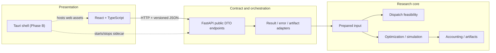

# Implementation architecture

## 1. Layer boundaries



React knows only public DTOs. The BFF adapter may read canonical or compatibility results but must not expose that split as a frontend branching requirement. Core formulas and dispatch conditions remain in Python.

## 2. Frontend stack decisions

| Technology | Responsibility | Boundary |
|---|---|---|
| React | Component composition | No domain formula implementation |
| TypeScript strict mode | Compile-time UI/client safety | No `any` in public DTO or feature code |
| Vite | Browser development and production build | BFF base URL supplied by environment/runtime adapter |
| React Router | URL-owned scenario/page/filter context | Opening a route must not mutate backend activation |
| TanStack Query | Server cache, mutations and job polling | No duplication into general global stores |
| TanStack Table + Virtual | Dense research tables | Server pagination preferred where available |
| React Hook Form | Draft form ownership | One form schema per domain section |
| Zod | Client validation and generated-contract boundary checks | Backend remains authoritative |
| ECharts | Time-series and balance visualization | Charts consume returned series without domain recomputation |
| Vitest + Testing Library | Unit/component tests | Includes null/zero, status and accessibility cases |
| Playwright | Browser/Tauri-compatible E2E flows | Critical workflow and contract fixtures |
| OpenAPI generator | API client and DTO generation | Enabled only after typed FastAPI response models exist |

ECharts is the initial chart choice because the expected workload is dense time-series and linked axes. A library change is acceptable only if it preserves accessibility, export and source-data fidelity.

## 3. Proposed frontend structure

```text
frontend/
  src/
    app/                 # router, providers, error boundary, boot state
    api/
      generated/         # generated; never hand-edited
      client/            # base URL, error normalization, request IDs
      queries/           # query keys and endpoint-facing hooks
    components/          # shared visual components only
    features/
      scenarios/
      setup/
      execution/
      results/
      comparison/
      fleet/
      depots/
      evidence/
    pages/               # route composition; minimal business logic
    schemas/             # UI form schemas and runtime guards
    formatters/          # presentation-only units/dates/numbers
    test/                # fixtures and render helpers
  e2e/
  package.json
  vite.config.ts
  playwright.config.ts
```

Feature modules may import shared components and API/query layers. They must not import another feature's internal form state. Pages compose features but do not own API transformation logic.

## 4. BFF contract structure

Recommended additive layout:

```text
bff/
  api_models/            # versioned public request/response/error models
  adapters/              # internal scenario/result/artifact -> public DTO
  routers/               # thin HTTP endpoints
  services/              # orchestration and existing domain services
```

Existing routers remain compatible with Tkinter. New response models can be attached to existing endpoints only where serialized output remains byte/field compatible; otherwise use parallel versioned endpoints until Tkinter is migrated to the adapter.

## 5. Browser deployment

- Development: Vite on localhost calls FastAPI through a dev proxy or configured local origin.
- Production browser build: static assets may be served independently or by FastAPI; this decision must not alter API semantics.
- The API client receives its base URL from a small runtime configuration adapter, not feature code.
- CORS remains restricted to configured local development origins.

## 6. Tauri sidecar design

Tauri is a deployment shell, not a third business-logic layer.

### Startup

1. Tauri resolves explicit read-only application resources and writable user data/output directories.
2. It selects or requests an available localhost port.
3. It starts the packaged FastAPI/Python sidecar hidden.
4. It waits for a versioned health/readiness response with a bounded timeout.
5. It passes the verified API base URL to the React runtime adapter.
6. React performs the same application boot checks as the browser build.

### Runtime

- Sidecar binds to loopback only by default.
- Tauri captures structured stdout/stderr into a local diagnostic log with bounded retention.
- React continues to use HTTP and public DTOs; no Tauri command calls the optimizer directly.
- Port, process ID, app/BFF version and data/output roots are visible in diagnostics.

### Shutdown

- If no research job is running, request graceful BFF shutdown and wait with a bounded timeout.
- If a job is running, show an explicit choice defined by the approved policy. Never silently terminate the sidecar.
- Forced termination is a last-resort diagnostic action and must state possible job/artifact consequences.

### Packaging decision still open

The sidecar may be a PyInstaller executable or another reproducible packaged Python runtime. Selection requires proof that Gurobi discovery/licensing, data resources, writable outputs, subprocess behavior and Windows shutdown all pass Gate 7. The existing Tkinter executable packaging is evidence but is not automatically the Tauri sidecar design.

## 7. Security and integrity

- No secrets or license material are embedded in frontend bundles.
- File/artifact identifiers supplied by React are validated by the BFF; React never submits arbitrary absolute paths for download.
- Sidecar origin/port is provided by the trusted runtime adapter in Tauri mode.
- API request validation remains in Pydantic even when Zod already validates the form.
- Artifacts expose hashes/schema versions where available; UI shows provenance instead of asserting trust from filenames.

## 8. Implementation sequence

1. Add BFF public DTOs, adapters, error normalization and fixtures without changing Tkinter payloads.
2. Scaffold React shell, strict TypeScript, generated client and controlled mock fixtures.
3. Implement scenario/result/evidence read paths.
4. Add Prepare and job workflow.
5. Add editing one domain section at a time with cross-UI round-trip tests.
6. Pass Gate 6 and only then scaffold the Tauri shell/sidecar manager.

