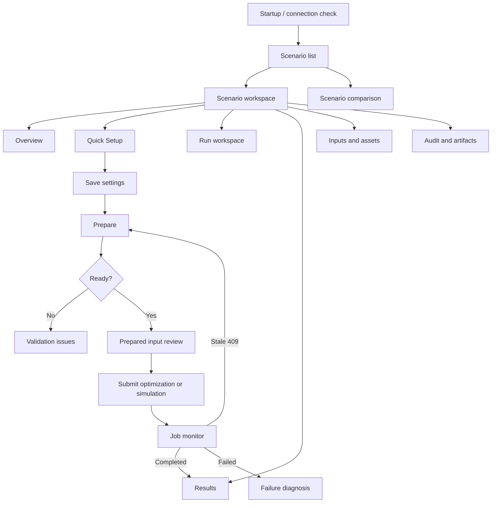

# Information architecture and screen transitions

## 1. Navigation model

The app uses a scenario-centered workspace. Selecting a scenario changes context but does not mutate the backend active scenario. Activation remains a separate labeled action.



## 2. Proposed routes

| Route | Screen | Data loading policy |
|---|---|---|
| `/` | Connection redirect | Health and app readiness only |
| `/scenarios` | Scenario list | Scenario summaries only |
| `/scenarios/:scenarioId` | Overview | Scenario summary + latest run summaries |
| `/scenarios/:scenarioId/setup` | Quick Setup | Quick Setup payload, lazy route groups |
| `/scenarios/:scenarioId/run` | Prepare and execution | Prepared summary, capabilities and current job |
| `/scenarios/:scenarioId/results` | Result overview | Validity and KPI summary only |
| `/scenarios/:scenarioId/results/dispatch` | Vehicle/trip schedule | Paginated/virtualized schedule |
| `/scenarios/:scenarioId/results/energy` | Energy balance | Requested time range/depot only |
| `/scenarios/:scenarioId/results/cost` | Cost and CO2 | Backend breakdown and provenance |
| `/scenarios/:scenarioId/evidence` | Audit and artifacts | Manifest first; file contents on demand |
| `/scenarios/:scenarioId/inputs/*` | Editors | One domain section at a time |
| `/compare` | Scenario/run comparison | Selected summaries, then comparison result |

## 3. Persistent application shell

```text
+--------------------------------------------------------------------------------+
| Research Operations Console | API ● | Dataset ● | Scenario: [name ▾] | Jobs 1 |
+----------------------+---------------------------------------------------------+
| Overview             | Page title                              [Evidence]        |
| Quick Setup          | Scenario / prepared / run identity strip                |
| Run                  |---------------------------------------------------------|
| Results              | Main page content                                        |
|  - Dispatch          |                                                          |
|  - Energy            |                                                          |
|  - Cost / CO2        |                                                          |
| Inputs               |                                                          |
| Audit / Artifacts    |                                                          |
| Compare              |                                                          |
+----------------------+---------------------------------------------------------+
```

The identity strip always shows scenario ID (copyable), operator, dataset/version, prepared ID/status and latest run status. Research-critical identity must not be hidden in a tooltip.

## 4. Run workspace flow

```text
[1 Scope saved] -> [2 Prepared] -> [3 Job submitted] -> [4 Result validated]

Scope card                 Prepared card              Execution card
- depots/routes/day        - prepared ID              - operation type
- service date(s)          - trip/vehicle counts      - requested/effective mode
- dirty/stale status       - warnings/audit           - limit/gap/seed
  [Edit Quick Setup]         [Prepare]                  [Start]

Job panel
- pending/running/completed/failed
- progress, backend stage, elapsed time, message
- no Cancel action until backend supports cancellation
```

Submitting a job requires a confirmation summary for large/long MILP runs. The dialog includes trip count, candidate solver path, time limit, MIP gap, partial-service policy and prepared ID.

## 5. Result screen hierarchy

Every result opens in this order:

1. Validity banner: execution status, physical/dispatch validation and KPI eligibility.
2. Scope and solver evidence: scenario/prepared/run IDs, solver requested/effective, time limit, gap, fallback/repair/exactness metadata.
3. KPI summary: only eligible backend values.
4. Domain tabs: dispatch, energy, cost/CO2.
5. Evidence: audits, manifests and raw result download/view.

An infeasible or invalid result keeps diagnostic counts and raw evidence visible, but comparison/ranking cards are disabled.

## 6. Destructive and mutating transitions

- Opening or selecting a scenario is read-only.
- Activation uses a dedicated action and confirmation.
- Deletion requires typing or selecting the exact scenario name and explains artifact impact.
- Navigating away from a dirty form prompts to discard or stay.
- Changing any Prepare dependency marks the previous prepared input stale immediately in the UI; backend remains authoritative.
- Timetable replacement/import is isolated from other scenario saves and has a preview/count confirmation.

