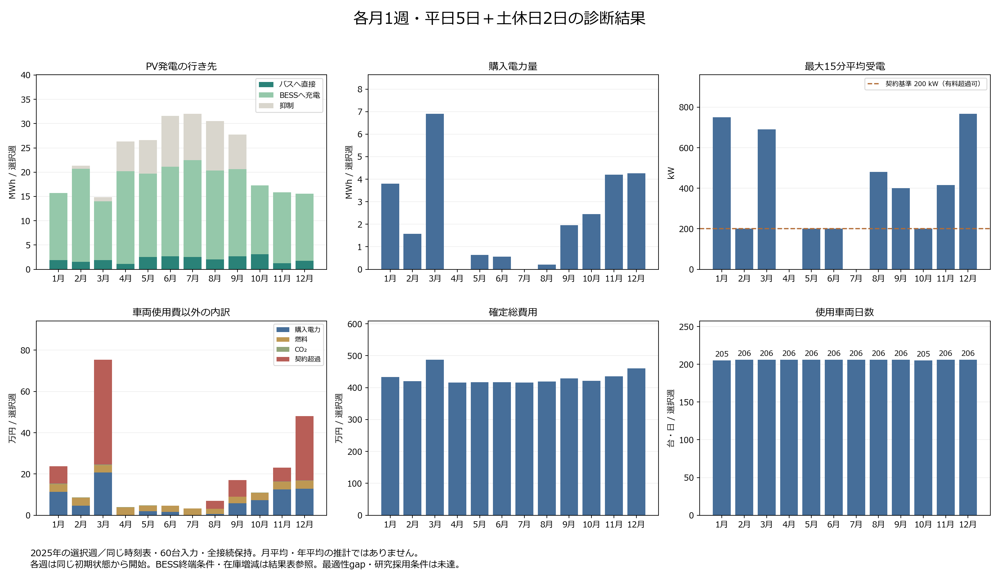

# 月別12週の結果

更新: 2026-09-22T16:20:00.105655+00:00。**12/12週が完了**。固定版 `7cb46894` の確定会計を掲載する。

各週は平日5日・土曜1日・日曜1日。同じ時刻表原本、車両60台（BEV35・ICE25）のパラメータ、充電器、予測モデルをハッシュで照合した。完了週は各168時間・672 slot、物理違反0件、日別台帳との差1e-6円以内を確認済み。

| 月 | 開始日 | 確定総費用［円］ | 車両日数 | 車両使用費以外［円］ | 購入量［kWh］ | ピーク［kW］ | PV抑制率 |
|---|---|---:|---:|---:|---:|---:|---:|
| 1月 | 2025-01-06 | 4,337,468.067042 | 205 | 237,468.067042 | 3,803.688 | 750.000 | 0.00% |
| 2月 | 2025-02-03 | 4,205,835.903082 | 206 | 85,835.903082 | 1,567.416 | 200.000 | 3.14% |
| 3月 | 2025-03-03 | 4,873,779.232267 | 206 | 753,779.232267 | 6,906.459 | 690.000 | 5.78% |
| 4月 | 2025-04-07 | 4,159,388.396748 | 206 | 39,388.396748 | 0.000 | 0.000 | 23.44% |
| 5月 | 2025-05-12 | 4,167,606.669347 | 206 | 47,606.669347 | 635.919 | 200.000 | 25.91% |
| 6月 | 2025-06-02 | 4,166,959.482958 | 206 | 46,959.482958 | 556.121 | 200.000 | 33.21% |
| 7月 | 2025-07-07 | 4,153,640.193807 | 206 | 33,640.193807 | 0.000 | 0.000 | 29.77% |
| 8月 | 2025-08-04 | 4,190,598.953923 | 206 | 70,598.953923 | 204.420 | 480.000 | 33.37% |
| 9月 | 2025-09-01 | 4,289,945.184815 | 206 | 169,945.184815 | 1,964.608 | 400.239 | 25.83% |
| 10月 | 2025-10-06 | 4,209,856.865142 | 205 | 109,856.865142 | 2,451.486 | 200.892 | 0.00% |
| 11月 | 2025-11-10 | 4,351,462.546809 | 206 | 231,462.546809 | 4,199.225 | 415.275 | 0.00% |
| 12月 | 2025-12-01 | 4,600,771.872987 | 206 | 480,771.872987 | 4,263.612 | 767.624 | 0.00% |

[編集可能なSVG](figures/shibu21_23_monthly_auxiliary_proof_budget_20260922.svg)

## 季節別の記述的比較

各季節3つの独立した7日間ケース。連続21日間の運用結果ではない。費用と購入量は選択週当たり平均、PV率は3週の合計量から求める。

| 季節 | 平均週間費用［円］ | 費用の最小〜最大［円］ | 平均購入量［kWh/週］ | 購入量の最小〜最大［kWh/週］ | 受電ピーク範囲［kW］ | 合計量でのPV抑制率 |
|---|---:|---:|---:|---:|---:|---:|
| 冬 | 4,381,358.61 | 4,205,835.90〜4,600,771.87 | 3,211.572 | 1,567.416〜4,263.612 | 200.000〜767.624 | 1.27% |
| 春 | 4,400,258.10 | 4,159,388.40〜4,873,779.23 | 2,514.126 | 0.000〜6,906.459 | 0.000〜690.000 | 20.54% |
| 夏 | 4,170,399.54 | 4,153,640.19〜4,190,598.95 | 253.514 | 0.000〜556.121 | 0.000〜480.000 | 32.09% |
| 秋 | 4,283,754.87 | 4,209,856.87〜4,351,462.55 | 2,871.773 | 1,964.608〜4,199.225 | 200.892〜415.275 | 11.78% |

## 観察と示唆

選択した12週のPV発電量は7月の32,026.3 kWhが最多、3月の14,855.9 kWhが最少だった。購入電力量は3月の6,906.5 kWhが最多、4月の0.0 kWhが最少で、差は6,906.5 kWhだった。PV総量と購入量の対応を解釈するには、直接利用・BESS充電・抑制と充電時刻の対応も確認する必要がある。

季節ごとの選択3週では、平均購入量は冬の3,211.6 kWh/週が最多、夏の253.5 kWh/週が最少だった。それぞれの平均週間費用は4,381,359円と4,170,400円である。月ごとの範囲も併記し、この3週平均を季節全体の期待値や統計的な季節効果とは扱わない。

週間総費用の最大月3月と最小月7月の差は720,139.04円で、車両使用費の差+0.00円と、電力・燃料・CO₂・契約超過費の合計差+720,139.04円に分かれる（ともに最大月から最小月を引いた符号付きの差）。使用車両日数と割当も求解で変わるため、総費用の差からPV単独の削減効果を取り出すことはできない。

最大15分平均受電が最も高かったのは12月の767.6 kWで、その週の契約超過費は311,645.02円だった。契約基準200 kWは有料超過を許す条件であり、購入電力量と受電ピークを別々に評価する。充電時刻や受電制限の政策を変える効果は、同じ気象・配車条件を固定した追加比較で確かめる必要がある。

各週のBESS在庫減少量（初期−終端）は-598.1〜1,800.0 kWhだった。PVはバス充電を優先し、余剰でBESSを充電する。SOC20–80%内で不足分を放電し、下限で待機、上限で余剰PVを抑制する。追加予備・終端復元なし。各週の初期在庫取り崩しを併記し、PV効果や継続週の節約と混同しない。毎週同じ初期状態から始めた独立ケースであり、連続運用の結果ではない。PVからBESSへの充電はPV利用として数えるが、その全量が評価週内にバスへ供給されたことまでは示さない。

## 原本・定義・限界

費用原本は各週の `rolling_hourly_chain/executed_day_accounting.json`。日別台帳、PV/購入flowの672 slot合計、ピーク、費用内訳、契約超過量×500円/kWhを再照合した。丸め前の値と原本パス・SHAは同名JSONに保存する。PV利用量はバスへの直接供給とBESSへの充電の和であり、BESS放電を再加算しない。営業便距離は停留所座標に基づく地理的代理距離で、回送を含む実道路走行距離ではない。

[選択週の日射量と月全体の比較](SHIBU21_23_MONTHLY_IRRADIANCE_CONTEXT_20260914.md)では、3月の選択週は月全体の日平均GHIより35.2%少なく、10月は20.2%多い。週選択は固定し、この天候条件も解釈へ含める。冬12/1/2月は同年内の非連続な週である。

各週は同じ初期状態へ戻して開始する。PVはバス充電を優先し、余剰でBESSを充電する。SOC20–80%内で不足分を放電し、下限で待機、上限で余剰PVを抑制する。追加予備・終端復元なし。各週の初期在庫取り崩しを併記し、PV効果や継続週の節約と混同しない。季節別の合計を連続21日間の費用とは扱わない。2026年時刻表・2025年評価日・2024年のみのclimatology予測であり、実運行再現やSolcast予測技能を示さない。

季節別入力は日付ごとのPV履歴と学習済みPV予測を扱う。走行需要は固定の電費・燃費を用いた距離ベースの設定で、気温に応じた空調負荷の月別変化は入力していない。したがって、結果を冷暖房等を含む季節的な需要変化の評価とは解釈しない。

同じseed・threads・時間制限でも、各月の探索の到達度が同じとは限らない。費用の順位は、その条件で得られた実行可能解の順位として読む。Stage 1 gapはその目的関数の最適性指標であり、確定週間費用の誤差幅・信頼区間や季節差の統計的有意性を表さない。

Stage 1 gap、二段階解法の統合最適性、正式research fleet contract、既存PowerPoint証拠2件の採用条件は別に残る。**DIAGNOSTIC / NOT USED FOR RESEARCH CONCLUSIONS、研究採用BLOCKED**。各月1週から月平均・年平均・季節一般やPV単独の因果を主張しない。

[選択日・固定条件・集計規則](SHIBU21_23_MONTHLY_FAIR_WEEKS_20260914.md)
