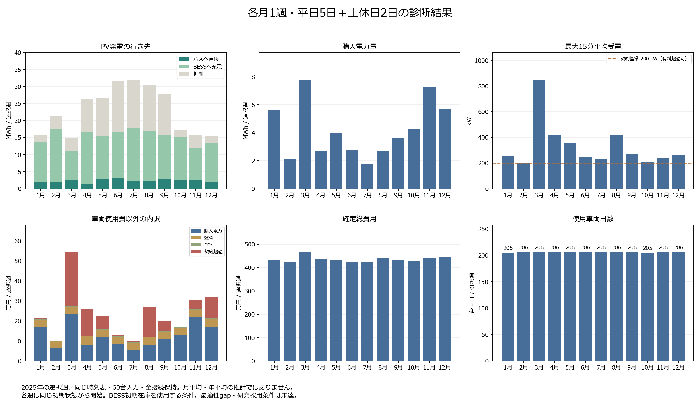

# 月別12週の結果

更新: 2026-09-15T03:44:40.615842+00:00。**12/12週が完了**。固定版 `7c7c2334` の確定会計を掲載する。

各週は平日5日・土曜1日・日曜1日。同じ時刻表原本、車両60台（BEV35・ICE25）のパラメータ、充電器、予測モデルをハッシュで照合した。完了週は各168時間・672 slot、物理違反0件、日別台帳との差1e-6円以内を確認済み。

| 月 | 開始日 | 確定総費用［円］ | 車両日数 | 車両使用費以外［円］ | 購入量［kWh］ | ピーク［kW］ | PV抑制率 |
|---|---|---:|---:|---:|---:|---:|---:|
| 1月 | 2025-01-06 | 4,316,253.829912 | 205 | 216,253.829912 | 5,621.675 | 256.786 | 13.01% |
| 2月 | 2025-02-03 | 4,222,734.531888 | 206 | 102,734.531888 | 2,123.523 | 200.000 | 17.55% |
| 3月 | 2025-03-03 | 4,664,502.518923 | 206 | 544,502.518923 | 7,794.056 | 849.442 | 24.25% |
| 4月 | 2025-04-07 | 4,378,269.341631 | 206 | 258,269.341631 | 2,706.690 | 420.000 | 36.32% |
| 5月 | 2025-05-12 | 4,344,277.835944 | 206 | 224,277.835944 | 3,981.889 | 358.573 | 42.03% |
| 6月 | 2025-06-02 | 4,248,324.923647 | 206 | 128,324.923647 | 2,804.812 | 244.106 | 47.02% |
| 7月 | 2025-07-07 | 4,218,568.548268 | 206 | 98,568.548268 | 1,746.370 | 227.008 | 44.12% |
| 8月 | 2025-08-04 | 4,391,753.640035 | 206 | 271,753.640035 | 2,723.825 | 420.000 | 44.77% |
| 9月 | 2025-09-01 | 4,320,853.662980 | 206 | 200,853.662980 | 3,619.456 | 270.000 | 43.02% |
| 10月 | 2025-10-06 | 4,269,270.169597 | 205 | 169,270.169597 | 4,294.150 | 209.643 | 12.71% |
| 11月 | 2025-11-10 | 4,424,601.989175 | 206 | 304,601.989175 | 7,302.402 | 234.781 | 24.82% |
| 12月 | 2025-12-01 | 4,442,187.290041 | 206 | 322,187.290041 | 5,695.416 | 263.707 | 13.31% |

[編集可能なSVG](figures/shibu21_23_monthly_phase_search_20260915.svg)

## 季節別の記述的比較

各季節3つの独立した7日間ケース。連続21日間の運用結果ではない。費用と購入量は選択週当たり平均、PV率は3週の合計量から求める。

| 季節 | 平均週間費用［円］ | 費用の最小〜最大［円］ | 平均購入量［kWh/週］ | 購入量の最小〜最大［kWh/週］ | 受電ピーク範囲［kW］ | 合計量でのPV抑制率 |
|---|---:|---:|---:|---:|---:|---:|
| 冬 | 4,327,058.55 | 4,222,734.53〜4,442,187.29 | 4,480.205 | 2,123.523〜5,695.416 | 200.000〜263.707 | 14.94% |
| 春 | 4,462,349.90 | 4,344,277.84〜4,664,502.52 | 4,827.545 | 2,706.690〜7,794.056 | 358.573〜849.442 | 35.92% |
| 夏 | 4,286,215.70 | 4,218,568.55〜4,391,753.64 | 2,425.002 | 1,746.370〜2,804.812 | 227.008〜420.000 | 45.30% |
| 秋 | 4,338,241.94 | 4,269,270.17〜4,424,601.99 | 5,072.002 | 3,619.456〜7,302.402 | 209.643〜270.000 | 29.69% |

## 観察と示唆

選択した12週のPV発電量は7月の32,026.3 kWhが最多、3月の14,855.9 kWhが最少だった。購入電力量は3月の7,794.1 kWhが最多、7月の1,746.4 kWhが最少で、差は6,047.7 kWhだった。PV総量と購入量の対応を解釈するには、直接利用・BESS充電・抑制と充電時刻の対応も確認する必要がある。

季節ごとの選択3週では、平均購入量は秋の5,072.0 kWh/週が最多、夏の2,425.0 kWh/週が最少だった。それぞれの平均週間費用は4,338,242円と4,286,216円である。月ごとの範囲も併記し、この3週平均を季節全体の期待値や統計的な季節効果とは扱わない。

週間総費用の最大月3月と最小月7月の差は445,933.97円で、車両使用費の差+0.00円と、電力・燃料・CO₂・契約超過費の合計差+445,933.97円に分かれる（ともに最大月から最小月を引いた符号付きの差）。使用車両日数と割当も求解で変わるため、総費用の差からPV単独の削減効果を取り出すことはできない。

最大15分平均受電が最も高かったのは3月の849.4 kWで、その週の契約超過費は270,256.72円だった。契約基準200 kWは有料超過を許す条件であり、購入電力量と受電ピークを別々に評価する。充電時刻や受電制限の政策を変える効果は、同じ気象・配車条件を固定した追加比較で確かめる必要がある。

各週のBESS在庫減少量（初期−終端）は1,786.6〜1,800.0 kWhだった。毎週同じ初期状態から始めた計算なので、この在庫利用を繰り返し使える運用上の節約とは解釈しない。PVからBESSへの充電はPV利用として数えるが、その全量が評価週内にバスへ供給されたことまでは示さない。

## 原本・定義・限界

費用原本は各週の `rolling_hourly_chain/executed_day_accounting.json`。日別台帳、PV/購入flowの672 slot合計、ピーク、費用内訳、契約超過量×500円/kWhを再照合した。丸め前の値と原本パス・SHAは同名JSONに保存する。PV利用量はバスへの直接供給とBESSへの充電の和であり、BESS放電を再加算しない。営業便距離は停留所座標に基づく地理的代理距離で、回送を含む実道路走行距離ではない。

[選択週の日射量と月全体の比較](SHIBU21_23_MONTHLY_IRRADIANCE_CONTEXT_20260914.md)では、3月の選択週は月全体の日平均GHIより35.2%少なく、10月は20.2%多い。週選択は固定し、この天候条件も解釈へ含める。冬12/1/2月は同年内の非連続な週である。

各週は同じ初期状態へ戻して開始する。BESSは初期3,000 kWhから最低1,200 kWhまで使える条件で、在庫減少をJSONに併記する。季節別の合計を連続21日間の費用とは扱わない。2026年時刻表・2025年評価日・2024年のみのclimatology予測であり、実運行再現やSolcast予測技能を示さない。

季節別入力は日付ごとのPV履歴と学習済みPV予測を扱う。走行需要は固定の電費・燃費を用いた距離ベースの設定で、気温に応じた空調負荷の月別変化は入力していない。したがって、結果を冷暖房等を含む季節的な需要変化の評価とは解釈しない。

同じseed・threads・時間制限でも、各月の探索の到達度が同じとは限らない。費用の順位は、その条件で得られた実行可能解の順位として読む。Stage 1 gapはその目的関数の最適性指標であり、確定週間費用の誤差幅・信頼区間や季節差の統計的有意性を表さない。

Stage 1 gap、二段階解法の統合最適性、正式research fleet contract、既存PowerPoint証拠2件の採用条件は別に残る。**DIAGNOSTIC / NOT USED FOR RESEARCH CONCLUSIONS、研究採用BLOCKED**。各月1週から月平均・年平均・季節一般やPV単独の因果を主張しない。

[選択日・固定条件・集計規則](SHIBU21_23_MONTHLY_FAIR_WEEKS_20260914.md)
