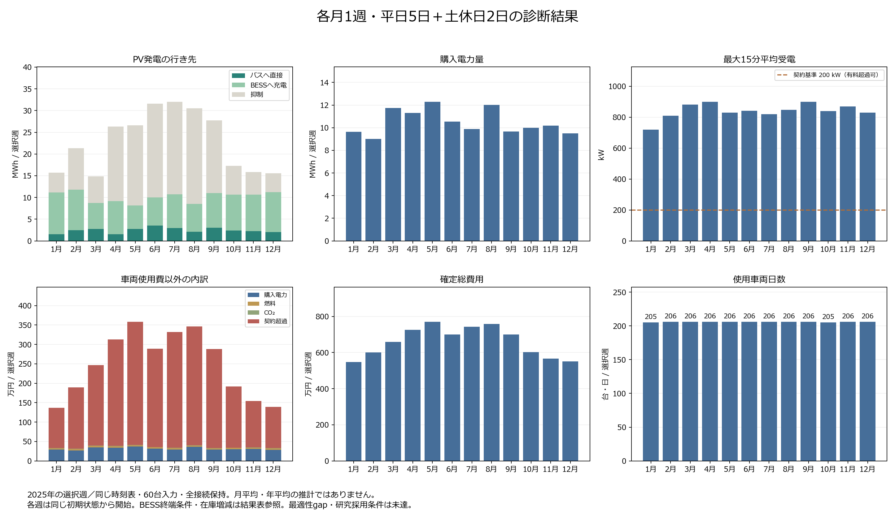

# 月別12週の結果

更新: 2026-09-20T14:52:39.413021+00:00。**12/12週が完了**。固定版 `68f2f4e5` の確定会計を掲載する。

各週は平日5日・土曜1日・日曜1日。同じ時刻表原本、車両60台（BEV35・ICE25）のパラメータ、充電器、予測モデルをハッシュで照合した。完了週は各168時間・672 slot、物理違反0件、日別台帳との差1e-6円以内を確認済み。

| 月 | 開始日 | 確定総費用［円］ | 車両日数 | 車両使用費以外［円］ | 購入量［kWh］ | ピーク［kW］ | PV抑制率 |
|---|---|---:|---:|---:|---:|---:|---:|
| 1月 | 2025-01-06 | 5,468,389.866126 | 205 | 1,368,389.866126 | 9,642.007 | 720.584 | 28.94% |
| 2月 | 2025-02-03 | 6,012,578.044332 | 206 | 1,892,578.044332 | 9,000.625 | 810.000 | 44.73% |
| 3月 | 2025-03-03 | 6,590,114.762219 | 206 | 2,470,114.762219 | 11,729.995 | 881.856 | 41.10% |
| 4月 | 2025-04-07 | 7,250,774.924918 | 206 | 3,130,774.924918 | 11,296.146 | 900.000 | 65.34% |
| 5月 | 2025-05-12 | 7,703,260.918491 | 206 | 3,583,260.918491 | 12,292.213 | 829.200 | 69.44% |
| 6月 | 2025-06-02 | 7,007,351.780176 | 206 | 2,887,351.780176 | 10,540.776 | 841.100 | 68.33% |
| 7月 | 2025-07-07 | 7,437,186.158060 | 206 | 3,317,186.158060 | 9,874.148 | 819.246 | 66.56% |
| 8月 | 2025-08-04 | 7,586,432.197427 | 206 | 3,466,432.197427 | 12,004.528 | 848.006 | 72.22% |
| 9月 | 2025-09-01 | 6,999,071.966782 | 206 | 2,879,071.966782 | 9,673.979 | 900.000 | 60.48% |
| 10月 | 2025-10-06 | 6,018,115.144413 | 205 | 1,918,115.144413 | 9,999.826 | 840.000 | 38.19% |
| 11月 | 2025-11-10 | 5,662,083.508082 | 206 | 1,542,083.508082 | 10,190.894 | 870.000 | 32.93% |
| 12月 | 2025-12-01 | 5,515,401.215533 | 206 | 1,395,401.215533 | 9,501.276 | 830.135 | 28.17% |

[編集可能なSVG](figures/shibu21_23_monthly_reserve_20260920.svg)

## 季節別の記述的比較

各季節3つの独立した7日間ケース。連続21日間の運用結果ではない。費用と購入量は選択週当たり平均、PV率は3週の合計量から求める。

| 季節 | 平均週間費用［円］ | 費用の最小〜最大［円］ | 平均購入量［kWh/週］ | 購入量の最小〜最大［kWh/週］ | 受電ピーク範囲［kW］ | 合計量でのPV抑制率 |
|---|---:|---:|---:|---:|---:|---:|
| 冬 | 5,665,456.38 | 5,468,389.87〜6,012,578.04 | 9,381.303 | 9,000.625〜9,642.007 | 720.584〜830.135 | 35.11% |
| 春 | 7,181,383.54 | 6,590,114.76〜7,703,260.92 | 11,772.785 | 11,296.146〜12,292.213 | 829.200〜900.000 | 61.64% |
| 夏 | 7,343,656.71 | 7,007,351.78〜7,586,432.20 | 10,806.484 | 9,874.148〜12,004.528 | 819.246〜848.006 | 68.99% |
| 秋 | 6,226,423.54 | 5,662,083.51〜6,999,071.97 | 9,954.900 | 9,673.979〜10,190.894 | 840.000〜900.000 | 46.99% |

## 観察と示唆

選択した12週のPV発電量は7月の32,026.3 kWhが最多、3月の14,855.9 kWhが最少だった。購入電力量は5月の12,292.2 kWhが最多、2月の9,000.6 kWhが最少で、差は3,291.6 kWhだった。PV総量と購入量の対応を解釈するには、直接利用・BESS充電・抑制と充電時刻の対応も確認する必要がある。

季節ごとの選択3週では、平均購入量は春の11,772.8 kWh/週が最多、冬の9,381.3 kWh/週が最少だった。それぞれの平均週間費用は7,181,384円と5,665,456円である。月ごとの範囲も併記し、この3週平均を季節全体の期待値や統計的な季節効果とは扱わない。

週間総費用の最大月5月と最小月1月の差は2,234,871.05円で、車両使用費の差+20,000.00円と、電力・燃料・CO₂・契約超過費の合計差+2,214,871.05円に分かれる（ともに最大月から最小月を引いた符号付きの差）。使用車両日数と割当も求解で変わるため、総費用の差からPV単独の削減効果を取り出すことはできない。

最大15分平均受電が最も高かったのは4月の900.0 kWで、その週の契約超過費は2,743,311.91円だった。契約基準200 kWは有料超過を許す条件であり、購入電力量と受電ピークを別々に評価する。充電時刻や受電制限の政策を変える効果は、同じ気象・配車条件を固定した追加比較で確かめる必要がある。

各週のBESS在庫減少量（初期−終端）は-0.0〜0.0 kWhだった。BESSはPVのみで充電し、週末に初期残量へ戻す。毎時の指令はPVがゼロでも初期残量を下回らない予備残量を持つ。BESSの各rolling窓末も同じ初期残量、車両の途中目標は固定day-ahead境界とする。物理20–80%範囲に加え、この条件では3,000 kWh（50%）を運用上確保するため、旧条件とは利用可能量・費用が異なる。毎週同じ初期状態から始めた独立ケースであり、連続運用の結果ではない。PVからBESSへの充電はPV利用として数えるが、その全量が評価週内にバスへ供給されたことまでは示さない。

## 原本・定義・限界

費用原本は各週の `rolling_hourly_chain/executed_day_accounting.json`。日別台帳、PV/購入flowの672 slot合計、ピーク、費用内訳、契約超過量×500円/kWhを再照合した。丸め前の値と原本パス・SHAは同名JSONに保存する。PV利用量はバスへの直接供給とBESSへの充電の和であり、BESS放電を再加算しない。営業便距離は停留所座標に基づく地理的代理距離で、回送を含む実道路走行距離ではない。

[選択週の日射量と月全体の比較](SHIBU21_23_MONTHLY_IRRADIANCE_CONTEXT_20260914.md)では、3月の選択週は月全体の日平均GHIより35.2%少なく、10月は20.2%多い。週選択は固定し、この天候条件も解釈へ含める。冬12/1/2月は同年内の非連続な週である。

各週は同じ初期状態へ戻して開始する。BESSはPVのみで充電し、週末に初期残量へ戻す。毎時の指令はPVがゼロでも初期残量を下回らない予備残量を持つ。BESSの各rolling窓末も同じ初期残量、車両の途中目標は固定day-ahead境界とする。物理20–80%範囲に加え、この条件では3,000 kWh（50%）を運用上確保するため、旧条件とは利用可能量・費用が異なる。季節別の合計を連続21日間の費用とは扱わない。2026年時刻表・2025年評価日・2024年のみのclimatology予測であり、実運行再現やSolcast予測技能を示さない。

季節別入力は日付ごとのPV履歴と学習済みPV予測を扱う。走行需要は固定の電費・燃費を用いた距離ベースの設定で、気温に応じた空調負荷の月別変化は入力していない。したがって、結果を冷暖房等を含む季節的な需要変化の評価とは解釈しない。

同じseed・threads・時間制限でも、各月の探索の到達度が同じとは限らない。費用の順位は、その条件で得られた実行可能解の順位として読む。Stage 1 gapはその目的関数の最適性指標であり、確定週間費用の誤差幅・信頼区間や季節差の統計的有意性を表さない。

Stage 1 gap、二段階解法の統合最適性、正式research fleet contract、既存PowerPoint証拠2件の採用条件は別に残る。**DIAGNOSTIC / NOT USED FOR RESEARCH CONCLUSIONS、研究採用BLOCKED**。各月1週から月平均・年平均・季節一般やPV単独の因果を主張しない。

[選択日・固定条件・集計規則](SHIBU21_23_MONTHLY_FAIR_WEEKS_20260914.md)
