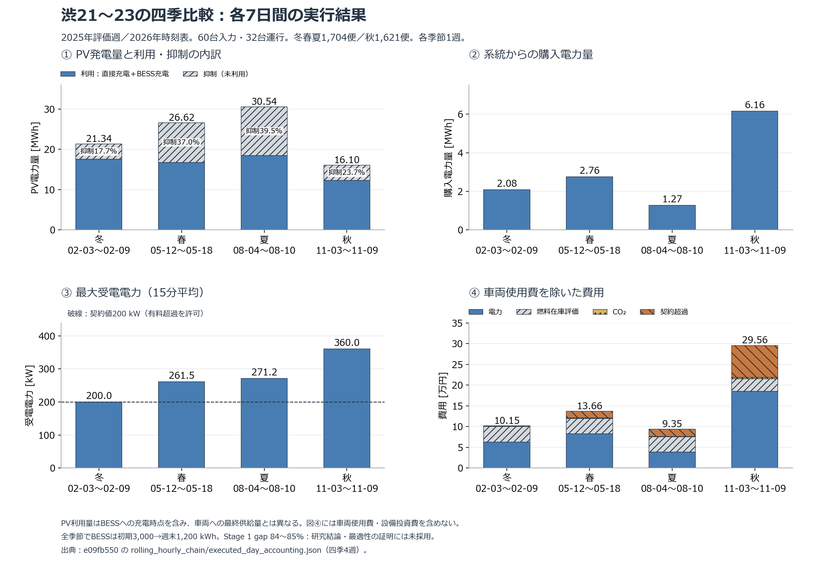

# 渋21〜23：四季の結果と季節差からの示唆

**今回の4週では、夏の購入電力量・電力費が最少、秋が最多だった。ただし秋の総費用は車両使用日数が少ないため最少になった。春は冬よりPV発電量が多くても、購入電力量が増えた。季節差を読むには、発電総量に加えてPVの未利用量、受電ピーク、運行量を確認する必要がある。**

対象は凍結 `e09fb550379db71730b1ee5025e721d64022303b` で完走した四季各7日間。60台（BEV35・ICE25）を入力に保持し、各週で32台（BEV26・ICE6）が運行。全4週168/168時間、物理・会計検証通過、接続候補削減・未割当・解後修復は0。この文書は既存の確定成果物の記述的分析であり、新しい求解や条件変更は行っていない。

**DIAGNOSTIC / NOT USED FOR RESEARCH CONCLUSIONS。研究採用はBLOCKEDのまま。** 各季節1週のみで、季節母集団の平均・有意差・因果効果を示さない。

## 結果

| 季節 | 対象期間 | 便数 | PV発電量 [MWh] | 購入電力量 [MWh] | 週間総費用 [JPY] | 車両使用費を除いた費用 [JPY] |
|---|---|---:|---:|---:|---:|---:|
| 冬 | 2025-02-03〜2025-02-09 | 1,704 | 21.341 | 2.085 | 4221549.725308 | 101549.725308 |
| 春 | 2025-05-12〜2025-05-18 | 1,704 | 26.624 | 2.756 | 4256622.315954 | 136622.315954 |
| 夏 | 2025-08-04〜2025-08-10 | 1,704 | 30.538 | 1.274 | 4213520.406793 | 93520.406793 |
| 秋 | 2025-11-03〜2025-11-09 | 1,621 | 16.096 | 6.162 | 4175642.379137 | 295642.379137 |

| 季節 | PV抑制率 | 最大受電 [kW] | 契約超過料金 [JPY] | 使用車両日 | 総費用/営業便km [JPY] | 車両使用費を除いた費用/営業便km [JPY] |
|---|---:|---:|---:|---:|---:|---:|
| 冬 | 17.70% | 200.000 | 0.000000 | 206 | 303.154 | 7.292 |
| 春 | 37.01% | 261.488 | 15522.689811 | 206 | 305.673 | 9.811 |
| 夏 | 39.52% | 271.179 | 17254.720547 | 206 | 302.577 | 6.716 |
| 秋 | 23.74% | 360.000 | 76769.786392 | 194 | 313.355 | 22.186 |

[編集可能なSVG](figures/shibu21_23_seasonal_20260912.svg) ／ [丸め前の集計・28日分の内訳・原本参照](SHIBU21_23_SEASONAL_INTERPRETATION_20260912.json)

## 観測できた違いと、その示唆

### 1. 夏は購入電力量が少ないが、PVを使い切れていない

夏のPV発電量は30.538 MWhで4週中最多、購入電力量は1.274 MWhで最少だった。冬に比べ購入電力量は38.91%少なく、電力費は62540.315036円から38208.953371円となった。同じ便数・営業便距離・使用車両日数の冬春夏では、夏の総費用と車両使用費を除いた費用が最少だった。

一方、夏のPV抑制量は12.068 MWh、発電量の39.52%だった。**発電量の多さを、そのまま有効利用量や費用削減量とみなせない。** 充電可能時間、BESSの充放電電力、予測と実行のずれを次の確認対象とする。実行時BESS最大SOCは4170.670 kWhで上限4,800 kWh未満であり、この結果だけから蓄電容量不足や増設の有効性を断定しない。

### 2. 春は冬より発電量が多くても、購入量・費用が増えた

春のPV発電量は冬比+24.76%だが、購入電力量も+32.23%だった。PV利用量（直接充電＋BESS充電）は冬17.563 MWh、春16.769 MWhで、抑制率は17.70%から37.01%へ上昇した。

**週間発電量だけでは運行時の電力不足を説明し切れないことが、この4週から読み取れる。** 時間帯・日別の需給のずれ、配車の違い、予測誤差、限られた求解時間の影響は候補原因だが、今回の集計では寄与を分離していない。「春という季節が購入電力を増やす」とは主張しない。

### 3. 秋は総費用が低く見えても、電力側の負担は最大

秋の購入電力量は夏の4.84倍、車両使用費を除いた費用は3.16倍だった。しかし便数は1,704→1,621、使用車両日は206→194に減り、20,000円/車両日の使用費が240,000円少ない。

夏→秋の総費用差は、次の恒等式で照合した。

`総費用差 -37878.027656円 = 車両使用費差 -240000.000000円 + その他4費目の差 202121.972344円`

営業便距離で割った総費用は夏302.577円/kmに対し秋313.355円/kmとなる。**総費用の単純順位を、季節による経済性の順位として扱わない。** 距離で割っても、運行時間帯や配車の交絡が取り除かれたわけではない。

### 4. 購入電力量と受電ピークは、別の指標で評価する必要がある

冬の最大受電は約200 kW、春は261.488 kW、夏は271.179 kW、秋は360.000 kW。購入量が最少の夏にも17254.720547円、秋には76769.786392円の超過料金が生じた。

今回の料金は、各15分slotの `max(購入電力量 - 200 kW × 0.25 h, 0)` を合計し500円/kWhを掛けるモデル値であり、最大kWに課すデマンド料金ではない。超過料金が出ることと物理違反は別で、今回は有料超過を明示的に許可している。**PVが多い週でも、充電集中への対処が必要になる可能性がある。** 最適な契約電力や設備容量は、この4週から決定しない。

## 先生への説明文案

> 四季各7日間で、全接続候補を保持した運行・充電計画の実行可能性と費用整合を確認しました。選んだ週では夏の購入電力が少なく、秋は購入電力と受電ピークが大きくなりました。一方、春は冬より発電量が多くても購入量が増え、夏にも約4割のPV抑制がありました。したがって、季節差を評価する際には、発電総量だけでなく充電機会との時間的な対応、PV利用量、受電ピークを見る必要があると考えています。これは現段階では記述的な示唆です。同じ運行条件でPVだけを変える比較と、求解品質の確認が今後の検証課題です。

## 定義・比較上の制限

- 費用の唯一の確定源は各週の `executed_day_accounting.json.cost_breakdown`。車両使用費を除いた費用は電力＋燃料＋CO₂＋契約超過料金の合計で、この4週では他費目を落としていないことを照合済み。週間費用・超過料金の表記は元JSONと1e-6円以内で一致する。距離当たり単価・比率・電力量は表示精度で丸めており、未丸め値は添付JSONを参照する。
- 分母の営業便距離は `sum(problem.trips.distance_km)`：冬春夏13,925.428829 km、秋13,325.586034 km。回送込みの総走行距離ではない。全費用をこの分母で割った参考指標であり、回送費の除外は行わない。
- PV利用量は `PV→車両 + PV→BESS`。BESSからの再放電をもう一度加えない。蓄電損失を含むため、車両が最終的に受け取ったPV由来電力量や再エネ比率とは異なる。PVは履歴推定値で、現地実測とは称さない。
- BESSは全週で初期3,000→週末1,200 kWh、SOC在庫を約1,800 kWh減らす条件。BEVは各車の初期SOCへ戻す。BESSの在庫減少をそのまま車両への供給量とみなさず、週を繰り返した定常運用の費用ともみなさない。
- この4週の系統→BESS充電、PV/BESS設備費、BESS放電費・定置電池劣化費はいずれも計上0。設備の無償性や投資採算を意味しない。給油は0でも、燃料費には消費した初期燃料在庫の評価を含む。
- 2026年時刻表に2025年の評価日・PVを適用し、予測学習は2024年のみ。暑さ・寒さによる空調負荷の効果や、年平均の季節傾向を今回の差から説明しない。
- Stage 1 gapは約84〜85%で事前宣言10%に未達。正式fleet contract未宣言、既存PowerPoint証拠2件の不一致も残る。日別28行を独立した28回の季節実験として統計検定しない。

## 再現と検証

`python scripts/build_four_season_interpretation.py` で原本ハッシュを検証し、集計JSON・図PNG/SVG・この文書を生成する。各4週の費用5成分、PV収支、raw flow合計、15分平均ピーク、超過量×単価、7日分台帳を照合。入力・solver・凍結原本は変更しない。

[完走記録](SHIBU21_23_FOUR_SEASON_COMPLETION_20260912.md) ／ [研究採用に残る条件](CURRENT_RESEARCH_RELEASE_BLOCKERS.md)
