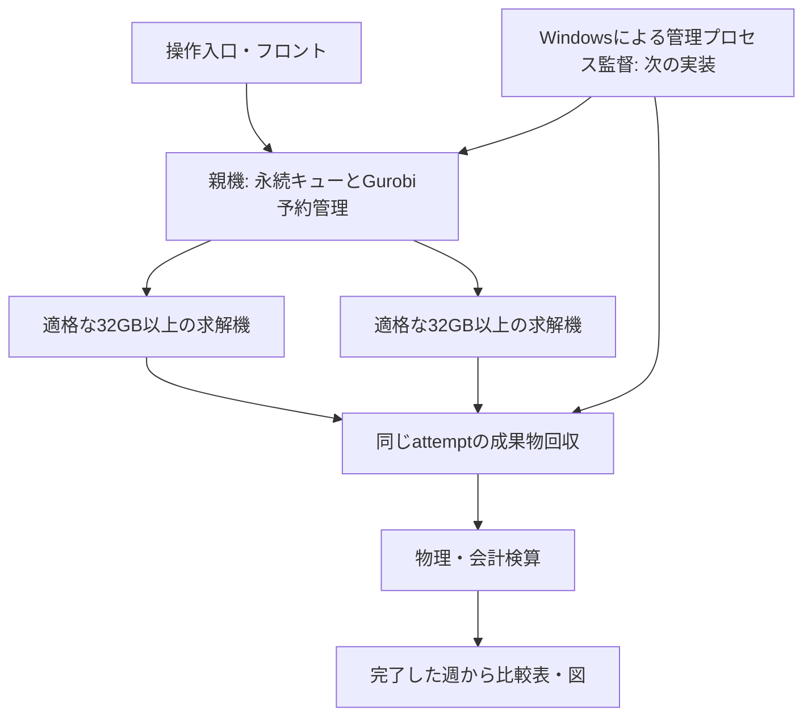

# 安定性と週次結果の取得速度を両立する構成判断

2026-09-27。開発版 `c4acca08`、実行版 `f524eca2`。Codexによる原本確認とClaude Code（実応答モデル `claude-sonnet-5`）の2回の読取レビューに基づく。
対象は「仮・正式用」の各月1代表週、渋21〜23、連続7日間＋最終翌朝の充電・受電・費用。現在の研究条件を維持する。

## 結論

現有構成は **親機の永続キュー＋許可済み32GB以上の求解機＋共有Gurobi枠＋独立した回収・検算** を維持する。
1週間を状態継承なしの日別ジョブへ分解しない。独立した代表週を並列に解く。
最優先は現在の12週の回収・検算を終えること。構成検討や追加診断のために実行中の11・12月を中断しない。
速度の評価単位は「検算済みの週次結果が揃うまでの時間」とする。

## 確認できた数値

証拠は `output/claude_capacity_design_20260927/` の `evidence.json`、`hourly_timing.json` とhash manifest。
9週の完了レシート、進捗側のメモリ時系列、選んだ3週の保存済みhourly_summaryを読み取った。再求解していない。

|項目|観測値|解釈の限界|
|---|---:|---|
|比較へ採用済み|9/12週|1月は図表修復まで。週全体の再監査は未完了|
|完了9週のworker実行時間|87.0〜218.0分、中央値140.3分|転送・親機の最終検算を含む全体所要時間ではない|
|9週のworker時間合計|22.15時間|2枠に完全均等配置できても11.08時間以上。将来12週のETAではない|
|観測されたpeak working set|約13.16〜13.17GiB|単一プロセス計測。プロセス群全体の上限保証ではない|
|サンプル中の最大Private Commit|約14.58〜14.63GiB|16GiB予算に対し余裕は約1.37GiB。未観測ピークに注意|
|現行要求|16GiB、4 threads、各機slots=1|全CPU使用ではない|
|許可済みGurobi同時枠|2|終了後の解放待ち330秒と状態不明の予約も管理する|

現在の配布済み求解プールは5台。登録18台の全てが現行版の求解可能機という意味ではない。
2台の32GB機で実求解、親機32GBは観測時の空き15.23GiBからOS予約6GiBを残すと16GiB要求に不足。
別の32GB機はWindows commit余裕約0.1GiBでDRAINING。64GB機はライセンス期限切れで無効。
これらの待機理由を無視して投入対象を増やさない。

## 時間がかかる箇所

|週|毎時窓数|毎時処理elapsed合計|Stage2処理記録の合計|time_limitの窓|
|---|---:|---:|---:|---:|
|3月3日開始|174|169.0分|145.0分|6|
|8月4日開始|175|44.4分|27.9分|0|
|10月6日開始|175|96.5分|79.6分|2|

この3週の全窓は保存記録上feasible。Stage1の指定上限は1800秒、毎時上限は600秒。
`stage2_runtime_seconds` は `_solve_thesis_stage2_charging_dispatch` 内の経過時間であり、
Gurobi native Runtimeだけを表す値ではない。構築・求解・後処理を分ける追加計測が必要。
日付・気象と担当PCが同時に違うため、この表だけでPC速度を順位付けしない。

まず3月step61（610.85秒）、10月step14（607.51秒）を重い窓、8月step160（15.30秒）を通常窓として診断候補にする。
選択理由は処理時間であり、費用が有利になる結果選択ではない。対象フォルダには結果・要約・次状態はあるがMPSは保存されていない。
従って「保存MPSをそのまま再実行できる」とは扱わない。前状態・元Prepared・予測入力から同一問題を復元し、hashと物理条件の一致を確認するのが先。

## 採る構成

親機も余裕が戻れば求解候補になる。親機固定・特定2台への永久固定にはしない。
ただし現在の2台を止めて割当変更しない。64GB機は正当に利用できる認証を確認できた後、同じ共有2枠内で重い週の候補にする。
64GBなら必ず速い、あるいは第3枠が増えるとは言わない。

16GB機や未適格機は、対応済みでライセンスを取得しない入力照合・検算・図表処理の候補。
全18台を稼働させることを目標にせず、転送・配置・検算の費用より効果が大きい仕事だけ配る。
現行のALNSを名称だけでライセンス不要として週次求解へ配らない。

## 実装・検証する順序

|順序|作業|受入条件|今の計算への適用|
|---|---|---|---|
|1|現在の11・12月を同じ試行で回収し、1月の図表失敗を後処理だけで回復する|原本hash、全区間、物理・会計を再確認。元FAILEDは保持し、再監査結果を別記録|計算の再投入なしで継続|
|2|既存CLIをWindowsタスクで監督する|1管理者/キューロック、PID+生成時刻、固定設定・版、起動前check、回数制限とバックオフ、監視の多重起動拒否|まずテスト用キューで検証。既存workerソースは変えない|
|3|重い毎時窓の復元と4threads対2threadsを同じ機器・入力で比較|時間、プロセス群のcommit/メモリ、可行性、物理残差、会計、目的値・gap・停止理由を保存|現行ジョブ終了後、共有枠内の診断のみ|
|4|効果が出た処理だけ次の固定版へ適用|同じ1週を最後まで通して検算。時間だけ速くても失敗・費用欠落が増えれば不採用|新しい実験版。旧結果はそのSHAのまま|

タスクスケジューラの監督は今回未配置。既存 `install_campaign_progress_task.ps1` の
current-user / Interactive / Limited / IgnoreNew / 有限回再起動の方式を再利用する。
ログオン前起動には別の資格情報・権限判断が必要で、当面は同じユーザーのログオン後起動を対象にする。
「コントローラーだけ復旧」「新規割当も再開」の方針を設定で明示し、利用者の意図的停止を障害と誤判定しない。
恒久的設定不一致・認証拒否・host key不一致を再起動ループにしない。正常な全件終了でも再起動しない。
復旧でrun/retry/new attemptを呼ばず、既存キューの照合と回収だけを行う。物理的なPC電源復旧はこの仕組みの対象外。

故障試験は専用の軽い試験ジョブで、管理プロセス終了、受理応答消失、同一要求二重起動、SSH断、認証拒否、古いPID、ディスク不足を確認する。
合格条件は「既存attemptが1件」「不明な実行の枠を解放しない」「原本が残る」「回収後の会計は1回だけ」「状態が画面に反映される」。
実機試験が終わる前に無故障・無人運用の保証を宣言しない。

## Claudeの意見をどう扱ったか

[訂正後の回答原文](../reviews/CLAUDE_WEEKLY_CAPACITY_20260927.md)を保存した。これは第三者モデルによる設計レビューであり、実機テストや研究承認ではない。

- 全CPU予約との初回指摘は、実効cpu_threads=4とコードの優先順位を提示して撤回を得た。
- source_digestが毎月変わるとの指摘も訂正。これはコードhashで、入力hashは別に保持している。
- 1月を含め実質10週完了、11・12月は回収待ちだけ、という初回解釈は採用しない。採用9週、残り2週は求解継続、1月は再監査待ち。
- 診断を最優先にする第2回答は採用しない。ユーザーの研究目的に従い、現在の12週の結果を先に揃える。
- 比較指標を時間・solver statusだけにする提案は不十分なので、物理・会計・解品質・メモリも必須とした。
- 現在のLOST保持はコード通りの照合状態。遠隔RUNNINGを確認できても、照合中の枠を解放しない。
- 根拠のない7.5時間の停滞判定は採用しない。ログ更新、CPU時間、保存窓、プロセス同一性を合わせて判断する。

## 期待する効果と未確定事項

今すぐ効果を狙うのは、同じ計算のやり直しを避けること、管理停止から復旧できること、完了週の集計を待たせないこと。
Threads変更やwarm start/cache最適化の短縮率は未測定。読み取り済みコードから未確認の既存最適化を再実装しない。
一律に600秒を削る、SOC目標を緩める、便を削る、時間刻みを粗くする変更は今回の構成案に含めない。
1月の再監査、11・12月の完走、15:52停止の原因、commit不足機の原因、64GB機の正当なライセンス利用、
管理プロセスのOS監督と実機故障試験は残件。現時点で「速くなった」「12週無人完走が保証できた」とは結論しない。
