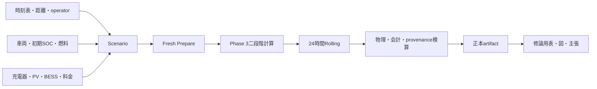
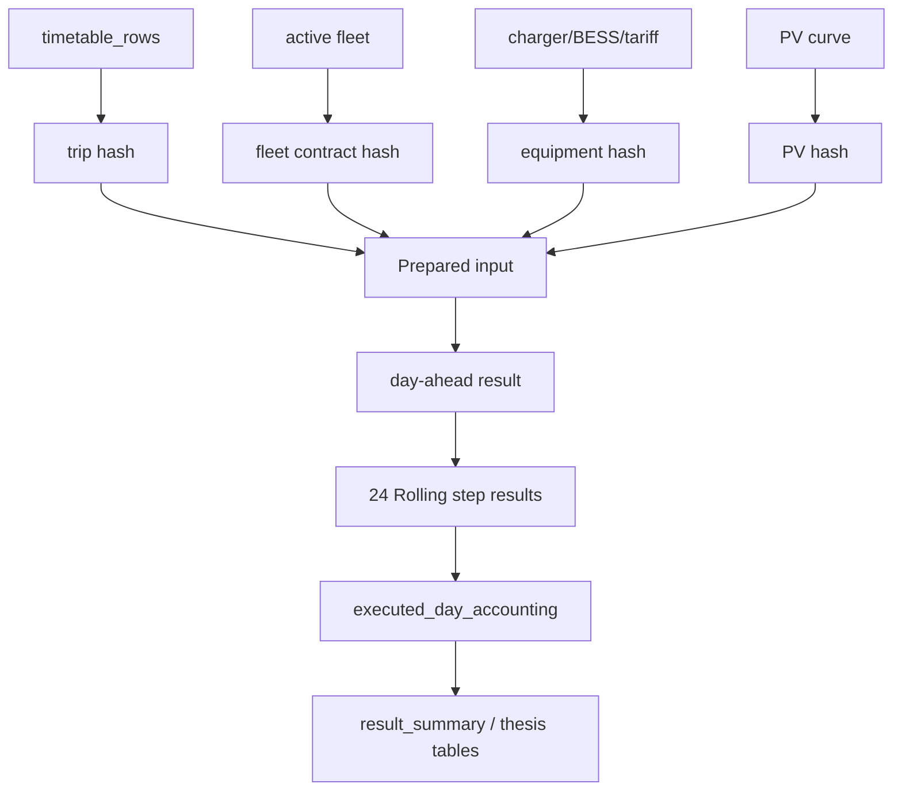
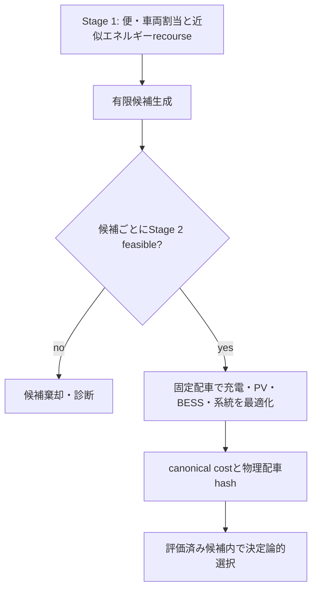
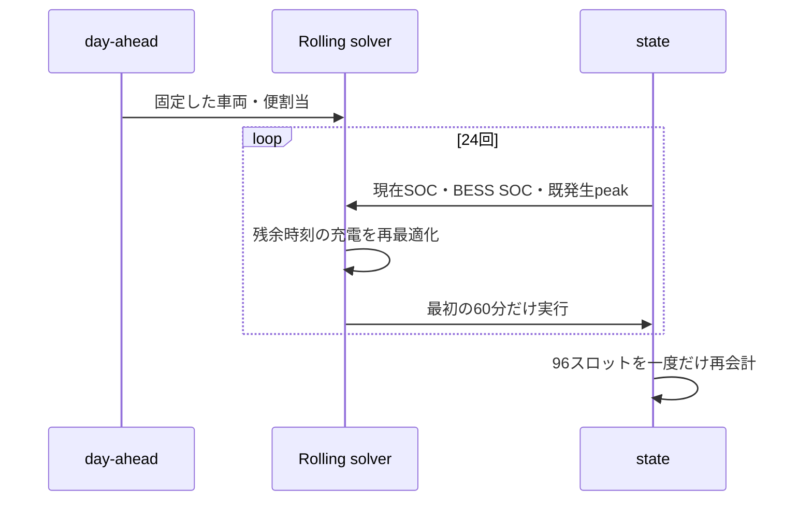
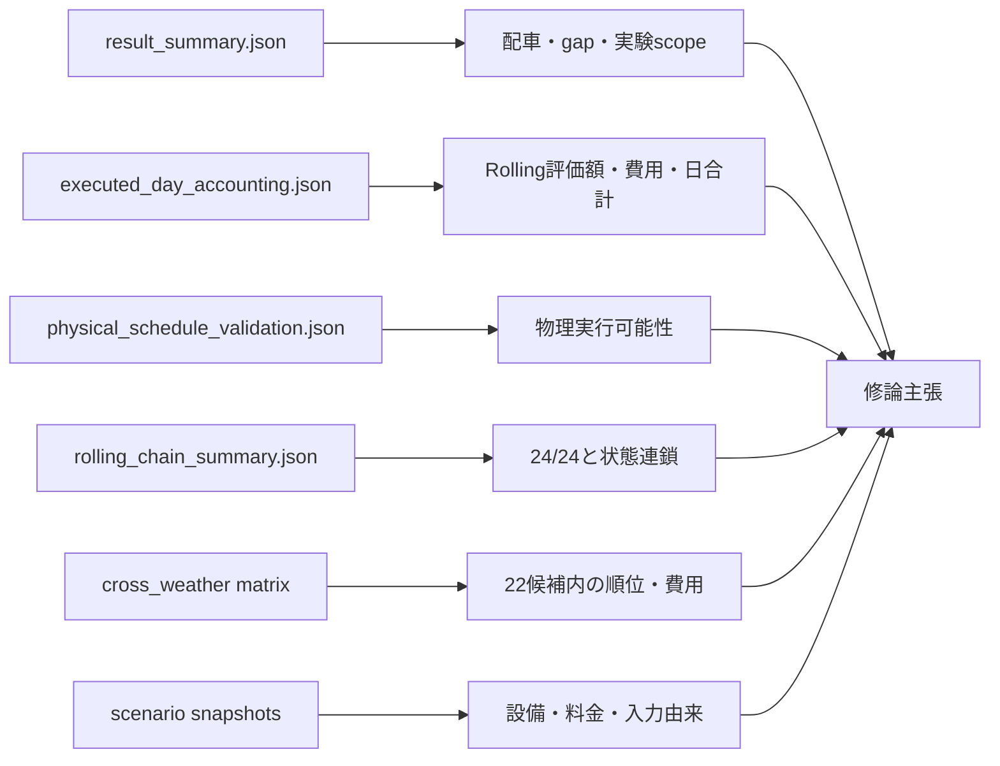

# システム全体像

## 非専門向け要約

本システムは、時刻表、車両、充電器、PV、BESS、料金を入力し、まず各便を担当する車両を決め、次にその担当を変えずに充電と営業所内電力の流れを決める。得られた日次計画を1時間ごとに見直し、実行した最初の1時間だけを状態として次時刻へ渡す。最後に、運行、SOC、充電器、電力、費用、入力由来を別々に検査する。

## 1. システム全体構成

## 2. データフロー

SUNNYとRAINではtimetable、vehicle、fleet contract、tariff、objective、solver controlを固定し、PV hashだけを分離している。RAINの日付を日曜ダイヤへ置換していない。

## 3. Phase 3二段階計算

Stage 2はStage 1へ一般的な最適化情報を返して全体を反復する統合手法ではない。評価済み候補の中からcanonical cost、使用車両数、物理割当hashの順で決定論的に選択する。

## 4. day-aheadとRolling

各stepの目的値は残余時間の値であり、24個を加算しない。`executed_day_accounting.json`は24個の実行prefixを15分×96スロットへ重複なくつなぎ、1回だけ費用を再計算した正本である。

## 5. artifactと主張

## 実行経路

`Fresh Prepare -> public BFF run-optimization -> phase3_two_stage -> 24-step Rolling -> physical/accounting finalization`である。主要実装は`bff/routers/optimization.py`、`bff/services/optimization_run/execute.py`、`src/optimization/milp/solver_adapter.py`、`scripts/run_hourly_charging_reoptimization.py`、`bff/services/optimization_run/rolling_chain.py`に分かれる。
