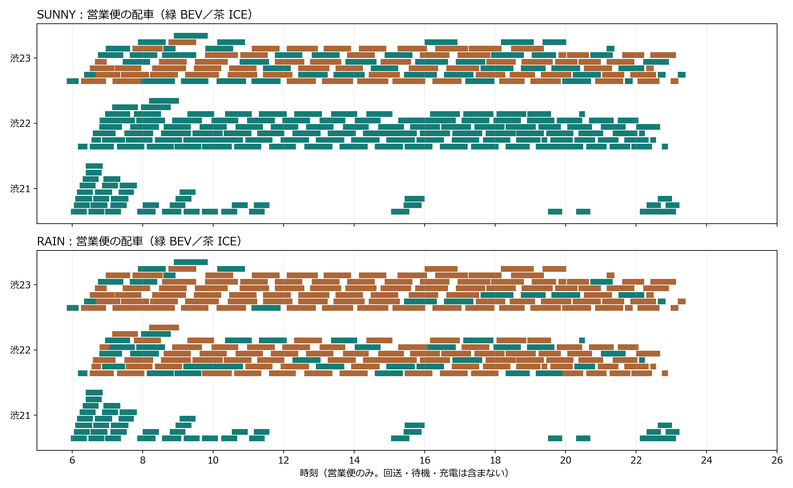
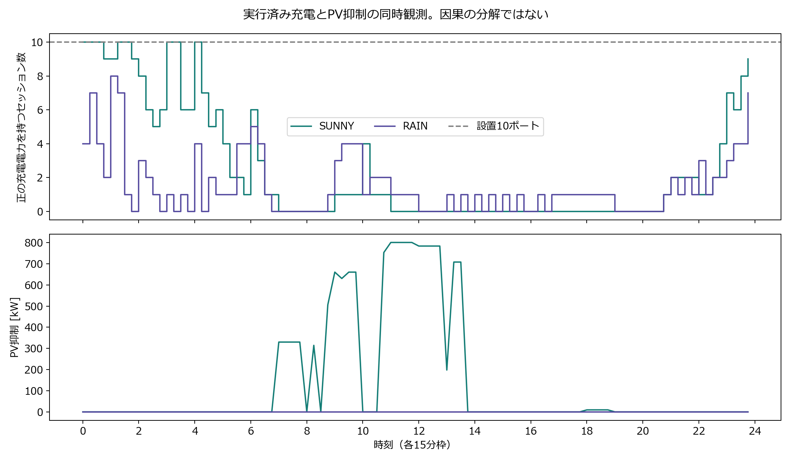

# 既存の凍結結果から今回新しく分かったこと

分析日：2026-09-05。実験SHA：`bb0c0050883a91dd86a9e8813ae88d4b6d8c361d`。新しいsolver実行は0件。

対象は `run_20260829_1445`（SUNNY）と `run_20260829_1455`（RAIN）。運行日は両方2025-08-05、WEEKDAY。低PVは2025-08-10由来の曲線を適用する。一般の晴雨比較より「固定運行・高PV／低PV比較」と呼ぶ方が正確である。

## 1. BEVの運行量を距離と時間でも示した

| 指標 | 高PV | 低PV |
| --- | ---: | ---: |
| BEV担当便 | 199 / 264 | 91 / 264 |
| BEV便数割合 | 75.38% | 34.47% |
| BEV営業距離 | 1,555.04 km | 635.21 km |
| BEV営業距離割合 | 72.78% | 29.73% |
| BEV営業時間割合 | 72.43% | 29.23% |
| 使用BEV1台当たり営業距離 | 55.54 km | 30.25 km |
| 使用ICE1台当たり営業距離 | 145.42 km | 136.50 km |

分母は全便の営業距離2,136.736916 km、営業時間10,994分。距離は凍結Prepared入力の `trip_stop_sequence_polyline_haversine` 由来で、停留所列から求めた距離。実走行距離の測定値ではなく、回送距離も含まない。車両別の仕事量やエネルギー消費を完全に説明するには回送も必要。

この2例では、BEVの便数割合は距離割合より高い。便数だけの図に加え、距離割合を併記することで運行量の説明を改善できる。因果として「短い便だから選ばれた」と断定するには、接続条件等の検証が必要。

## 2. 108便の置換位置を特定した

| 系統群 | 低PVでもBEV | 低PVはICE・高PVはBEV | 両方ICE |
| --- | ---: | ---: | ---: |
| 渋21 | 42 | 0 | 0 |
| 渋22 | 32 | 78 | 0 |
| 渋23 | 17 | 30 | 65 |
| 合計 | 91 | 108 | 65 |

高PVでICE・低PVでBEVになる便は0。ここでいう3系統群は16個のroute IDを束ねた分類であり、入力の路線数を変更していない。両条件で同じ便・距離・時刻であることを確認して比較した。

横棒は各営業便。同じ系統内の上下位置は重なりを見やすくするための表示用レーンで、車両IDや便鎖ではない。図から「渋22の78便と渋23の30便が置き換わった」と説明できる。理由を確定するには固定配車の評価などが必要。

## 3. PV抑制を充電器満杯やBESS満杯だけでは説明できない

高PVでは26個の15分枠で合計3,373.22 kWhが抑制された。そのうち2,532.00 kWh（75.06%）は充電電力がない枠で発生した。

- 抑制枠と10ポートすべてで正の充電電力がある枠の重なり：0 kWh。
- 抑制枠とBESSの枠末SOCが上限4,800 kWhに達する枠の重なり：0 kWh。
- 抑制枠のBESS枠末SOCの最大：3,644.33 kWh。

したがって、「BESSが満杯だったから55.7%余った」「10基とも使われていて充電できなかった」という単一の説明は、この採用計画の枠末記録では裏付けられない。

**これは原因を数量分解した結果ではない。** 車両の所在、必要な充電量、終端SOC、充放電モード、費用目的、同じ費用を持つ別の計画などが関係し得る。各状態は重複するため、これらを足して100%の原因円グラフにしてはいけない。未充電を「営業所にBEVがいない」「充電待ち」と読み替えることもできない。

## 4. 充電器利用は定義を明示した

| 指標 | 高PV | 低PV |
| --- | ---: | ---: |
| 最大同時使用（電力 > 0.000001 kW） | 10 | 8 |
| 最大同時使用（電力 >= 1 kW） | 9 | 5 |
| 正の充電電力を持つポート時間 | 60.0 h | 36.0 h |
| 24h×10ポートに対する割合 | 25.0% | 15.0% |
| 充電電力量／24h×10基×90kW | 11.26% | 4.87% |

同じ車両・充電器・枠のPV/BESS按分行を合算し、二重計上を除いた。第一の最大値には非常に小さいsolver出力も含まれる。1 kW基準は読み方を補足する記述統計であり、物理検算の許容値を変更するものではない。

「平均利用率が低いから設備を減らせる」「低PVは8基で十分」とは結論できない。充電器の最小必要数と充電待ち時間は今回の記録から未識別として `null` にした。故障実験では端末条件・充電の再配置まで評価する必要がある。

## 5. 共通車両使用費を分けた

| モデル評価額 [円] | 高PV | 低PV |
| --- | ---: | ---: |
| 合計 | 660,983.78 | 698,598.63 |
| 車両使用費 | 640,000.00 | 640,000.00 |
| 車両使用費を除く部分 | 20,983.78 | 58,598.63 |
| 車両使用費の割合 | 96.83% | 91.61% |

差37,614.84円のうち、燃料費差は33,054.03円（87.88%）、系統電力費差は3,925.56円（10.44%）、CO₂費用差は635.25円（1.69%）。表示丸めで百分率の和は100%とずれる場合がある。

最終評価額の出典はaccepted Rollingの `executed_day_accounting.json`。RAINの候補選択時評価698,296.47円と、Rolling後698,598.63円は異なる。差302.16円を混ぜない。設備投資、運転士費、保守費等を含む実際の営業所運営費ではない。

## 再現・根拠

表の元データは [summary.json](analysis/summary.json)、便ごとの確認は [trip_powertrain_changes.csv](analysis/trip_powertrain_changes.csv)。[manifest.json](analysis/manifest.json) は元artifact108件のSHA-256と各出力のSHA-256を記録する。既存の正本読み取り検証を再利用し、Preparedハッシュ、264便の一対一担当、公開値、96枠の電力と実行充電を照合した。これは既存実験の説明分析であり、現HEADで再実験した結果ではない。
