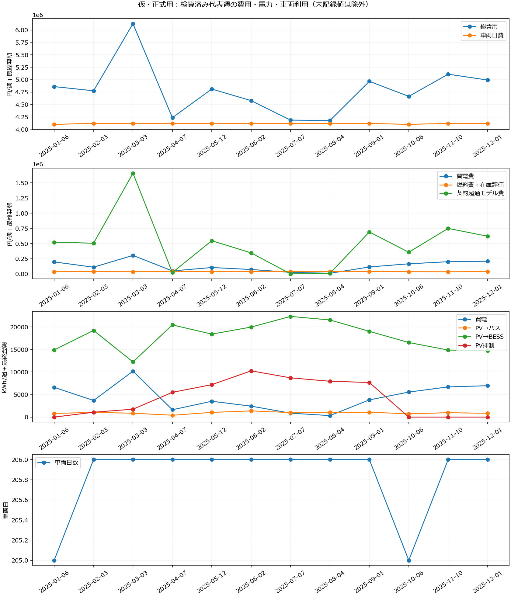

# 仮・正式用：各月の代表週の比較

実行固定版 `f524eca2552a4386bd033a15bbe046c14dc09281`。集計採用 12/12週。
各週は独立した連続7日間と最終翌朝の充電・受電・費用。月平均・年間連続運用ではない。
原本hashと記録済み物理判定、実行会計との一致を再確認した集計。新しい物理再求解ではない。
統合最適性・正式研究採用は別判定。未完了・検算不通過は費用比較へ含めない。

REPORTING_RECOVEREDは原試行の図表生成失敗を残した別出力での再検算済み集計。原ジョブの完了への変更ではない。

|代表週開始日|状態|週次費用 [円]|
|---|---|---:|
|2025-01-06|REPORTING_RECOVERED|4,860,462.66|
|2025-02-03|VERIFIED|4,776,386.72|
|2025-03-03|VERIFIED|6,126,515.17|
|2025-04-07|VERIFIED|4,235,093.71|
|2025-05-12|VERIFIED|4,811,474.56|
|2025-06-02|VERIFIED|4,577,588.89|
|2025-07-07|VERIFIED|4,185,894.60|
|2025-08-04|VERIFIED|4,178,455.31|
|2025-09-01|VERIFIED|4,966,232.14|
|2025-10-06|VERIFIED|4,663,508.59|
|2025-11-10|REPORTING_RECOVERED|5,110,163.39|
|2025-12-01|REPORTING_RECOVERED|4,992,623.66|

## 数値から読めること（記述的比較）

以下は集計採用した12/12週の範囲です。未完了週をゼロや推定値で補いません。
保存済み総費用の最小は2025-08-04開始週の4,178,455.31円、最大は2025-03-03開始週の6,126,515.17円、差は1,948,059.86円です。
これは取得した運用計画の費用差であり、各月の最適費用の順位や季節平均ではありません。

最大費用週−最小費用週の内訳（正値は最大費用週の方が高い）:

|費目|差 [円]|
|---|---:|
|車両日費|0.00|
|買電費|295,228.30|
|燃料費・在庫評価|-886.99|
|契約超過モデル費|1,648,813.37|
|CO₂費|4,905.18|
|未分解の費目差（総費用差から上記差の和を引いた値）|0.00|
|総費用差|1,948,059.86|

- 買電量：337.28〜10,178.23 kWh（記録あり12/12週）。
- PVからバスへの直接供給：414.68〜1,373.93 kWh（記録あり12/12週）。
- PVからBESSへの充電：12,231.42〜22,325.71 kWh（記録あり12/12週）。
- PV抑制量：0.00〜10,259.21 kWh（記録あり12/12週）。
- 受電ピーク：200.00〜733.86 kW（記録あり12/12週）。
- 車両日数：205.00〜206.00 車両日（記録あり12/12週）。

費目差の分解は算術的な説明です。PVだけを変えた対照実験ではなく、日付別入力・配車・充電・探索到達度の差を含みます。
総費用と買電・燃料費を分けて読むことで、車両日費や契約超過モデル費の変化を電力利用の効果と取り違えずに確認できます。
BESS初終端差は別表を参照してください。在庫取り崩しを翌週以降も続く節約とせず、月額・年額への単純換算も行いません。

## 週次費用の分解 [円/週＋最終翌朝]

|代表週|総費用|車両日費|買電費|燃料費・在庫評価|契約超過モデル費|CO₂費|円/営業km|円/便|
|---|---:|---:|---:|---:|---:|---:|---:|---:|
|2025-01-06|4,860,462.66|4,100,000.00|197,891.04|36,317.88|522,329.45|3,924.28|349.04|2,852.38|
|2025-02-03|4,776,386.72|4,120,000.00|110,646.49|37,385.22|505,866.40|2,488.60|343.00|2,803.04|
|2025-03-03|6,126,515.17|4,120,000.00|305,346.77|35,954.95|1,659,504.49|5,708.95|439.95|3,595.37|
|2025-04-07|4,235,093.71|4,120,000.00|48,977.96|42,249.08|22,322.02|1,544.64|304.13|2,485.38|
|2025-05-12|4,811,474.56|4,120,000.00|105,397.51|36,469.51|547,222.20|2,385.33|345.52|2,823.64|
|2025-06-02|4,577,588.89|4,120,000.00|72,880.60|36,469.51|346,395.39|1,843.39|328.72|2,686.38|
|2025-07-07|4,185,894.60|4,120,000.00|26,264.78|38,527.87|0.00|1,101.94|300.59|2,456.51|
|2025-08-04|4,178,455.31|4,120,000.00|10,118.47|36,841.94|10,691.13|803.77|300.06|2,452.15|
|2025-09-01|4,966,232.14|4,120,000.00|114,566.61|37,836.61|691,267.20|2,561.72|356.63|2,914.46|
|2025-10-06|4,663,508.59|4,100,000.00|166,496.31|36,317.88|357,293.36|3,401.03|334.89|2,736.80|
|2025-11-10|5,110,163.39|4,120,000.00|201,017.25|35,303.80|749,883.45|3,958.90|366.97|2,998.92|
|2025-12-01|4,992,623.66|4,120,000.00|208,854.71|38,424.27|621,201.35|4,143.32|358.53|2,929.94|

## 電力利用・車両運用（最終翌朝を含む）

|代表週|買電 kWh|PV→バス kWh|PV→BESS kWh|PV抑制 kWh|BESS→バス kWh|受電ピーク kW|車両日数|燃料 L|
|---|---:|---:|---:|---:|---:|---:|---:|---:|
|2025-01-06|6,596.37|821.71|14,881.82|0.00|15,140.85|720.00|205.00|242.12|
|2025-02-03|3,688.22|1,035.52|19,224.42|1,080.80|17,855.05|702.21|206.00|249.23|
|2025-03-03|10,178.23|868.33|12,231.42|1,756.12|11,544.14|630.00|206.00|239.70|
|2025-04-07|1,632.60|414.68|20,447.24|5,495.52|20,163.63|240.00|206.00|281.66|
|2025-05-12|3,513.25|1,045.12|18,399.96|7,193.49|18,041.19|570.00|206.00|243.13|
|2025-06-02|2,429.35|1,373.93|19,968.38|10,259.21|18,796.28|561.44|206.00|243.13|
|2025-07-07|875.49|1,021.60|22,325.71|8,707.68|20,625.28|200.00|206.00|256.85|
|2025-08-04|337.28|1,072.29|21,538.23|7,948.89|21,148.25|239.26|206.00|245.61|
|2025-09-01|3,818.89|1,088.23|19,016.26|7,677.76|17,663.63|733.86|206.00|252.24|
|2025-10-06|5,549.88|727.04|16,543.68|0.00|16,282.01|435.99|205.00|242.12|
|2025-11-10|6,700.57|978.63|14,868.56|0.00|15,016.81|732.21|206.00|235.36|
|2025-12-01|6,961.82|848.82|14,746.77|0.00|14,696.51|699.64|206.00|256.16|

## BESSの在庫 [kWh]

|代表週|営業所|初期|終端|差（終端−初期）|
|---|---|---:|---:|---:|
|2025-01-06|tsurumaki|3,000.00|1,200.00|-1,800.00|
|2025-02-03|tsurumaki|3,000.00|2,468.41|-531.59|
|2025-03-03|tsurumaki|3,000.00|2,468.12|-531.88|
|2025-04-07|tsurumaki|3,000.00|1,200.00|-1,800.00|
|2025-05-12|tsurumaki|3,000.00|1,489.24|-1,510.76|
|2025-06-02|tsurumaki|3,000.00|2,184.40|-815.60|
|2025-07-07|tsurumaki|3,000.00|2,498.60|-501.40|
|2025-08-04|tsurumaki|3,000.00|1,200.00|-1,800.00|
|2025-09-01|tsurumaki|3,000.00|2,472.15|-527.85|
|2025-10-06|tsurumaki|3,000.00|1,577.54|-1,422.46|
|2025-11-10|tsurumaki|3,000.00|1,317.97|-1,682.03|
|2025-12-01|tsurumaki|3,000.00|1,539.42|-1,460.58|

PV→BESSとBESS→バスは別時点の流れで、合計をPV利用量としない。BESS初期在庫の由来も当該週のPVとはしない。
契約超過モデル費は実際の電気料金の保証ではない。設備投資・保守・劣化等は原モデルの未計上範囲を引き継ぐ。
燃料費は消費距離に基づく在庫評価を含む。総費用を現金支出だけと解釈しない。

費目・電力量・車両台帳は各週の元resultsを参照。電費一定条件であり空調負荷差は未評価。
BESS初終端はcomparison.jsonのbess_terminalに原記録を保存。在庫取り崩しを恒常的節約やPV効果としない。
設備費等の未計上項目、受電設備・距離・fleetの仮定、元の研究判定は引き継ぐ。
