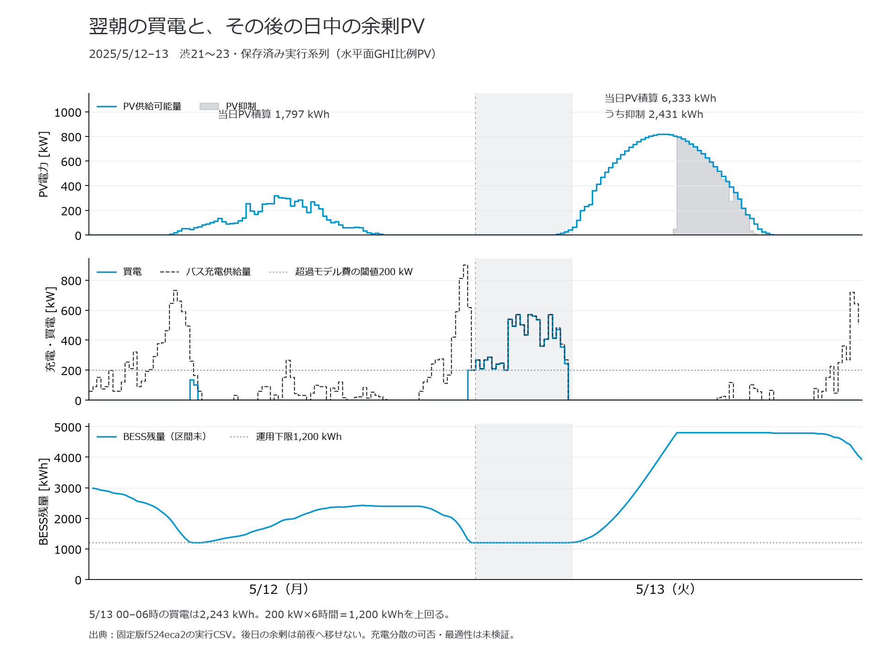

# 週次運用研究の意味と、先生への説明

作成：2026-10-03。対象：渋21〜23「仮・正式用」、2025年の各月から事前選定した12代表週。各季節は集計上の区分であり、実験を四季4ケースへ置き換えない。

## 1. 研究で答える問い

**所与の車両・ダイヤ・充電設備のもとで、日ごとの日射と翌朝までの充電要求が、連続7日間の運行成立、電力利用、週次費用にどう現れるか。**

この問いを、①全対象便を運行する週次計画、②その計画の費目別評価、③月別代表週での違い、の三つに分ける。最適化は計画を作る手段であり、全ケースの統合最適性を証明することを成果提示の前提にしない。時間上限内の実行可能解にも評価上の意味があるが、「最適費用」とは呼ばない。

研究の価値は、計算を12本完走した件数だけでは説明できない。日射がいつ利用でき、バスがいつ充電でき、BESSがどこまで翌朝へ移せるかを時系列で結び、費用差を説明する必要がある。今回の再集計は、その説明に使える事実を追加した。

## 2. 何が既に分かり、何がまだ分からないか

| 論点 | 今回確認した事実 | 主張の限界 |
|---|---|---|
| 週次計画 | 保存済み12週の物理判定はaccepted。各週1,704便、営業距離13,925.428829 km | 今回は原本CSVの照合・再集計。全native成果物の独立再検証を新たに完了したものではない |
| 比較の基礎 | 曜日内の便ID・時刻・区間・事業者・距離等を正規化した時刻表hashは12週共通。使用有無を除く車両台帳の全項目hashも共通 | 全Prepared制約・探索到達度・車両割当まで同一という意味ではない |
| 電力と費用 | 15分ごとのバス充電供給収支、週全体のBESS収支、超過費式、費目合計を再照合 | 設定されたモデルの整合。実設備・実請求額の保証ではない |
| 月別比較 | 入力と記録された運用結果の違いを記述できる | 月の違いには予測・割当・充電・在庫・探索の違いも含まれる。PVだけの因果効果ではない |
| 最適性 | 原本の停止理由・各段階のgapを保持。週全体の統合gapは未算出 | 費用順位を各月の大域最適費用順位と呼ばない |

計算固定版は `f524eca2552a4386bd033a15bbe046c14dc09281`。現開発HEADの成果へ付け替えない。元の正式研究採用判定と失敗・図表復旧の履歴は保持する。「条件付き週次評価」と正式研究採用は別である。

## 3. 今回得られた、説明の中心に置く結果

### 3.1 4月と5月：PV総量が近くても、費用は近くならない

| 指標 | 4/7開始週 | 5/12開始週 | 5月−4月 |
|---|---:|---:|---:|
| 利用可能PV [kWh] | 26,357.44 | 26,638.58 | +281.14（+1.07%） |
| モデル週次総費用 [円] | 4,235,093.71 | 4,811,474.56 | +576,380.85（+13.61%） |
| 車両日費 [円] | 4,120,000.00 | 4,120,000.00 | 0.00 |
| 契約超過モデル費 [円] | 22,322.02 | 547,222.20 | +524,900.18 |
| 買電量 [kWh] | 1,632.60 | 3,513.25 | +1,880.65 |
| PV抑制 [kWh] | 5,495.52 | 7,193.49 | +1,697.97 |
| BESS終端残量 [kWh] | 1,200.00 | 1,489.24 | +289.24 |

費用差の約91.1%は、採用した超過モデル費の差に対応する。この結果から、少なくとも今回の記録を「週のPV総量が多いほど費用が安い」という説明だけで並べることはできない。

この二つの計画を固定した費用差は、`51,480.67円 + 超過単価[円/kWh] × 1,049.80 kWh` に分解できる。車両日費は同額で、それ以外の差の大部分が超過単価500円/kWhから生じる。これは保存済み計画の会計上の恒等式であり、別単価で再最適化した結果ではない。したがって「運用の時間差」と「その時間差をどれだけ高く評価するか」を分けて説明する。[差額の原値](april_may_comparison.json)を保存した。

2026-10-05訂正：この表の車両日費を原CSVの各412万円へ訂正した。前記の410万円は説明表の誤記。差額・超過費分解・元計算・CSVに変更はない。

一方、これは「PVを増やすと高くなる」という実験ではない。気象の並び方、予測誤差、配車と充電、終端残量、求解結果を区別して追跡する入口として使う。

### 3.2 5/12〜13：後から得られるPVと、その前に必要な充電

- 5/12の利用可能PVは1,797.33 kWh。BESSは同日末に運用下限1,200 kWhへ到達している。
- 5/13の00〜06時に買電2,242.92 kWh。その後、同日の日中にPV6,333.35 kWhが得られ、2,431.40 kWhを抑制している。
- 未来の日射は、その前の夜の充電へ戻せない。週積算だけではこの前後関係が見えない。

200 kWを6時間維持した電力量は1,200 kWhである。**00〜06時の買電量2,242.92 kWhを固定し、その6時間内だけで配分し直すなら、少なくとも1,042.92 kWhはこのモデル閾値を超える。** 実際の同区間の超過は1,092.92 kWhだった。

この算術確認は、00〜06時内の単なる平坦化だけでは、その買電量を200 kW以内へ収められないことを示す。帰庫後〜翌朝出庫の実充電可能時間とは異なり、前日深夜への移動、早い時間のPV利用、配車変更を含む可行性は検証していない。週次問題の下界・不可行性・充電集中の最適性の証明ではない。

ここから検証する仮説は「日射の総量より、充電要求との時間差、前日からの残量、充電可能時間が受電と費用を左右する場面がある」。別の可行な充電計画でこの集中を減らせるなら、現行計画・ローリング処理の改善余地として報告する。仮説に都合の悪い結果も残す。

## 4. なぜ7日間にする意味があるか

平日・土休日の便と需要、低日射日の連続、夜間から翌日の残量、翌朝SOC目標、週末後の充電費用を、同じ状態の鎖として確認できるからである。毎日SOCを初期化した独立1日計算を足し合わせる方法では、前日の不足や蓄えを翌日へ渡す影響が消える。

ただし「7日間を解いた」だけが学術的な新規性ではない。[Hendriks・Sturmberg (2024)](https://www.nature.com/articles/s44333-024-00008-2)は週単位の充電、車両の利用可能時間、定置電池と受電ピークを既に扱う。[Liuら (2024)](https://doi.org/10.1016/j.tre.2024.103572)はPV・蓄電設備を含むバス充電計画を扱う。[Nathらのプレプリントv2](https://arxiv.org/abs/2504.20790v2)には季節的な日射・温度と複数期間のシナリオが含まれる。

今回の貢献候補は、**対象路線の混成車両、翌朝の運用SOC上限、余剰PVだけで充電する補助BESSという条件下で、月別代表週の運行・需給・費用を連続時系列で評価し、日射と充電要求の時間差が現れる場面を定量的に示すこと**である。世界初とは主張しない。対象固有の事例研究として何が有用な知見かを先生と確認し、必要な比較を加えて貢献を確定する。

上記は焦点を絞った一次資料確認であり、系統的な全件文献レビューではない。確認範囲は[文献・根拠一覧](source_manifest.json)に記録した。

## 5. 経済性の説明で必ず分けるもの

1. **費用水準と削減効果**：現在は設定条件下の運用評価額を示せる。比較対象なしに「何円削減した」とは言えない。
2. **実支出とモデル評価項**：車両日費、超過モデル費、CO₂評価は仮定を含む。燃料費は全12週で距離ベースの暫定消費評価であり、実際の給油支払いとは異なる。
3. **電力量とタイミング**：200 kWは有料超過可能なモデル閾値、500円/超過kWhは実験係数。実契約の請求規則や受電設備の絶対上限ではない。費用差の大部分がこの係数に依存するため、実料金への外挿はしない。
4. **運用と投資**：PV・BESS設備費、保守・劣化費を含めた投資採算は未評価。今回の運用結果から購入の有利さや最適容量を結論づけない。
5. **PVと初期在庫**：BESS初期3,000 kWh、下限1,200 kWh、余剰PV充電、追加予備・終端復元なしの合意条件を維持する。終端は1,200〜2,498.60 kWhに分布し、常に下限へ戻るわけではない。

週次電力収支では、充放電効率を各0.95として、次式を確認した。

`BESS→バス = 0.95² × PV→BESS + 0.95 × (初期BESS残量 − 終端BESS残量)`

右辺第2項のバス側電力量換算は週により476.33〜1,710.00 kWh。この正味在庫減少を、当該週に発電したPVや恒常的な節約として数えない。これは集約収支上の分解であり、個々の車両への電源追跡ではない。終端差は現在の条件で得られた結果であり、入力不一致とは扱わない。

総費用に占める車両日費は約67.2〜98.6%。したがって、総費用だけでなく、車両日費・買電費・燃料評価・超過モデル費を分け、買電量、PV直接利用・BESS経由利用・抑制を並べる。この表示変更のために再求解は不要である。

## 6. 先生の疑問への回答と、次に必要な確認

| 想定される問い | 今、答えられること | 次に確かめること |
|---|---|---|
| 「なぜ7日間？」 | 日別ダイヤ、日射の並び、翌朝SOCと在庫の継承を同じ期間で扱うため。1日結果の7倍ではない | 日境界と最終日の翌朝までの範囲を図と台帳で示す |
| 「PVがあるのになぜ夜に買う？」 | 該当時刻はPVがなく、BESSは利用可能分を使い切っている。未来のPVは前夜へ使えない | 帰庫・回送・充電枠・必要SOCから、どこまで前倒しや分散が可能か |
| 「夜間集中は最適化が悪いだけでは？」 | 供給理由は確認できるが、その時刻に集中する必要性は未証明 | 同じ配車・情報・物理条件で別の充電計画を作り比較する |
| 「季節差と呼んでよい？」 | 12代表週の日射・日付別運行条件の比較。電費一定条件である | 季節内の全期間・気温/HVACを含む実季節影響へは一般化しない |
| 「経済性は何を示す？」 | 費目別の週次評価額と、買電・燃料・車両使用・超過の対応 | 必要なら同条件の対照を一つ設定し、実支出・未計上費用と分ける |
| 「本当に最適？」 | 検算済みの実行可能解。各段階の求解品質は記録済み | 統合最適性は未証明。対象の異なるgapを週全体へ転用しない |
| 「設置面の日射では？」 | 現12週は水平面GHI比例のPV推計。設置角・方位を反映した発電評価ではない | DNI/DHIと太陽位置を使い、設置角・方位を明示した別入力版を検討する |
| 「来週も同じ節約ができる？」 | 独立代表週の有限期間評価。初終端残量を併記する | 初期在庫を毎週無料で復元した長期運用・年間節約とは説明しない |

2026年ダイヤ×2025年気象の仮想運用実験であり、2025年実運行の再現ではない。予測は2024年のclimatologyで、予測誤差は予測系列と実現系列の差。年次が違うこと自体を予測誤差の定義にしない。距離は地理的代理距離であり、実道路距離の検証は残る。

## 7. 次の作業を、成果へ直結する範囲に絞る

### 優先1：既存結果だけで、充電可能時間と情報の対応を示す

5月を先に、必要なら3月も確認する。各車両について、帰庫までの回送、実際の営業所到着、次の出庫、充電器への接続可能時間、必要な充電量、翌朝SOC期限を抽出する。最後の営業便の到着を帰庫時刻へ置き換えない。

前日計画の予測PV、毎時ローリングで利用した情報、実現PV、採用された実行区間を対応づける。将来の実現PVを既知としていたかのように解釈しない。日中の抑制と翌夜のBESS利用まで追えば、余剰がいつ使えるかを説明できる。

### 優先2：固定配車の充電比較をまず1件、必要なら2件

最初は5月の同じ配車を固定し、既存の充電求解・物理検算・会計経路を使う。比較内でダイヤ、充電器、帰庫、翌朝SOC90%、料金、PV情報、BESS余剰PV方策、効率、初期状態を揃える。元計画の終端状態も比較内で揃えれば、追加の在庫取り崩しによる見かけの改善を除ける。これは局所診断の統制であり、元12週の終端復元方策を変更しない。

良い可行候補が得られたら「固定配車下の改善余地」とする。得られなければ、証明付きの不可行と、時間上限・解なし・実装未対応を分ける。「別解が出ない」だけで現行計画を最適としない。

実現PVを全期間既知とする比較は、予知情報を与えた診断参照である。運用できる改善を主張する場合は、同じ予測情報とローリング手順で実行・会計まで比較する。費用が近い結果なら、その組だけ追加時間を配分する。全12週のgap改善や多数seedを先に必須化しない。

### 優先3：設置面PVの入力分析を先に行う

保存済み2025年15分データにDNI・DHI・GHIがある。太陽位置、設置角・方位、時刻・単位、損失を明示し、水平面から設置面への推計を別版で作る。角度未確認なら仮定として扱う。12週の入力差は求解なしで先に集計し、結果に効きそうな少数の組から確認する。

再計算する場合は、予測PVと実現PVの変換条件を対応させ、新しいclean固定版・新しい入力hashで実行する。旧GHI比例結果は旧版として残し、異なるPV定義の結果を同条件の12週比較に混ぜない。

以上の追加比較は未実施。今回の依頼では計算を自動開始していない。元12週の分析・図表・発表説明は、この追加比較を待たず進められる。

## 8. 先生へ90秒で説明する文章

> 今回は、渋21〜23について、平日と土休日を含む連続7日間を、各月から1週ずつ評価しました。目的は、この条件で運行と翌朝までの充電が成立するか、週に何の費用がかかるか、月ごとの日射で運用がどう違うかを示すことです。
>
> 重要なのは、PVの週合計だけでは費用を説明できないことです。4月と5月のPV総量は約1%しか違わない一方、5月のモデル総費用は約57.6万円高く、約52.5万円は超過モデル費の差でした。5月の時系列を見ると、少ない日射の翌朝に買電が発生し、その後の日中にはPVの余剰が出ています。週合計だけを見ると隠れる、充電要求と発電の時間差が表れています。
>
> ただし、夜間へ集中した計画が最も良いとはまだ証明していません。次に帰庫から出庫までの充電可能時間と予測情報を確認し、同じ配車のまま充電を変える少数比較で、避けられる集中と避けにくい要求を区別します。200 kWと超過単価はモデル仮定で、設備投資や実料金の節約はまだ結論にしていません。

## 9. Claudeとの検討と検証範囲

Claude Codeへ3回、根拠を追加しながら研究上の問い・説明・比較範囲のレビューを依頼した。時間的な関係を研究の中心へ置く提案は採用し、BESS終端固定による全12週再計算、200 kWの設備上限扱い、夜間算術確認を不可行性証明とする提案は訂正した。[採否とレビュー記録](claude_discussion.md)を参照。

Claudeは提供した記録を検討したもので、原本・論文・実機を直接監査したものではない。先生の研究採用承認でもない。今回の数値と図は、原本102ファイルのhashを確認したうえで、[再集計スクリプト](analyze_existing_weeks.py)から生成した。再実行手順・検証限界は[README](README.md)に記録した。
