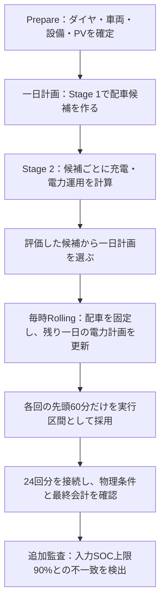

# 研究の現在地と進捗資料の詳しい解説

あなた自身が研究を理解し、占部先生に自分の言葉で説明するための資料です。2026年9月8日確認。

対応する発表資料は [元の8月進捗報告・現在37枚](修士研究_2026年8月_進捗報告_先行研究図表パラメータ追加版.pptx) です。この説明資料だけで全体像を読めるようにまとめています。

> **現在地：配車・充電・毎時更新を動かし、保存結果を追跡できるところまで進んでいます。しかし、指定SOC上限と実行結果の不一致が見つかりました。今は、研究結論を確定する前に、制約と検証を修正して再実験する必要がある段階です。**
>
> 以下の実験数値はすべて **DIAGNOSTIC / NOT USED FOR RESEARCH CONCLUSIONS（原因調査・説明用。研究結論には使用しない）** です。数値を読むことと、正しい条件での研究成果として採用することを分けてください。

## この説明資料の読み方

- 全体をつかむ：第1～4章。研究の目的と、現在の方法を理解します。
- 数値を説明できるようになる：第5～10章。配車、電力、SOC、費用、計算時間を順番に読みます。
- 発表の準備：第12章の37枚解説と、第14章の想定問答を読みます。
- 次にすることを決める：第13章。作業順序と、何をもって完了とするかを確認します。

## 1．現在、何ができていて、何ができていないのか

### 1.1 研究を五つの段階に分ける

| 段階 | 確認したいこと | 現在地 |
| --- | --- | --- |
| 入力をそろえる | 同じダイヤ、車両、設備で比較できるか | 保存された比較入力とハッシュの記録がある |
| 計算を動かす | 配車、充電、毎時更新まで処理がつながるか | 8月29日の保存実行で一連の処理が動いた |
| 指定条件を守る | 入力した制約すべてを実行結果が満たすか | **SOC上限で不一致。ここを解消する必要がある** |
| 方法の価値を示す | 何と比べて、どの程度良いのか | 同条件baseline比較、統合方式との比較が未実施 |
| 研究として確定する | 出典・検証・独立レビューを満たして主張できるか | 出典の残件と独立レビュー等が残り、確定していない |

「コードが動く」「検査が通る」「論文で主張できる」は、それぞれ別の到達点です。現在は最初の二つについて証拠があり、三つ目の条件適合を追加監査で問い直している状態です。

完成率を70%や90%と付ける根拠はありません。論文執筆量や機能数が増えても、研究結論の前提となる制約が未解決なら、その部分は未達です。逆に、この問題があるからといって、入力整備・実行経路・可視化・検証の仕組みがすべて無価値になるわけでもありません。

### 1.2 今までの作業で残る価値

固定したダイヤと車両を用意し、配車案を比較し、毎時の実行区間だけを接続し、費用の最終台帳へ結び付ける仕組みがあります。この仕組みがあるため、今回も「資料のSOC上限90%」と「保存された最大SOC93.375%」を突き合わせられました。

ただし、資料を詳しくしたこと自体を、モデルの正しさを改善した実験と数えてはいけません。今回直したのは主に説明と主張の範囲であり、SOC制約の修正や修正後のsolveは行っていません。

### 1.3 今、言ってよいこと

「二つの固定PV条件について、異なる配車が保存されている」「日合計だけでなく15分の電力やSOCまで追える」「入力SOC上限が守られていない例を見つけた」は説明できます。

一方、「すべての物理条件を満たした」「この方法が既存手法より優れている」「晴天なら一般にこの費用差になる」「研究モデルは完成した」は、現在の証拠では言えません。

## 2．実験した日と、資料を直した日を分けて理解する

| 時点 | 行ったこと | 何を意味するか |
| --- | --- | --- |
| 2026年8月29日 | 固定入力で配車・充電・24回のRollingを実行 | いま説明している数値の元となる実験 |
| 9月5～7日 | 保存結果の再集計、文献整理、図表・説明の整備 | 新しい最適化結果を出したわけではない |
| 9月7日の追加確認 | PreparedのSOC上限と保存軌跡の不一致を開示 | 旧結果の研究への使用範囲を診断用に限定 |
| その後の資料整理 | 指定された元PPTXへ37枚版を反映、派生版を保管 | 普段使う発表ファイルを一本化 |
| 9月8日の本資料 | 現在地、図の読み方、次の作業を詳しく説明 | モデル修正・再実験は行っていない |

実験のコード識別子は `bb0c0050883a91dd86a9e8813ae88d4b6d8c361d` です。本資料作成時の作業ツリーのHEADは `85b01713ae73a33b79bed434a542bd227aa5d7d5` で、資料等の未コミット変更があります。**現在のコードを今走らせて得た結果として、8月29日の数値を説明してはいけません。**

9月8日に、補足集計が参照する108ファイルのハッシュが記録と一致すること、元PPTXが反映済み37枚版のハッシュと一致することを確認しました。これは出典のその範囲を確認したという意味で、過去の別manifestの不一致やモデルの欠陥が直ったという意味ではありません。

## 3．そもそも、あなたの研究は何を解こうとしているのか

### 3.1 対象となる実際の難しさ

バスは、電気が余った時刻だけ走ればよいものではありません。ダイヤで決まった時刻に走り、次の便に間に合い、営業所で充電する時間を確保する必要があります。そのうえで、PV発電は時刻によって変わり、充電器の数や出力にも限界があります。

したがって、考える対象は「どの便をどの車両が担当するか」と「いつ・どこから・どれだけ充電するか」の両方です。BEVを多く使えば燃料消費を抑えられる可能性がありますが、その車両が充電する時間と場所を確保できなければ、成立する運行計画にはなりません。

### 3.2 用語を日常の意味へ置き換える

| 用語 | 意味 | 混同しやすい点 |
| --- | --- | --- |
| BEV | 電池で走る電気バス | 使用台数と担当便数は違う |
| ICE | エンジンで走るバス | 今回の軽油条件と、Slackの過去の呼び方を区別する |
| PV | 太陽光発電 | 発電可能量のすべてを利用できるとは限らない |
| BESS | 営業所に置く定置用蓄電池 | バスに積まれた電池とは別の設備 |
| SOC | 電池に残っているエネルギーの割合 | 90%は電力出力ではなく残量の割合 |
| 配車 | 便を車両へ割り当て、連続する運行をつなぐこと | 便を配るだけでなく、回送・時間接続も必要 |
| 回送 | 乗客を運ぶ営業便以外の車両移動 | 距離・時間・エネルギーを消費する |
| Prepared | 実行に用いる入力を具体化した保存データ | 画面の表示とsolverへ届く値が一致する必要がある |
| 制約 | 守らなければならない条件 | 費用が安ければ破ってよい条件ではない |
| 目的関数 | 条件を守った案どうしを比べる評価式 | 現実の総費用をすべて含むとは限らない |
| baseline | 方法の価値を測るための比較相手 | 高PVと低PVの比較だけでは手法の優劣比較にならない |

### 3.3 研究の問いと、現在まだ答えられない問い

今の具体的な観察対象は、「同じ264便・車両・設備に、異なるPV曲線を与えると、保存された配車と電力運用がどう変わるか」です。

修士研究としてさらに必要なのは、「提案する二段階方式は、単純な運用や比較手法に対してどの点で有用か」「計算を分けることによって、解の品質と計算時間にどのような違いが生まれるか」といった問いへの証拠です。これらは、現在の二条件の結果だけでは答えが出ていません。

## 4．計算はどの順番で動くのか

### 4.1 二つの違う『段階』を区別する

**Stage 1 / Stage 2** は、一日計画の計算を配車側と電力側に分けることです。**一日計画 / 毎時Rolling** は、計画するタイミングを分けることです。先生の「一日の後に一時間の最適化」という要望を説明する際に、この二種類を一つの意味で使わないでください。

### 4.2 Stage 1：配車と、電力費用の楽観的な見積もり

Stage 1では配車候補を作ります。車両が次の便へ移るときは、少なくとも「到着時刻＋折返し時間＋回送時間≦次の出発時刻」を守る必要があります。

保存実行のStage 1には、15分単位のPV・BESS・電力費用の評価が入っています。ただし充電器の割当やBESSの充放電モード等を連続緩和した代理評価であり、後段と同じ離散条件をすべて解いた最終費用ではありません。そのため、Stage 1でよさそうな配車でも、後段で具体的な充電時刻を決めると、期待した費用にならないことがあります。

「充電量の下界」は、必要な充電量を少なく見積もっても最低限これだけは必要、という量です。説明用の式は次のとおりです。

`最低充電器入力 = max(走行・回送消費 + 終端要求残量 − 初期残量, 0) ÷ 充電効率`

例えば、走行消費100 kWh、初期残量80 kWh、終端要求80 kWh、充電効率0.95なら、最低でも100÷0.95≒105.26 kWhの充電器入力が必要です。これは**式を理解するための仮想例**で、本研究の実測値ではありません。この量を確保できることと、必要な時刻に充電できることは別です。

### 4.3 Stage 2：配車を固定して充電と電力を決める

候補の担当便を固定し、充電時刻、PVの利用先、BESSの充放電、系統購入などを具体化します。今回の保存実行では22候補を評価しています。

22候補の中で安い案を選べても、すべての可能な配車を調べたことにはなりません。「有限候補の中で選んだ結果」と説明します。さらに今回、そのStage 2のSOC上限の扱いに不一致が見つかっています。

### 内訳の違いが出た理由：何をどこで直したか

**8ページを一言でいうと、配車の選択肢を1案から22案に増やした、という修正です。** 配車とは「どのバスがどの便を走るか」を決めることです。以前も太陽光発電量は費用計算に使っていました。しかし、詳しく費用を比べる配車が一つしかなければ、電気バスの台数や担当便が違う別案の方が安いかを比較できません。修正後は21案多い22案を評価します。同じ22案を高PV・低PVで評価した診断は、22×2＝44回の比較です。

**9ページは、その比較を金額で示したものです。** 高PVでは、電気28台のA案が電気21台のB案より **33,624円/日安い**。低PVでは反対にB案がA案より **8,418円/日安い**。そこで高PVではA、低PVではBを選びました。選ばれた案の差は、電気バス **7台**、電気バスの担当便 **108便**（199−91便）です。両案とも合計32台・264便で、単に運行便を減らした結果ではありません。

この費用差は、**同じPV条件でA案とB案を比べた差**です。「修正によって以前より何円安くなったか」ではありません。7台・108便も修正前後の増減ではなく、高PVで選ばれた案と低PVで選ばれた案の差です。旧モデルの電池残量上限には不一致が残るため、これらは仕組みを調べるための診断値です。

以前の同一配車は、通常のPhase 3経路がStage 2へ渡す候補を1案に限定し、候補の選択肢が不足していたこととして診断されています。PV・BESS・料金がStage 1へ全く入っていなかった、という診断ではありません。また、最終選択の費用ソートは、渡された候補に対して正しかったと記録されています。

2026年8月27日の修正 `edcbe703` では、公開BFFの `_apply_research_phase3_candidate_coverage_policy` を実行経路へ追加しました。研究用Phase 3では、候補上限を最低22、構成探索幅を最低4、既存のBEV構成探索をONにします。8月29日の保存実行では実効22候補を評価しました。要求値1案・幅0・探索OFFと、実際に適用した22案・幅4・探索ONは区別して記録します。

最終選択は引き続きStage 2費用→使用台数→配車ハッシュの順です。晴天ならEVを増やすという恣意的な優遇係数は追加していません。配車を毎時更新するRollingが車種構成を分けたわけでもありません。

| 同じ配車を両PVで評価（一日計画、円/日） | 高PV | 低PV |
| --- | ---: | ---: |
| 案A：BEV28・ICE4台 | 660,983.78 | 706,714.24 |
| 案B：BEV21・ICE11台 | 694,607.64 | 698,296.47 |

高PVでは案A、低PVでは案Bが安く、22候補全体でもそれぞれが最小でした。この交差評価は配車を固定し、充電・電力運用だけを再計算した診断（SHA `3ec8714`）です。その後の通常経路の8月29日実行（SHA `bb0c005`）でも同じ配車ハッシュを選んだため、候補被覆の修正が通常の実行へ到達したことを確認しています。

つまり、「PVによって費用が変わる選択肢を、実際に比較対象へ出せるようにした」ことが修正の中心です。候補内のStage 1代理順位とStage 2費用順位の逆転は監査対象で0件であり、候補内ソートの誤りを修正したという説明ではありません。この限定診断は、旧方式に対する速度改善率や統合全体の最適性を示すものではありません。

**この表もSOC上限不一致を持つ旧モデルの診断です。** 修正後にも同じ順位・台数になる保証はありません。低PV698,296.47円は候補評価時の額で、最終Rolling698,598.63円とは区別します。

根拠：[候補診断](../docs/evidence/weather_dispatch_rerun_bb0c005/case_a_candidate_selection_audit.json)、[固定配車の交差評価](../docs/evidence/weather_dispatch_rerun_bb0c005/cross_weather_fixed_dispatch_matrix.json)。本編8・9枚目で説明し、補足32枚目のStage 1説明も修正しています。

### 4.4 Rolling：一時間ずつ進める

例えば00:00に残り一日を計算しても、その計画の24時間すべてを確定した実行値として数えません。最初の00:00–01:00だけを採用し、01:00に残りの時間を計算し直します。これを24回繰り返します。

本研究の今回の経路では、Rolling時の配車は固定です。毎時すべての便を別の車両へ再配車しているわけではありません。また、毎時更新が動いたことだけで、未知の天候予測誤差にも強いと証明したことにはなりません。

## 5．比較条件をどう理解するか

| 条件 | 今回の設定 | その意味 |
| --- | --- | --- |
| 営業所・ダイヤ | 弦巻、平日264便・16路線 | 一営業所・一つのダイヤに限定 |
| 運行日 | 2025年8月5日で固定 | 低PV側も同じ運行日の反実仮想 |
| 高PVの曲線 | 2025年8月5日由来、6,056.25 kWh/日 | 発電量が多い入力 |
| 低PVの曲線 | 2025年8月10日由来、996.20 kWh/日 | 日曜の実運行を再現したわけではない |
| 入力車両 | BEV35台、ICE25台 | 実際に使用する台数とは異なる |
| BEV電池 | 314 kWh/台 | SOC%をkWhへ換算する母数 |
| BEVの指定SOC範囲 | 20～90% | **上限90%は保存結果と不一致** |
| 充電設備 | 90 kW×10基、各1ポート | 車両側の上限や在所時間も関係する |
| BESS | 6,000 kWh、900 kW | 容量と充放電出力は別の量 |
| BESSの範囲 | 1,200～4,800 kWh | 容量の20～80%に相当 |
| BESSの始終端 | 3,000→3,000 kWh | 前日からの残量を一方的に使い切らない |
| 系統の受電上限 | 200 kW | 全充電電力の上限とは違う |
| 時間刻み | 15分、96枠 | 60分ごとの更新とは違う刻み |
| 費用係数 | 電力30円/kWh、軽油150円/L、使用費20,000円/台日等 | 仮定した評価条件。現実の費用全体ではない |

PVだけを変えた比較として解釈するには、ダイヤ、車両、初期SOC、設備、価格、solver設定などが共通でなければなりません。今回には固定入力を照合した記録がありますが、条件が同じという確認と、条件を正しく実装して守ったという確認は別です。SOCの問題は後者に関係します。

## 6．配車の結果を読む：台数・便数・距離は違う

以下は保存結果の記述であり、SOC修正後にも同じ結果になる保証はありません。

| 指標 | 高PV | 低PV | 読み方 |
| --- | ---: | ---: | --- |
| BEV使用台数 | 28 | 21 | 入力35台のうち使った台数 |
| ICE使用台数 | 4 | 11 | 入力25台のうち使った台数 |
| 使用合計 | 32 | 32 | 総台数は同じ、車種構成が異なる |
| BEV担当便 | 199 | 91 | 同じ1台が複数便を担当できる |
| ICE担当便 | 65 | 173 | 両車種合計で264便 |
| BEV営業距離 | 1,555.04 km | 635.21 km | 営業便のみ、回送を除く |
| ICE営業距離 | 581.70 km | 1,501.52 km | 燃料計算の全走行距離と同一ではない |
| 燃料消費 | 137.521 L | 357.881 L | 最終台帳の量。営業距離だけで再計算しない |

高PV側のBEV使用率は28÷35＝80%、低PV側は21÷35＝60%です。高PVでもBEV7台は未使用です。「晴れなら電気バスを全部使える」という説明にはなりません。

未使用の理由として、充電可能時間、便のつながり、候補探索、評価式などは調査対象になります。しかし、この表だけからどれが原因かは決められません。「BEVが余る＝充電器が足りない」と即断しないでください。

## 7．電力の図を読む：まずkWとkWhを区別する

### 7.1 kWは速さ、kWhは量

90 kWは、その出力を保つと1時間で90 kWhを送れる速さです。15分は0.25時間なので、90 kWを15分続けると22.5 kWhです。

`電力量[kWh] = 平均電力[kW] × 時間[h]`

補足の15分電力グラフは、各枠の電力量を0.25時間で割っています。線が急に変わるのは、15分平均値を段差で表したためでもあります。実機の秒単位の出力変動を測った図ではありません。

### 7.2 PVの行き先

| 日合計[kWh] | 高PV | 低PV |
| --- | ---: | ---: |
| 発電量 | 6,056.25 | 996.20 |
| バスへ直接 | 110.05 | 230.57 |
| BESSへ | 2,572.98 | 765.63 |
| 抑制 | 3,373.22 | ほぼ0 |

「バスへ直接＋BESSへ＋抑制」が発電量に対応します。表示は丸めているので、厳密な照合には元データを使います。

高PVは発電量が多いのに、直接バスへ渡す量は低PVより小さいという結果です。これは直ちに誤りという意味ではありません。配車や充電の時間分布が異なり、BESSを通す量も異なるためです。ただし、なぜこの配分を選んだかを一因子に分けて証明する追加比較はまだありません。

高PVの非抑制率は約44.30%、低PVは約100%です。これは「発電量のうち、直接バスかBESSへ送った割合」という定義です。BESSの損失を引いた、バスへ実際に届く割合とは異なります。この割合の差も、今回の診断結果の記述に限ります。

### 7.3 バス充電をどの電源が支えるか

営業所の電力フローでは、PV・BESS・系統からの供給を合計して充電器入力へつなぎます。高PV側の系統購入は数値誤差を除いて0、低PV側は130.851943 kWh/日です。

系統購入が0でも、運行費が0になるわけではありません。車両使用費とICE燃料費等があります。また、PVやBESSの設備費を評価式に入れていないため、実際の事業費用が無料とも言えません。

ここで示しているのは営業所・時刻別の電源フローです。「この1台の、この充電分はPV由来」と車両ごとに割り振る場合、比例配分などの推定とsolverが直接決めた値を区別します。

### 7.4 BESSの始終端と損失

両条件とも3,000 kWhで始まり、3,000 kWhで終わっています。開始時点の電力を一方的に使って一日だけ安く見せる比較にならないようにするため、終端条件は重要です。

充電効率・放電効率がそれぞれ95%の場合、状態更新の意味は次のようになります。

`次の残量 = 今の残量 + 充電入力×0.95 − 放電出力÷0.95`

例えばBESSへ100 kWhを入れてから、その増えた分をすべて取り出す説明例では、外へ出せる量は100×0.95×0.95＝90.25 kWhです。したがって始終端が同じでも、充電入力と放電出力が等しくならないことは自然です。

保存日合計でも、高PVはBESS入力約2,572.98に対して出力約2,322.11 kWhで、差約250.87 kWhが対応します。低PVは約765.63に対して約690.98 kWhです。

### 7.5 充電時間とピークへの答え

314 kWhの電池を20%から80%へ上げるには、314×0.60＝188.4 kWhが必要です。90 kWで、損失なし・中断なし・連続定格出力なら188.4÷90＝約2.09時間です。

これは理論最短の説明です。実際には充電効率、出力、停車時間、設備競合などで長くなります。「最大2時間で終わる」とは言えません。

低PV側の最大買電枠は6:15–6:30です。15分平均で、充電177.55 kW＝PV55.25＋BESS0＋系統122.30 kWとなっています。系統購入量は122.301665…×0.25≒30.575 kWhです。

同じ枠の正電力セッションは4台ですが、1 kW以上なのは3台です。非常に小さい正電力も数える集計と、実質的な充電の大きさは区別します。6月のSlackで議論した「10時ピーク」を、この8月の結果の原因説明としてそのまま使わないでください。

## 8．最重要：SOC上限の問題を正しく理解する

### 8.1 何が食い違っているのか

| 確認箇所 | 値・状態 |
| --- | --- |
| Preparedと資料の上限 | 90% |
| 314 kWhの90% | 282.6 kWh |
| 高PVの保存最大残量 | 約293.1966 kWh、93.3747% |
| 上限からの超過 | 約10.5966 kWh、3.3747パーセントポイント |
| 高PVで見つかった範囲 | 3台、12個の車両×15分境界点 |
| 低PVの保存最大 | 約83.1856%、同監査の超過0点 |
| 凍結Stage 2の扱い | 容量100%を上限とし、入力90%を上限へ適用していない |

「12点」は12台でも12時間でもありません。複数の車両について観測した境界点の件数です。今回の集計だけから、連続時間の超過継続時間を断定しないでください。

### 8.2 なぜ過去のPASSで見つからなかったのか

テストやvalidatorは、書かれている検査条件を調べます。過去ログのPASSは、その検査範囲を通ったという証拠です。しかし、実験の入力が指定した90%と、モデル・独立検証側の上限が一致していることまで保証していなければ、100%を超えない93.375%が見逃されることがあります。

今回確認した事実は「過去のPASSと、入力90%超過の保存点が併存する」ことです。どの検証経路でどの上限が使われるかは、修正作業で経路全体を調べる必要があります。

### 8.3 数値を少し直せば済む問題ではない

グラフの93.375%を90%へ切り下げると、約10.6 kWhの行き先や、その後の走行・充電との収支が変わります。表示だけ直しても、制約を守った運行計画を解き直したことにはなりません。

入力の上限を後から100%と読み替えることも、元の実験条件を変える行為です。正しい修正は、入力上限を実際の制約と検証へ反映し、新しいコード・固定入力で再計算することです。

### 8.4 低PVだけは使えるのか

低PVで今回の超過がないことは、低PVのその軌跡についての事実です。しかし高PV側を含む比較ペアが入力条件どおり成立していないので、その二つから費用差などの研究結論を確定できません。他の検証項目をすべて新たに保証したことにもなりません。

ここで重要なのは、「数値を全部捨てる」ことではなく、「問題を特定する診断として保存し、修正後の結果と取り違えない」ことです。

## 9．費用差の意味：安く見える理由を説明する

### 9.1 費用の内訳

| 円/日 | 高PV | 低PV | 低PV−高PV |
| --- | ---: | ---: | ---: |
| 車両使用費 | 640,000.00 | 640,000.00 | 0.00 |
| 燃料費 | 20,628.17 | 53,682.20 | 33,054.03 |
| 系統電気料金 | 0.00 | 3,925.56 | 3,925.56 |
| CO₂費 | 355.62 | 990.87 | 635.25 |
| 合計 | 660,983.78 | 698,598.63 | 37,614.84 |

元精度から各セルを独立に丸めています。表示セルだけを足すと0.01円程度ずれる場合があります。研究データの照合は元精度で行います。

両条件とも32台使用なので、20,000×32＝640,000円で台数費用は同額です。係数が一定であることと、目的関数の項全体が定数であることは違います。使用台数が変われば、この項も変わります。

保存された差額の主な構成要素は燃料費です。ただし「手法を導入して37,615円節約した」ではありません。比較しているのはPV入力の違う二条件であり、「提案手法あり／なし」の比較をしたわけではないからです。SOCの問題もあるため、研究効果の確定値として扱えません。

### 9.2 一日前の選択費用と、実行後の最終費用

候補を選ぶときには一日計画のStage 2評価額を使います。最終報告は、Rolling実行区間を集計した `executed_day_accounting.json` を基準にします。

低PVでは、一日計画の選択時評価額698,296.465284円に対して、最終実行評価額は698,598.628643円です。約302.16円違います。異なる段階の評価を同じ値として混ぜないでください。この差額の存在は保存値で確認できますが、各要因への分解は別の確認です。

### 9.3 この費用に入っていないもの

設備投資、電池劣化、運転士費などは含みません。需要料金等も今回の設定では0です。燃料費には未補給の消費分の在庫評価が含まれるため、当日実際に支払った現金額そのものとも異なります。

先生には「設定した費用項目での一日評価額」と説明してください。実際の導入採算や総保有費用まで評価した、と広げないことが重要です。

## 10．計算時間とgap：速い・最適と言う前に

### 10.1 保存された時間の範囲

| 項目 | 高PV | 低PV | 意味 |
| --- | ---: | ---: | --- |
| Stage 1実測 | 378.97秒 | 378.64秒 | 配車側の計算 |
| 採用候補Stage 2実測 | 2.01秒 | 1.38秒 | 選ばれた候補についての電力側の計算 |
| 保存solve_time_seconds | 380.98秒 | 380.02秒 | 上の二つに対応する範囲 |
| 毎時処理24回のelapsed合計 | 99.01秒 | 95.66秒 | 各回の処理時間を足した値 |
| 毎時処理の最大elapsed | 5.35秒 | 5.05秒 | この保存実行の中の最大 |

約381秒を「Prepareから全候補探索・24回Rollingまで全部終わる時間」と説明してはいけません。候補全体・前後処理を含むwall timeとは範囲が違います。

また、この1回の結果だけでは、旧方式より何倍速いか、他の日や大規模条件でも同じ応答時間を守れるかは分かりません。速さの優位性を示すには、比較相手・計算機・入力・停止条件・時間の計測区間をそろえる必要があります。

### 10.2 gapは何を測っているか

最小化問題では、現在得られた解の目的値と、それより良い解がどこまであり得るかを示す認証下界の隔たりをgapとして示します。よく使われる形は `|現在値−下界|÷|現在値|` です。

今回の約9.52%・約1.66%は、Stage 1の代理目的に対する記録です。最終実行費用が真の最安値からその割合以内である、という保証ではありません。Stage 2とRollingを経た最終費用とは評価対象が違います。

さらに、GurobiがあるモデルをOPTIMALと判定しても、そのモデルが入力90%を100%として扱っていれば、90%の要求を満たした証拠にはなりません。solverが与えられた数式を解くことと、数式が意図した問題を表すことは分けて確認します。

## 11．先行文献から何を借り、何はまだ証明していないか

今回の補足で原本確認した主な手本はHuらとZhouらです。借りているのは、図表を使って問いに答える構成です。

| 文献の例 | 取り入れた見せ方 | あなたの資料で答える問い |
| --- | --- | --- |
| Huら(2025) Fig.6 | 車両のSOCと充電時刻を対応させる | 残量はいつ増え、いつ減るか |
| Huら Fig.8–9 | 定置電池と電力の時間変化 | PVを蓄えていつ使うか、終端を守るか |
| Huら Table 5 | 費用と電力量の内訳 | 何が費用・利用量を構成するか |
| Zhouら(2025) Table 5 | 規模・手法・費用・時間を並べる | 計算の品質と時間を同時に比較できるか |

Zhouらの50便の例では、Gurobiの費用4,599.4 CNY・時間617.6秒と、ALNS-SAの4,630.9 CNY・14.7秒が並びます。これは論文内の条件での比較であり、あなたの264便・JPYの結果と直接並べて優劣を判断できません。418便の結果へ50便の誤差をそのまま外挿することもできません。

あなたの研究でまだ必要なのは、「同じ入力で比較すると、提案方式は何をどれだけ改善するのか」という表の中身です。形式を参考にしたことは、比較実験を完了したことではありません。

また、混成車両やPV・BESSを扱うだけで新規性が確定するわけではありません。問い、方法の差、比較結果、適用限界を組み合わせて貢献を説明する必要があります。本編に以前からある文献一覧については、図表番号との対応を全件再確認できておらず残件です。

原本：[HuらのDOI](https://doi.org/10.1016/j.apenergy.2025.125714)、[ZhouらのDOI](https://doi.org/10.1080/21680566.2025.2506689)。手元原本はそれぞれNo63.pdf、No06.pdfです。追加図表は原図の貼り付けではなく、主として本研究の保存値で構成しています。

## 12．37枚のスライドを一枚ずつ読む

本編1～18枚は研究の説明、19～37枚は質問に答える補足です。本編のページ表記が「/18」でも、補足を含むファイル全体は37枚です。

### 1～5枚目：何の研究で、何を比較しているか

**1：表紙。** 研究テーマと、SOC問題の追記を最初に確認します。先生が後半の図まで見ない場合でも、完成済みの研究結果と受け取られないようにする役割があります。

**2：背景。** ダイヤを守る運行、限られた設備での充電、変動するPV利用を同時に扱います。「電気バスは環境によい」で止めず、なぜ配車と電力を合わせて考える必要があるかを説明します。

**3：先行研究の図表と位置づけ。** 構成図・入力表・時系列・費用表をセットにする考え方です。「文献にある図と似せた」より、「この図でどの問いを確認できるか」を説明してください。従来引用の詳細照合は残件です。

**4：比較条件。** 高PVと低PVで運行日やダイヤまで変えた比較ではありません。同じ平日ダイヤへ二種類のPV入力を与えており、低PV側が日曜運行そのものではない点が重要です。

**5：方法の全体像。** 入力、配車候補、電力調整、毎時更新、検算の順番を説明します。二段階の一日計画と、その後の毎時更新を区別できれば、このページの要点は押さえられています。

### 6～9枚目：入力と作業の履歴

**6：運行・車両・設備。** 入力した値を示す表です。SOC20～90%は「モデルが全点で守った実績」ではなく、指定値です。容量kWhと出力kW、入力台数と使用台数を読み分けます。

**7：費用とsolver設定。** 係数・時間上限・候補数を示します。上限585秒を実測時間と思わないこと、費用に設備投資等が含まれないことを確認します。

**8：同じ配車になった原因と修正。** 通常経路の1候補という制限と、22候補・構成幅4・BEV構成探索ONへの変更を説明します。PVの入力欠落や費用ソートの誤りという診断ではなく、候補不足だったことを区別してください。

**9：固定配車の交差評価。** BEV28台の案と21台の案を、同じ配車のまま両PV条件で評価した表です。高PVでは28台案、低PVでは21台案が安いため、選択肢がそろうと配車が分かれることを説明できます。候補診断の費用と、最終Rolling費用を混ぜないでください。

### 10～14枚目：結果の数字

**10：台数と便数。** 高PV28BEV・4ICE、低PV21BEV・11ICEです。使用合計32台は同じでも担当便の割合が変わります。台数だけでなく199便と91便という担当差も読みます。

**11：どの配車が安いか。** 1点は1つの配車案の費用です。横軸はその案に含まれる電気バス台数、縦軸は一日計画の費用（万円）で、低い点ほど安い案です。緑が高PV、青が低PVです。同じ横位置の2点は同じ配車をPV条件だけ変えて評価しています。

左は全22案の全体図です。電気バス29〜35台の7案では、ディーゼル18台が残り、バス総台数も47〜53台へ増えています。その費用は約101〜113万円です。ここを「総台数32台のまま電気バスを増やした効果」と読むと誤解になります。

右は、総台数32台となる電気バス14〜28台の15案を拡大した図です。縦軸を65〜72万円に絞り、選択付近の違いを読みやすくしました。各色で最も低い点を選ぶため、高PVでは電気28台・ディーゼル4台で66.10万円、低PVでは電気21台・ディーゼル11台で69.83万円の案になります。どちらも全22案の中でも最小です。

候補間では担当便も変わるので、電気バスの台数だけを変えた因果効果は示しません。点を結ぶ連続的な費用曲線でもありません。値は候補評価時点の額で、最終Rolling会計額とは区別します。SOC上限不一致が残る旧モデルの診断です。

**12：費用差。** 保存された約37,615円差の大部分は燃料費です。PV条件の比較であって、提案手法による節約額の比較ではありません。診断用である点も添えます。

**13：一日の電力フロー。** PVを直接使う、BESSへ蓄える、抑制するという行き先を整理します。日合計だけでは、その充電が必要な時刻に間に合ったかは分からないため、後半の時系列へつなぎます。

**14：一覧表。** 複数の指標をまとめて確認するページです。旧検算PASSと、入力SOC上限の不一致を同時に読む必要があります。「表の最後にPASSがあるから全部成立」とは説明しません。

### 15～18枚目：検証・限界・今後

**15：24回の更新。** 毎時計算の先頭60分をつなぐ意味を説明します。24回通過は旧検証の結果であり、入力SOC上限や予測誤差への頑健性を自動的に保証しません。

**16：限界。** 有限候補、gap、候補の安定性、二条件のみ、限定費用を並べています。現在はこれらに先立ち、SOC条件の修正・再検証が必要です。

**17：次の作業と相談事項。** 小規模比較や候補安定性の検討は次の研究計画です。今すぐ比較実験へ進むのでなく、まずSOC修正後の条件適合を確認する順番で説明します。旧スケジュールを現在の実施済み事実と扱わないでください。

**18：従来の参考文献。** 研究の位置づけを支える一覧です。表題・書誌・本文の引用箇所・図表番号の対応をすべて最終確認した状態ではありません。今回追加したHu・Zhouの出典は補足とノートにもあります。

### 19～24枚目：先生の質問と電力・蓄電池

**19：指摘との対応。** 各図を追加した理由を示します。先生の確認したい問いと、対応する数値・図・未解決事項を結び付ける入口です。

**20：文献の図表構成。** 原本のどの図表を参考にしたかを示します。文献と自分の数値を同じ費用単位・設備・手法条件だと誤解させないことが要点です。

**21：PVの15分別の行き先。** 同じ縦軸で高PV・低PVを比較します。高PVの抑制がいつ現れるかを読みます。抑制が見えることと、設備や配車の何が原因か特定できたことは違います。

**22：充電の供給元。** PV・BESS・系統の内訳です。買電が少なくてもBESSからの供給で充電は大きくなり得ます。系統出力と全充電出力を分けて読んでください。

**23：BESS残量。** 最初と最後が3,000 kWhに戻ることと、その途中の上下限を確認します。高PVの最小は約1,200、最大約3,644 kWh、低PVは約2,609～3,337 kWhという軌跡です。

**24：BESS充放電。** 充電と放電をそれぞれ正の値で表示しています。二本の線の差を、そのまま残量差と読まず、効率を含む式で理解します。

### 25～29枚目：車両・SOC・燃料・費用

**25：同時充電数と必要時間。** 正電力のセッション数と、1台を20→80%へ充電する時間を別々に示します。台数の集計閾値があること、2.09時間は理論最短であることを説明します。

**26：最大充電量の車両例。** 高PVと低PVで、それぞれ一日充電量が最大の1台を選んでいます。両側は同一車両でも平均車両でもありません。4.00時間・3.25時間は正の電力がある枠の合計で、連続充電時間ではありません。

**27：前ページの各車両のSOC。** 高PVの例が90%の線を超えることを読みます。「同じ車両例」は前ページとの対応を意味し、高PVと低PVで同じIDを比較している意味ではありません。BEVは枠開始値と24時の終端値です。

**28：距離と燃料。** 同じ264便でも、車種別に担当する営業距離が異なります。燃料の元には回送等もあるため、この表のICE営業距離だけを燃費で割って、台帳と同じはずだと考えないでください。

**29：費用内訳。** 使用費64万円が両条件で同じこと、差額の主成分が燃料費であることを確認します。最終台帳、費用の対象範囲、表示の丸めまで説明できると数字の意味が明確になります。

### 30～35枚目：時間・方法・未達条件

**30：時間の一覧。** 設定値と実測値を列で区別しています。特に採用候補のStage 2時間と、全候補の処理時間を混同しないでください。

**31：24回それぞれの処理時間。** 単発実験の各回が約3～5.4秒だったことを示します。24点の線を、複数日・複数回実験の統計的安定性として読まないでください。

**32：Stage 1のPV評価と緩和。** 保存実行では15分単位の電力評価が有効で、PV・BESS・料金も目的へ入っています。充電器割当とBESSモード等を連続緩和するため、Stage 2と同じ条件での最終費用評価ではありません。「Stage 1は時間別のPVを見ていなかった」と説明しないでください。初期BESSと終端要求が同じなので、終端を減らして使い切る量が0という説明はノートに残しています。

**33：文献の性能表。** 手法・問題規模・費用・時間を同じ表に載せる手本です。本研究のbaseline欄が未実施であることを正面から説明します。

**34：示せるものと残るもの。** 検算・最適性・時間・抑制・承認を別々に整理しています。次に何をすれば研究主張を強くできるかを確認するページです。

**35：SOC上限不一致。** 今回最も優先すべきページです。上限、実行値、影響件数、修正後の再実験という順序で説明し、表示を直しただけでは解決しないことを伝えます。

### 36～37枚目：具体的な追加質問への答え

**36：全BEVを使ったか。** 母数35台を示すことで、高PV28台＝80%と明確に答えられます。使わなかった理由の特定は未実施なので、比率の説明と原因の仮説を分けます。

**37：買電ピークの収支。** 6:15の122.30 kWを、全充電177.55 kWの一部として説明します。PV55.25 kWとの合計、15分電力量、セッション数の閾値まで確認できます。

## 13．次に何をすればよいか：順番と合格条件

この章は**次の作業の提案**です。ここに書いた修正や実験を実施したという記録ではありません。

| 順序 | 作業 | 完了と判断するための証拠 |
| --- | --- | --- |
| 1 | SOC入力がどの経路で制約・検証に届くか確認 | Prepare→canonical→Stage 1/2→Rolling→独立検証の対応表。欠落箇所を特定 |
| 2 | 上限の適用と独立検証を修正 | 90%と100%を取り違えない回帰。境界値・終端値・違反例を確認 |
| 3 | 関連テストと独立レビュー | solverと検証が同じ誤りを共有していないことを確認。重大指摘を解消 |
| 4 | クリーンなコードと入力を固定 | 新しいSHA、車両集合・初期SOC・設備・PV・停止条件等を記録 |
| 5 | 二つのPV条件を再実行 | 全便、時間接続、距離・operator、SOC、設備、24回Rolling、会計等の各gateを確認 |
| 6 | 修正後の結果で図表を更新 | 最終台帳との一致。旧bb0c005の図と新結果を混同しない |
| 7 | baseline・小規模参照比較を行う | 同じ入力・制約・費用範囲・計測条件で費用と時間を比較 |
| 8 | 文献・主張・資料を確定 | 図表出典、限界、未達条件、独立レビュー・指導教員の確認を整理 |

SOC修正後、費用が増えたり、配車が変わったり、今の条件では実行可能解を得られなくなったりする可能性があります。現在の結果を維持するために制約を緩めるのではなく、修正した条件で何が起きるかを記録する必要があります。

### 13.1 出典不一致の扱い

今回、元PPTXを37枚版に変更したことは、あなたの明示的な指示による編集です。旧18枚版はarchiveに保存し、変更前後のハッシュも記録しました。したがって過去のmanifestと現在のPPTXが同じでないことには、今回の編集という説明があります。

これとは別に、以前からある元PPTX・結果パッケージ生成スクリプトの出典不一致の来歴調査が残っています。今回の上書きを理由に、以前からの不一致まで解決済みと扱うことはできません。古い期待ハッシュを現在値へ書き換えて検査を通すのではなく、どの版を指していたかを整理します。

### 13.2 あなたが今準備するとよいこと

最初に、自分の言葉で「対象」「計算の流れ」「SOCの問題」「次の合格条件」を一分で説明してみてください。そこで分からない語があれば、本資料の対応章へ戻ります。

そのうえで先生には、SOC修正・再検証を優先することと、その後に行う比較の研究上の目的を相談します。小規模比較は「小さい問題なら正しい答えとの距離を詳しく確認できる」、baseline比較は「提案方式の価値を同条件で測れる」という目的があります。単に実験数を増やすための作業にはしません。

## 14．先生から聞かれそうなことと、今の答え方

**Q：今、研究はどこまでできたのですか。**  
配車候補の比較、充電計画、毎時更新、実行区間の集計までつながっています。ただし、保存結果に入力SOC上限との不一致を見つけたため、現結果を診断用に限定しています。次は制約と独立検証を修正し、新しい固定条件で再実験します。

**Q：前回と比べて、今回は何が増えましたか。**  
日合計だけでなく、時間別の電力、BESS残量、車両SOC、充電時間、費用と実測時間の説明を追加しました。その確認によってSOC上限の不一致を明確にできました。今回の資料整備で新しいsolver結果を出したわけではありません。

**Q：24回PASSしたのに、なぜ間違いがあるのですか。**  
旧検証が通った条件と、入力で指定した条件の一致が十分でなかったためです。実際に90%を超えた保存点がある以上、その上限を満たしたという主張は撤回し、検証対象へ明示的に加える必要があります。

**Q：高PVなら電気バスを全部使えるのですか。**  
今回の保存結果では35台中28台です。全台使用ではありません。未使用理由を設備、運行条件、候補探索などへ分解する比較はまだ行っていません。

**Q：BESSの初期電力で費用を安く見せていませんか。**  
今回の保存結果は両条件とも3,000 kWhで開始して同じ量へ戻っています。終端を減らすことで当日だけ有利にする形ではありません。ただしSOC問題は別途残っています。

**Q：買電が0なのに、どうして充電できるのですか。**  
PVから直接、またはBESSから供給しています。買電量と総充電量は別です。BESSは過去の枠で蓄えた電力を別の時間へ移します。

**Q：PVが余る原因は充電器不足ですか。**  
今の図で確認できるのは、どの時間帯にどれだけ抑制されたかです。充電器、配車、価格、蓄電池、充電可能時間のどれが支配的かは、条件を分けた追加比較が必要です。

**Q：9.5%以内の最適解ですか。**  
いいえ。約9.5%はStage 1の代理目的のgapです。最終実行費用の統合全体の最適性保証ではなく、今回には入力SOC上限の不一致もあります。

**Q：論文と比べて何が良いのですか。**  
今は図表の構成を参考にして、自分の運行・電力・費用を説明できるようにした段階です。優位性を示すための同条件baselineや参照方式との比較は未実施です。

**Q：次に見せるべき結果は何ですか。**  
第一に、指定SOC上限をモデルと独立検証の両方で守った新しい二条件の結果です。その後、同条件比較で方法の費用と計算時間の違いを示します。

## 15．最初に話すための一分説明

> 私の研究は、決められたバスの便を守りながら、電気バスとエンジンバスの担当、充電時刻、PVと蓄電池の利用を計画するものです。現在、配車候補の比較から毎時の電力計画更新、最終費用の集計まで動かした保存結果があります。
>
> 今回、先生からいただいた電力収支や充電時間の質問に対応して、15分単位の図と車両SOCを追加しました。その過程で、入力ではSOC上限90%なのに、高PVの保存結果が最大93.375%になっている点を確認しました。
>
> そのため、今の数値は診断用として扱っています。次に上限の伝達と独立検証を修正し、新しい固定コードで再実験します。その条件適合を確認してから、小規模参照比較とbaseline比較によって方法の価値を示したいと考えています。

## 16．この説明の根拠と、確認していない範囲

数値は8月29日の凍結結果と、9月7日の追加集計を参照しています。9月8日は出典ファイルと反映済みPPTXの照合を行いました。SOC修正、新規solver実行、現HEAD全体のコード監査、文献一覧全件の原本再読は行っていません。Slackの説明は9月7日に読んだ先生とのDMに基づき、9月8日の新着確認は行っていません。

| 根拠 | 用途 |
| --- | --- |
| [実験サマリー](../docs/evidence/weather_dispatch_rerun_bb0c005/result_summary.json) | 固定条件、候補数、時間、一日計画と最終費用の区別 |
| [補足集計](2026-09-07_urabe_progress_review/analysis/review_data.json) | 15分フロー、SOC監査、車両例、台帳、108出典ハッシュ |
| [高PVの最終台帳](../output/2026-08-29/run_20260829_1445/rolling_hourly_chain/executed_day_accounting.json) | 高PVの最終費用・電力量 |
| [低PVの最終台帳](../output/2026-08-29/run_20260829_1455/rolling_hourly_chain/executed_day_accounting.json) | 低PVの最終費用・電力量 |
| [SOC監査とSlack対応表](2026-09-07_urabe_progress_review/README.md) | 先生の指摘への対応、未解決問題、集計上の定義 |
| [現在の研究ブロッカー](../docs/notes/CURRENT_RESEARCH_RELEASE_BLOCKERS.md) | モデル修正・再実験・来歴・レビューの未達条件 |
| [元PPTX反映記録](2026-09-07_urabe_progress_review/analysis/canonical_install.json) | 普段使う資料と、変更前の保管版の識別 |

過去サマリーの `VALID` や「supported」という記録は当時の検証結果として保存されています。本説明では、その後に見つかったSOC不一致を踏まえて主張を狭めています。古いファイルに強い表現が残っていても、それを現在の研究承認として引用しないでください。
